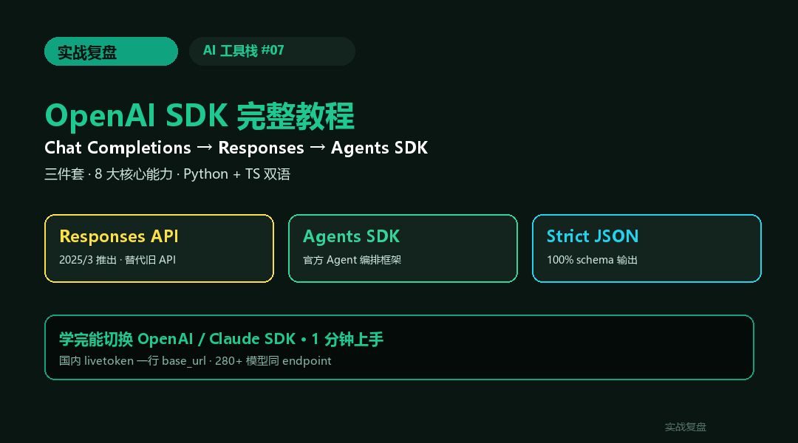
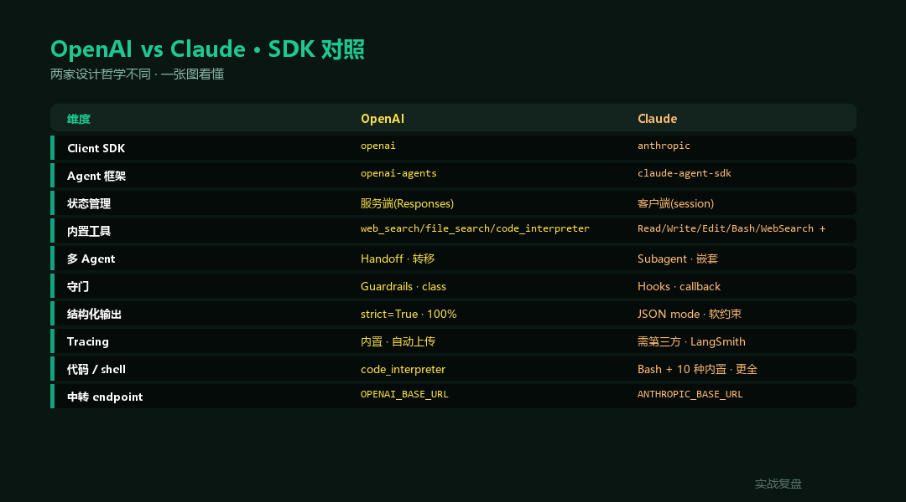
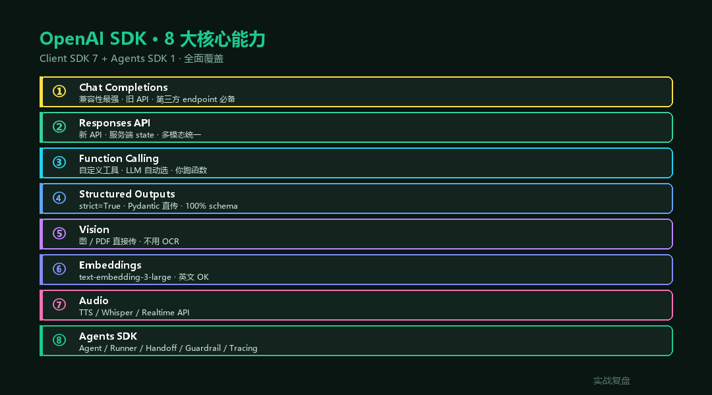
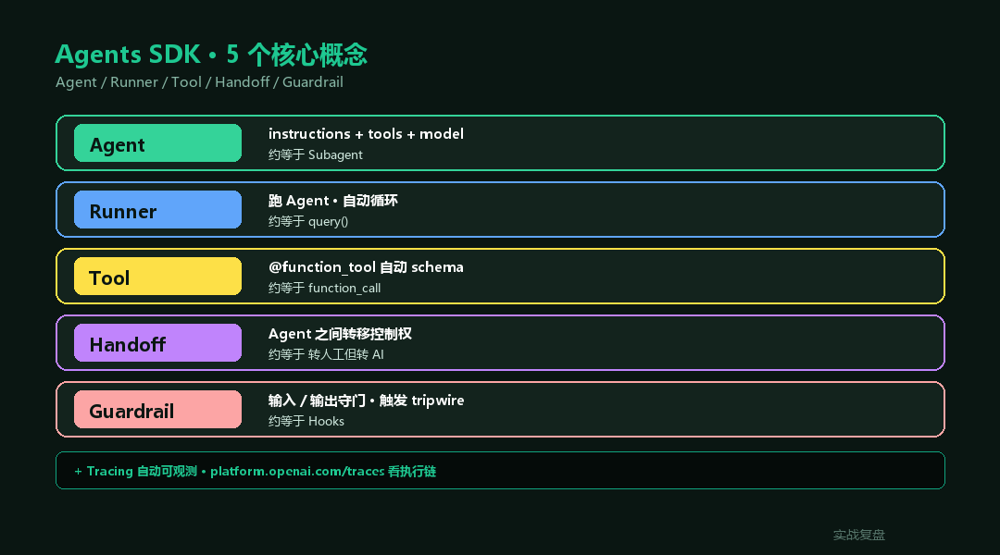
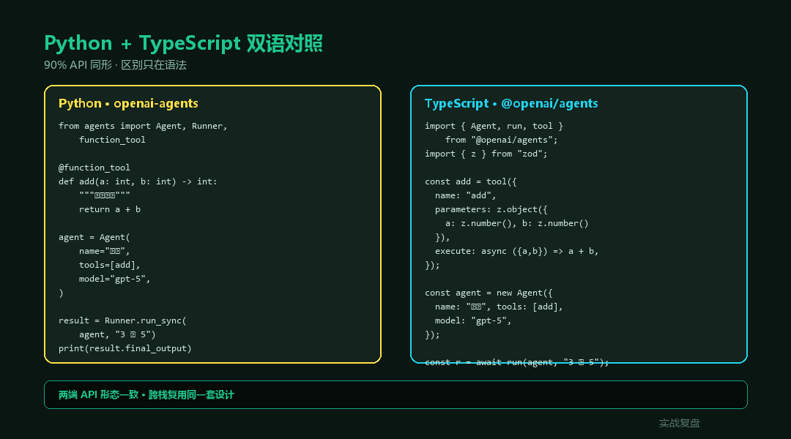

# OpenAI SDK 完整教程 —— 从 Chat Completions 到 Agents SDK(Python + TypeScript)

> **TL;DR**:OpenAI SDK 一句话总结 = **API client + Responses API + Agents SDK** 三件套。本文按时间线讲清楚:旧 API(Chat Completions / Assistants)→ 新 API(**Responses API · 2025/3 推出**)→ 官方 Agent 框架(**Agents SDK · 2025/3 推出**)。8 大核心能力全拆,**Python + TypeScript 双语**,**livetoken 国内 endpoint 配法**直接给。

<div align="center">

<a href="https://github.com/OnelongX/aiagent">

</a>

📖 **本文同步发布于公众号「实战复盘」** · 微信号:`IamOnelong`
🌐 [完整代码仓库 · github.com/OnelongX/aiagent](https://github.com/OnelongX/aiagent)
💡 endpoint 选型:[docs/livetoken.md](../../docs/livetoken.md)

</div>

---

承接 AI 工具栈系列前 6 篇(Codex / Claude / opencode / Hermes / OpenClaw / Claude Agent SDK)。

[#06](../06-claude-agent-sdk/) 讲完 **Claude 官方 SDK**,这篇换个阵营:**OpenAI 官方 SDK**。

两家 SDK 设计哲学不同 —— Anthropic 偏 "Agent SDK 即 Claude Code 库版",OpenAI 偏 "拼乐高":Responses API 管对话状态 / Agents SDK 管编排 / Tools 管动作。**搞清楚谁管什么,2 小时就能上手。**



---

## 一、OpenAI SDK 全家桶 · 一张图看懂

OpenAI 的"SDK 矩阵"过去 1 年发生了**大重构**(2025/3):

| 时期 | 旧 | 新(推荐) |
|---|---|---|
| **2023-2024** | Chat Completions API + 自实现工具循环 | – |
| **2024** | + Assistants API(state 由服务端管) | – |
| **2025/3** | – | **Responses API**(替代 Chat + Assistants) |
| **2025/3** | – | **Agents SDK**(官方 Agent 编排框架) |
| **2026** | Assistants API 进入 deprecated 状态 | Responses + Agents SDK 双引擎 |

简单说,**新代码用 Responses + Agents SDK**,Chat Completions 还能用(向后兼容)但不要再为新项目自实现状态了。

### 三件套定位

```
┌────────────────────────────────────────────────────┐
│  Python:openai                    TS:openai      │  ← Client SDK(发 HTTP)
│  · client.chat.completions.create  (旧)            │
│  · client.responses.create          (新 · 推荐)    │
│  · client.images / audio / embeddings              │
│  · client.beta.assistants           (deprecated)   │
└────────────────────────────────────────────────────┘
                        ↑
                        │ 底层
┌────────────────────────────────────────────────────┐
│  Python:openai-agents          TS:@openai/agents │  ← Agents SDK(编排)
│  · Agent / Runner / Tool / Handoff                 │
│  · Guardrails(输入 / 输出守门)                    │
│  · Tracing(可观测性内置)                          │
└────────────────────────────────────────────────────┘
```

**Client SDK** = 给你发 HTTP 请求的库。
**Agents SDK** = 给你写 Agent 编排逻辑的库 · 底层调 Client SDK。

跟 Claude 那边的对照:

| | OpenAI | Anthropic |
|---|---|---|
| 底层 client | `openai` | `anthropic` |
| Agent 框架 | `openai-agents` | `claude-agent-sdk` |
| 内置工具 | web_search / file_search / code_interpreter / computer_use | Read / Write / Edit / Bash / WebSearch / etc.(10 种) |
| 状态管理 | **Responses API 服务端管** | 客户端管 |
| 多 Agent | **Handoff** | Subagent |
| 守门 | **Guardrails** | Hooks |
| 可观测 | **Tracing 内置** | 第三方 |



---

## 二、安装 + Hello World

### Python

```bash
pip install openai openai-agents
```

```python
# Hello World · 最简 Responses API
from openai import OpenAI

client = OpenAI()  # 从 env 读 OPENAI_API_KEY / OPENAI_BASE_URL

resp = client.responses.create(
    model="gpt-5",
    input="用一句话解释什么是 Agent",
)
print(resp.output_text)
```

### TypeScript

```bash
npm install openai @openai/agents
```

```typescript
import OpenAI from "openai";

const client = new OpenAI();   // 同样从 env 读

const resp = await client.responses.create({
  model: "gpt-5",
  input: "用一句话解释什么是 Agent",
});
console.log(resp.output_text);
```

**就这么简单**。但你想拿来做生产用,还差 8 个能力。

---

## 三、8 大核心能力(Python 为主 · TS 同形)



### 1. Chat Completions(旧 · 仍可用)

最老的 API · 兼容性最好 · 但**不要再为新项目用了**(状态自己管 / 工具循环自己写)。

```python
resp = client.chat.completions.create(
    model="gpt-5",
    messages=[
        {"role": "system", "content": "你是一个简洁的助手"},
        {"role": "user",   "content": "你好"},
    ],
    temperature=0.3,
    max_tokens=500,
)
print(resp.choices[0].message.content)
```

**保留场景**:对接第三方 endpoint(几乎所有 OpenAI 兼容服务 · 包括 livetoken / vLLM 自建)只认 Chat Completions 协议。

### 2. Responses API(新 · 推荐)

**2025/3 推出**,合并了 Chat + Assistants 的能力。核心特性:

- **服务端状态**:不用每次传完整 messages
- **多模态输入输出统一**:文字 / 图 / 音频一致
- **内置工具直接挂**:web_search / file_search / code_interpreter

```python
# 单轮
resp = client.responses.create(
    model="gpt-5",
    input="北京今天天气",
    tools=[{"type": "web_search"}],   # 内置工具一行挂
)
print(resp.output_text)

# 多轮 · 服务端记 state
resp1 = client.responses.create(
    model="gpt-5",
    input="我叫 Onelong",
)
resp2 = client.responses.create(
    model="gpt-5",
    previous_response_id=resp1.id,   # ← 接上一轮
    input="我叫什么",
)
print(resp2.output_text)  # 我叫 Onelong
```

### 3. Function Calling(自定义工具)

跟 Anthropic 一样,LLM 不能直接执行你的函数 —— 你拿到 tool_call 后自己跑。

```python
import json

def get_weather(city: str) -> str:
    # 真实场景:接气象 API
    return f"{city}: 23°C 晴"

tools = [{
    "type": "function",
    "name": "get_weather",
    "description": "查询城市天气",
    "parameters": {
        "type": "object",
        "properties": {"city": {"type": "string"}},
        "required": ["city"],
    },
}]

resp = client.responses.create(
    model="gpt-5",
    input="上海今天天气怎么样",
    tools=tools,
)

# 解析 tool_call
for item in resp.output:
    if item.type == "function_call":
        args = json.loads(item.arguments)
        result = get_weather(**args)
        # 把结果回传给下一轮
        resp2 = client.responses.create(
            model="gpt-5",
            previous_response_id=resp.id,
            input=[{
                "type": "function_call_output",
                "call_id": item.call_id,
                "output": result,
            }],
        )
        print(resp2.output_text)
```

**比 Chat Completions 时代清爽 N 倍** —— 不用拼 messages,不用 while 循环。

### 4. Structured Outputs(strict JSON)

**这是 OpenAI 一直比 Anthropic 强的地方**:`strict=True` 保证输出 100% 符合 JSON Schema(违反则不输出)。

```python
from pydantic import BaseModel

class Contract(BaseModel):
    party_a:    str
    party_b:    str
    amount_rmb: int
    has_risk:   bool

resp = client.responses.parse(
    model="gpt-5",
    input="解析这段合同:甲方 ACME 公司,乙方 上海科技,标的 5 万元,无风险。",
    text_format=Contract,    # ← Pydantic 模型直接传
)

contract: Contract = resp.output_parsed
print(contract.amount_rmb)   # 50000(int,不是 str!)
```

**关键**:`responses.parse` 强制服务端按 schema 生成 · 不需要 retry · 不需要后处理。
合同审查 / 风控 / 简历提取场景,**比 Claude + 多模型交叉还稳**。

### 5. Vision(图片 / PDF)

```python
resp = client.responses.create(
    model="gpt-5",
    input=[{
        "role": "user",
        "content": [
            {"type": "input_text",  "text": "这是什么"},
            {"type": "input_image", "image_url": "https://example.com/img.jpg"},
        ],
    }],
)

# 本地图片 · base64
import base64
with open("invoice.png", "rb") as f:
    b64 = base64.b64encode(f.read()).decode()
resp = client.responses.create(
    model="gpt-5",
    input=[{
        "role": "user",
        "content": [
            {"type": "input_text",  "text": "提取发票金额"},
            {"type": "input_image", "image_url": f"data:image/png;base64,{b64}"},
        ],
    }],
)
```

PDF 也走同样的 `input_file` · 不用 OCR 预处理(模型自己看)。

### 6. Embeddings(向量)

```python
resp = client.embeddings.create(
    model="text-embedding-3-large",
    input=["AI Agent 是工具调度器", "Agent = Prompt 是错的"],
)
vec_1 = resp.data[0].embedding   # 3072 维
vec_2 = resp.data[1].embedding
```

**生产建议**:中文场景 OpenAI embedding **不是首选**(BGE-M3 / Qwen3-Embedding 中文上分数更高)。
英文 / 多语言场景 OpenAI 默认够用。

### 7. Audio(TTS / STT / Realtime)

```python
# TTS · 文字 → 语音
speech = client.audio.speech.create(
    model="gpt-4o-mini-tts",
    voice="alloy",
    input="你好,这是一段 AI 语音。",
)
speech.stream_to_file("out.mp3")

# STT · 语音 → 文字
with open("voice.mp3", "rb") as f:
    text = client.audio.transcriptions.create(
        model="whisper-1",
        file=f,
    )
print(text.text)
```

**Realtime API**(WebSocket / WebRTC 实时双向):适合做语音助手 / 客服坐席,
本教程不展开 · 官方 `openai/openai-realtime-agents` repo 有完整 demo。

### 8. Images(生成 / 编辑)

```python
# 文生图
img = client.images.generate(
    model="gpt-image-1",
    prompt="赛博朋克风格的咖啡馆 · 16:9",
    size="1536x1024",
    quality="high",
)
img_url = img.data[0].url

# 图生图编辑
with open("origin.png", "rb") as f:
    edited = client.images.edit(
        model="gpt-image-1",
        image=f,
        prompt="把背景换成雪山",
    )
```

---

## 四、Agents SDK(2025/3 推出 · 重点)



**openai-agents** = OpenAI 官方 Agent 编排框架,**对标 Claude Agent SDK / LangGraph / CrewAI**。

核心 5 个概念:

| 概念 | 干什么 | 类似 |
|---|---|---|
| **Agent** | 单个 LLM + 指令 + 工具 | Subagent |
| **Runner** | 跑 Agent · 自动循环 | Claude SDK 的 query() |
| **Tool** | 函数 / 内置 / handoff | function calling |
| **Handoff** | Agent 之间转移 | Subagent 调用 |
| **Guardrail** | 输入 / 输出守门 | Hook |

### 最简示例(Python)

```python
from agents import Agent, Runner

agent = Agent(
    name="助手",
    instructions="你是一个简洁的助手。",
    model="gpt-5",
)

result = Runner.run_sync(agent, "你好")
print(result.final_output)
```

### 加自定义工具

```python
from agents import Agent, Runner, function_tool

@function_tool
def get_weather(city: str) -> str:
    """查询城市天气"""
    return f"{city}: 23°C 晴"

agent = Agent(
    name="天气助手",
    instructions="用户问天气时调用 get_weather 工具。",
    tools=[get_weather],
    model="gpt-5",
)

result = Runner.run_sync(agent, "上海今天天气")
print(result.final_output)
```

`@function_tool` 装饰器自动从函数签名 + docstring 生成 JSON Schema · 不用手写。

### 多 Agent + Handoff

```python
from agents import Agent, Runner

triager = Agent(
    name="分诊员",
    instructions="把用户问题分流到 法律 / 技术 / 其他。",
    handoffs=["法律专家", "技术专家"],
    model="gpt-4o-mini",   # 分诊用小模型
)

legal = Agent(
    name="法律专家",
    instructions="只回答法律问题。涉及具体案例引导找律师。",
    model="gpt-5",
)

tech = Agent(
    name="技术专家",
    instructions="只回答技术问题。代码示例用 Python。",
    model="gpt-5",
)

triager.handoffs = [legal, tech]

result = Runner.run_sync(triager, "Python 怎么读 CSV")
# triager → 自动 handoff 给 tech → 出答案
print(result.final_output)
```

**注意**:`handoffs` 不是 subagent 嵌套,是 Agent 之间 **转移控制权**(类似客服转人工但是转给另一个 AI)。

### Guardrails(输入/输出守门)

```python
from agents import Agent, Runner, InputGuardrail, OutputGuardrail
from pydantic import BaseModel

class BlockReason(BaseModel):
    blocked: bool
    reason:  str

# 输入守门 · 拦截敏感问题
async def block_legal_specific_case(ctx, agent, input):
    if "我的案子" in input or "我该不该起诉" in input:
        return InputGuardrail.GuardrailFunctionOutput(
            tripwire_triggered=True,
            output_info={"reason": "涉及个案咨询 · 引导找律师"},
        )

agent = Agent(
    name="法律科普",
    instructions="只做法律科普 · 不给具体建议。",
    input_guardrails=[block_legal_specific_case],
    model="gpt-5",
)
```

**Guardrails 等价于 Hooks** —— 防 LLM 自由发挥触红线。

### Tracing(内置可观测)

不用配,跑完直接到 [platform.openai.com/traces](https://platform.openai.com/traces) 看完整执行链:
- 每个 Agent 的输入输出
- 工具调用参数 + 结果
- token 用量 + 延迟
- Handoff 转移轨迹

**这是 OpenAI 比 Anthropic SDK 强的地方 —— 开箱可观测**。

---

## 五、Python + TypeScript 双语对照



90% 的 API 形态完全一致 · 区别只在语言语法。

```python
# Python · Agents SDK
from agents import Agent, Runner, function_tool

@function_tool
def add(a: int, b: int) -> int:
    """两数相加"""
    return a + b

agent = Agent(name="算术", tools=[add], model="gpt-5")
result = Runner.run_sync(agent, "3 加 5 等于多少")
print(result.final_output)
```

```typescript
// TypeScript · @openai/agents
import { Agent, run, tool } from "@openai/agents";
import { z } from "zod";

const add = tool({
  name: "add",
  description: "两数相加",
  parameters: z.object({ a: z.number(), b: z.number() }),
  execute: async ({ a, b }) => a + b,
});

const agent = new Agent({
  name: "算术",
  tools: [add],
  model: "gpt-5",
});

const result = await run(agent, "3 加 5 等于多少");
console.log(result.finalOutput);
```

**差异**:
- Python 用 `@function_tool` 装饰器 + 类型注解推断 schema
- TypeScript 用 `tool()` 工厂 + `zod` schema 声明
- Python 同步 `run_sync` / 异步 `Runner.run`;TypeScript 只有异步 `run()`

---

## 六、国内 endpoint 配置

国内访问 `api.openai.com` 不稳。最简方式:**设 `OPENAI_BASE_URL` 走中转**。

### 方式 A:livetoken(推荐)

[livetoken.top](https://livetoken.top) —— **OpenAI 协议 100% 兼容** · 一个 base_url 跑 280+ 模型(GPT-5 / Claude / Gemini / DeepSeek 全在内)· **官方价 2.21~3.42 折**。

```bash
# env 配两行就行
export OPENAI_API_KEY="sk-livetoken-xxxxx"
export OPENAI_BASE_URL="https://livetoken.top/v1"
```

```python
from openai import OpenAI

# 不传参数,从 env 读
client = OpenAI()

resp = client.responses.create(
    model="gpt-5",   # 直接用,走 livetoken 代理
    input="hello",
)
```

**注意**:

1. `OPENAI_BASE_URL` 末尾要带 `/v1`(livetoken 自动支持去掉,稳妥起见加上)
2. **Responses API** 部分中转服务还在跟进 · 若报错 fallback 到 `chat.completions.create`
3. **Agents SDK** 底层调 Responses API · 需要中转支持(livetoken 已支持)

完整对比见 [docs/livetoken.md](../../docs/livetoken.md)。

### 方式 B:官方 + 代理

```bash
export OPENAI_API_KEY="sk-..."   # 官方 key
export HTTPS_PROXY="http://127.0.0.1:7890"   # Clash / V2Ray 端口
```

适合个人开发 · 不适合生产(IP 不稳 + 没保障)。

### 方式 C:Azure OpenAI

```python
from openai import AzureOpenAI

client = AzureOpenAI(
    api_key="...",
    api_version="2025-04-01-preview",
    azure_endpoint="https://yours.openai.azure.com",
)
```

企业首选 · 需要先在 Azure 申请部署。

---

## 七、跟 Claude Agent SDK 的对照

写过 [#06 Claude Agent SDK](../06-claude-agent-sdk/) 的读者,这张表帮你 1 分钟切换:

| 概念 | OpenAI 怎么写 | Claude 怎么写 |
|---|---|---|
| **导入** | `from agents import Agent, Runner` | `from claude_agent_sdk import query, ClaudeAgentOptions` |
| **跑 Agent** | `Runner.run_sync(agent, prompt)` | `async for m in query(prompt, options)` |
| **自定义工具** | `@function_tool` 装饰函数 | `@tool` + `create_sdk_mcp_server` |
| **多 Agent** | `Agent(handoffs=[...])` | Subagent(.claude/agents/*.md)|
| **守门** | Guardrails(class) | Hooks(callback)|
| **状态** | Responses 服务端 | 客户端 session |
| **内置工具** | web_search / file_search / code_interpreter / computer_use | Read/Write/Edit/Bash/WebSearch/... 10 种 |
| **可观测** | Tracing 自带 | 第三方(LangSmith / Phoenix)|
| **endpoint 替换** | `OPENAI_BASE_URL` | `ANTHROPIC_BASE_URL` |

**两个都熟之后会发现**:**OpenAI Agents SDK 偏"框架感"**(Agent/Runner/Tool 类层次清晰),**Claude Agent SDK 偏"工程感"**(直接复用 Claude Code 引擎,代码 / shell 能力开箱即用)。

- **做对话型 Agent / 客服 / 工具调度** → 两家都行
- **做能写代码 / 跑 shell 的 dev Agent** → Claude Agent SDK 更顺(10 种内置工具)
- **做需要内置 web search / file search / code interpreter 的 Agent** → OpenAI 更顺
- **要 Tracing 开箱可观测** → OpenAI Agents SDK 完胜

---

## 八、实战:30 行做一个工具调度 Agent

跟 [#06](../06-claude-agent-sdk/) 一样的"家庭绿电方案"场景,用 OpenAI Agents SDK 重写:

```python
import os
from agents import Agent, Runner, function_tool

# 1. 业务工具
@function_tool
def get_irradiance(city: str) -> dict:
    """查城市年辐照量(kWh/m²/year)"""
    db = {"上海": 1320, "北京": 1450, "广州": 1280, "拉萨": 2100}
    return {"city": city, "irradiance": db.get(city, 1200)}

@function_tool
def get_tariff(city: str) -> dict:
    """查城市阶梯电价(¥/kWh)"""
    return {"city": city, "tier1": 0.52, "tier2": 0.57, "tier3": 0.82}

@function_tool
def calc_system_size(monthly_kwh: int, irradiance: float) -> dict:
    """根据月用电量 + 辐照量算系统规模 kW"""
    daily = monthly_kwh / 30
    kw = round(daily / (irradiance / 365) / 0.78, 2)   # 78% PR
    return {"system_kw": kw, "panel_count_400w": int(kw * 1000 / 400) + 1}

@function_tool
def estimate_payback(system_kw: float, tariff_avg: float) -> dict:
    """估算回本年数"""
    cost = system_kw * 3500            # 全包 3500/kW(2026 价格)
    annual_gen = system_kw * 1200      # 1200 度/kW·年
    annual_save = annual_gen * tariff_avg
    return {
        "cost_rmb": cost,
        "annual_save_rmb": int(annual_save),
        "payback_years": round(cost / annual_save, 1),
    }


# 2. 组装 Agent
agent = Agent(
    name="家庭绿电方案助手",
    instructions=(
        "你是家庭光伏方案顾问。\n"
        "用户给城市 + 月用电量 → 依次调用工具:\n"
        "1. 查辐照量\n"
        "2. 查电价\n"
        "3. 算系统规模\n"
        "4. 估算回本\n\n"
        "最后用一段话总结方案 · 含装机 kW / 投入 / 年省电费 / 回本年数。"
        "不预测涨跌 · 不保证收益 · 不推荐具体品牌。"
    ),
    tools=[get_irradiance, get_tariff, calc_system_size, estimate_payback],
    model="gpt-5",
)


# 3. 跑
result = Runner.run_sync(agent, "我在上海 · 月用电 800 度 · 装光伏划算吗?")
print(result.final_output)
```

跑起来你会看到 LLM **自动**调 4 个工具,**不需要你写 while 循环**。

跟 [#01 家庭绿电方案助手](../../02-industry-cases/01-home-solar-advisor/) 那篇对比 —— 同一个业务,**OpenAI Agents SDK 30 行 vs Claude Agent SDK 50 行 · 框架感更明显**。

---

## 九、踩坑指南

### 1. `responses.create` vs `chat.completions.create` 别混

- **新代码**:全部用 `responses.create`
- **对接第三方 endpoint**(尤其 vLLM 自建):还用 `chat.completions.create`(协议兼容更广)
- **不要在同一个工作流里混用**,状态对不齐

### 2. `strict=True` 不是免费的

```python
client.responses.parse(..., text_format=MyModel)
```

服务端会预先编译 schema · **第一次调用慢 1-2s**(冷启动)· 后续正常。
schema 太深 / 嵌套太多会被拒(目前限制是嵌套深度 5 · 字段数 ≤ 100)。

### 3. function_tool 的类型注解必须严格

```python
# ❌ 错:没有类型
@function_tool
def get_weather(city):
    ...

# ✓ 对:类型 + docstring
@function_tool
def get_weather(city: str) -> dict:
    """查询城市天气"""
    ...
```

Agents SDK 用 `inspect.signature` 自动生成 schema · 没类型就报错。

### 4. Handoff 不能形成循环

```python
a.handoffs = [b]
b.handoffs = [a]   # ❌ 死循环 · Runner 会抛 MaxTurnsExceeded
```

设计原则:**单向树**(triager → 专家),专家不再 handoff 回去。要交互让 triager 重新分诊。

### 5. Tracing 默认会上传

```python
import os
os.environ["OPENAI_AGENTS_DISABLE_TRACING"] = "1"   # 关闭
```

涉密 / 工艺机密场景必关 · 或自建 OTLP 后端导到自己集群。

### 6. 国内中转的 SSE 流式

```python
resp = client.responses.create(model="gpt-5", input="hi", stream=True)
for event in resp:
    if event.type == "response.output_text.delta":
        print(event.delta, end="", flush=True)
```

部分中转对 SSE 长连接支持不全 · 报 `IncompleteRead` 多半是中转网关层超时,
不是你代码问题 · 切换 endpoint(或加 `timeout=180`)即可。

---

## 十、模型选型(2026/5 最新)

| 任务 | 推荐 | 备注 |
|---|---|---|
| 主推理 / 复杂任务 | **gpt-5** | 默认就用它 |
| 长上下文 / 大文档 | gpt-5(200k context) | – |
| 意图分类 / 路由 | **gpt-5-mini** / gpt-5-nano | 便宜 5-10 倍 |
| Vision 图理解 | **gpt-5**(已是多模态) | – |
| 图像生成 | **gpt-image-1** | 替代 DALL-E 3 |
| TTS | gpt-4o-mini-tts / gpt-4o-tts | – |
| 语音识别 | whisper-1 | 多语种 |
| 实时语音 | gpt-realtime | WebSocket/WebRTC |
| Embeddings | text-embedding-3-large | 英文好 · 中文 BGE-M3 更好 |

---

## 十一、关联资源

- 官方文档:[platform.openai.com/docs](https://platform.openai.com/docs)
- Agents SDK 文档:[openai.github.io/openai-agents-python](https://openai.github.io/openai-agents-python/)
- TypeScript:[openai.github.io/openai-agents-js](https://openai.github.io/openai-agents-js/)
- 国内 endpoint:[docs/livetoken.md](../../docs/livetoken.md)
- 对照阅读:[#06 Claude Agent SDK](../06-claude-agent-sdk/)
- 实战案例:[02-industry-cases/](../../02-industry-cases/) 13 篇行业落地

---

## 十二、收尾

**学完这一篇,你应该能:**

- [x] 区分 Chat Completions / Responses / Agents SDK 的定位
- [x] 用 Responses API 写多轮对话
- [x] 用 Function Calling + Structured Outputs 做结构化提取
- [x] 用 Agents SDK 组装 Agent + 工具 + Handoff + Guardrail
- [x] 配国内 endpoint(livetoken)跑通整套
- [x] 看着 [#06](../06-claude-agent-sdk/) 一秒切换两家 SDK

**OpenAI 和 Anthropic 不是二选一,是组合**:

- 你的应用里 **Triager 用 gpt-5-mini**(便宜)
- **法律 / 医疗 / 共情** 走 **Claude Sonnet 4.5**(语感强 + 守红线)
- **JSON 结构化提取 / 风控评分** 走 **OpenAI strict mode**(100% schema)
- **多模态 / 图理解** 走 **Gemini 2.5 Pro**(2M 上下文)
- 一层 **LiteLLM** 统一封装 · `task_type` 决定调谁

这就是 [13 篇行业落地综述](../../04-survey/) 里讲的 **"任务 × 模型矩阵"** 的工程实现。

---

实战复盘 · AI 工具栈 #7 · OpenAI SDK
关键词:OpenAI · Agents SDK · Responses API · Function Calling · Structured Outputs · livetoken
本文同步发布于公众号「实战复盘」(IamOnelong)· 仅供学习参考。
