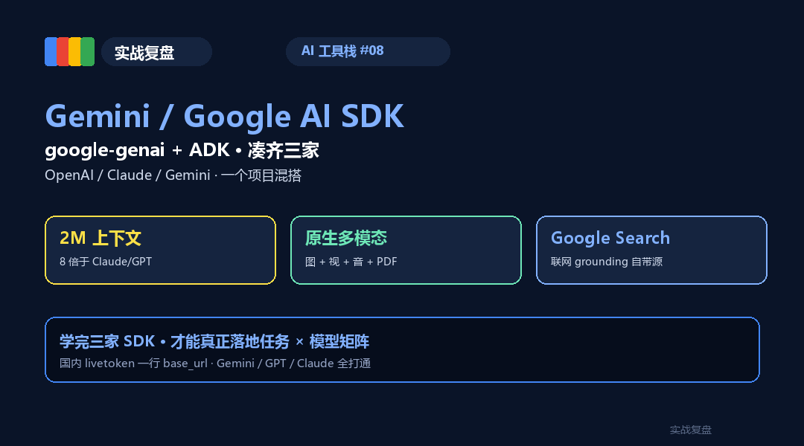
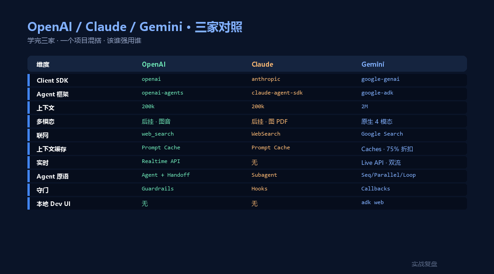
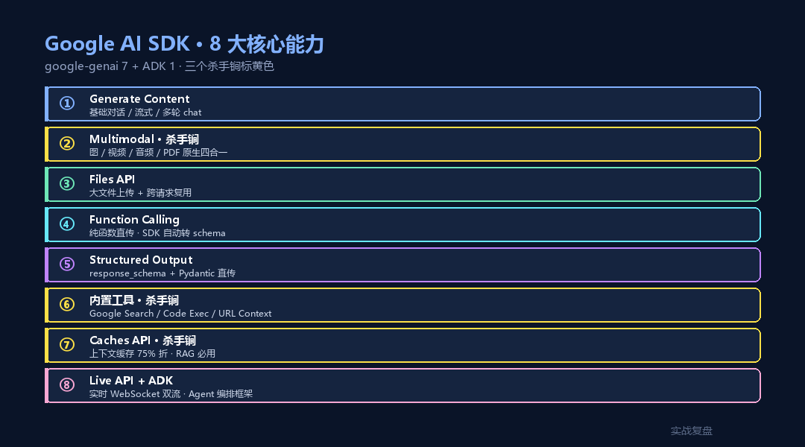
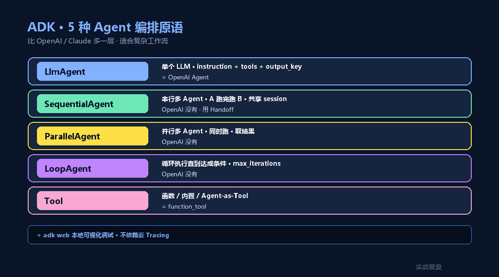

# Gemini / Google AI SDK 完整教程 —— 从 google-genai 到 ADK(Python + TypeScript)

> **TL;DR**:Google 一边的 SDK 矩阵 = **google-genai(新统一 SDK)+ Vertex AI(企业版)+ ADK(官方 Agent 框架)**。本文从安装到 8 大核心能力全拆,**重点讲 Gemini 三个杀手锏**:**2M 上下文 / 原生多模态(图+视频+音频+PDF)/ 内置 Google Search 联网**。配 **Agent Development Kit (ADK · 2025/4 推出)** 一起讲,完整工具栈跑通。

<div align="center">

<a href="https://github.com/OnelongX/aiagent">

</a>

📖 **本文同步发布于公众号「实战复盘」** · 微信号:`IamOnelong`
🌐 [完整代码仓库 · github.com/OnelongX/aiagent](https://github.com/OnelongX/aiagent)
💡 endpoint 选型:[docs/livetoken.md](../../docs/livetoken.md)

</div>

---

承接 AI 工具栈系列。

[#06](../06-claude-agent-sdk/) 讲 Claude · [#07](../07-openai-sdk/) 讲 OpenAI · **这篇凑齐 Google**。

三家 SDK 各有所长:**Claude 强在 Agent + 代码 + 共情** · **OpenAI 强在生态 + 结构化输出 + Tracing** · **Gemini 强在多模态 + 2M 上下文 + Google 全家桶集成**。

学完三家,你的"任务 × 模型矩阵"才真正闭环。



---

## 一、Google AI SDK 矩阵 · 一张图看懂

Google 这边 SDK 命名乱过(google-generativeai / google-cloud-aiplatform / google-genai),2024-2025 已经统一:

| 时期 | 旧 | 新(推荐) |
|---|---|---|
| **2023** | `google-generativeai`(Python)/ `@google/generative-ai`(TS) | – |
| **2024/12** | – | **`google-genai`** 统一 SDK(Python + TS) |
| **2024** | Vertex AI SDK `google-cloud-aiplatform` | 仍可用 · 企业向 |
| **2025/4** | – | **Agent Development Kit (ADK)** |
| **2026** | 旧 SDK 进入 deprecated | google-genai + ADK 双引擎 |

简单说:

```
┌──────────────────────────────────────────────────────────┐
│  Python:google-genai            TS:@google/genai        │  ← 统一 Client SDK
│  · client.models.generate_content       (基础)           │
│  · client.models.generate_content_stream (流式)          │
│  · client.files.upload                   (大文件)        │
│  · client.caches.create                  (上下文缓存)    │
│  · client.live.connect                   (实时 WebSocket)│
└──────────────────────────────────────────────────────────┘
                          ↑
                          │ 底层
┌──────────────────────────────────────────────────────────┐
│  Python:google-adk          TS:@google/adk             │  ← Agent Development Kit
│  · Agent / LlmAgent / SequentialAgent / ParallelAgent    │
│  · BaseTool / FunctionTool / built-in tools              │
│  · Sessions / Memory / Artifacts                         │
│  · Dev UI(本地可视化调试)                              │
└──────────────────────────────────────────────────────────┘
```

**两条路**:
- **Gemini API**(免费 tier · `aistudio.google.com` 拿 key)→ 个人 / 原型
- **Vertex AI**(企业 · GCP project)→ 生产 / 国内 OpenAI 同等 SLA

跟前两家的对照:

| | Google | OpenAI | Anthropic |
|---|---|---|---|
| Client SDK | `google-genai` | `openai` | `anthropic` |
| Agent 框架 | **`google-adk`** | `openai-agents` | `claude-agent-sdk` |
| 杀手锏 | **2M 上下文 + 原生多模态** | strict JSON + Tracing | 代码 / shell 能力 |
| 内置工具 | Google Search / Code Execution / URL Context | web_search / file_search / code_interpreter | Read/Write/Edit/Bash + |
| 上下文缓存 | **Caches API · 75% 折扣** | Prompt Caching | Prompt Caching |
| 实时多模态 | **Live API · WebSocket 音视频双流** | Realtime API | – |
| 国内可用 | 直接调通常受限 | 中转 OK | 中转 OK |



---

## 二、安装 + Hello World

### Python

```bash
pip install google-genai google-adk
```

```python
from google import genai

# 从 env 读 GOOGLE_API_KEY · 或 GEMINI_API_KEY
client = genai.Client()

resp = client.models.generate_content(
    model="gemini-2.5-pro",
    contents="用一句话解释什么是 Agent",
)
print(resp.text)
```

### TypeScript

```bash
npm install @google/genai @google/adk
```

```typescript
import { GoogleGenAI } from "@google/genai";

const client = new GoogleGenAI({ apiKey: process.env.GOOGLE_API_KEY });

const resp = await client.models.generateContent({
  model: "gemini-2.5-pro",
  contents: "用一句话解释什么是 Agent",
});
console.log(resp.text);
```

---

## 三、8 大核心能力(Python 为主)



### 1. Generate Content(基础)

```python
# 多轮对话
chat = client.chats.create(model="gemini-2.5-pro")
r1 = chat.send_message("我叫 Onelong")
r2 = chat.send_message("我叫什么")
print(r2.text)   # Onelong

# 流式
for chunk in client.models.generate_content_stream(
    model="gemini-2.5-flash",
    contents="解释什么是 Subagent",
):
    print(chunk.text, end="", flush=True)
```

### 2. Multimodal(图 / 视频 / 音频 / PDF 一把梭)· 杀手锏

**Gemini 是真正的多模态原生模型** —— 不是后挂的 vision 模块。

```python
from google.genai import types

# 图
img = types.Part.from_uri(
    file_uri="https://example.com/invoice.jpg",
    mime_type="image/jpeg",
)
resp = client.models.generate_content(
    model="gemini-2.5-pro",
    contents=["提取这张发票的总金额", img],
)

# 本地视频(< 20MB 内联,大文件用 Files API)
video = types.Part.from_bytes(
    data=open("clip.mp4", "rb").read(),
    mime_type="video/mp4",
)
resp = client.models.generate_content(
    model="gemini-2.5-pro",
    contents=["总结这段视频", video],
)

# PDF(直接看,不用 OCR)
pdf = types.Part.from_bytes(
    data=open("contract.pdf", "rb").read(),
    mime_type="application/pdf",
)
resp = client.models.generate_content(
    model="gemini-2.5-pro",
    contents=["提取合同关键条款", pdf],
)

# 音频
audio = types.Part.from_bytes(
    data=open("voice.mp3", "rb").read(),
    mime_type="audio/mp3",
)
resp = client.models.generate_content(
    model="gemini-2.5-pro",
    contents=["转写并总结", audio],
)
```

**这就是 Gemini 在医疗影像 / 工业质检 / 教育批改场景的护城河** ——
单一模型吃 4 种模态,不用拼 pipeline。

### 3. Files API(大文件 + 复用)

文件超 20MB 必走 Files API,**还能跨请求复用**(省 token):

```python
# 上传一次
file = client.files.upload(file="long_video.mp4")

# 多次问
r1 = client.models.generate_content(
    model="gemini-2.5-pro",
    contents=["前 30 秒讲了什么", file],
)
r2 = client.models.generate_content(
    model="gemini-2.5-pro",
    contents=["最后有什么结论", file],
)

# 列出 / 删除
for f in client.files.list():
    print(f.name, f.size_bytes)
client.files.delete(name=file.name)
```

### 4. Function Calling

```python
from google.genai import types

def get_weather(city: str) -> dict:
    """查询城市天气"""
    return {"city": city, "temp": 23, "weather": "晴"}

# 把函数直接传给 tools · SDK 自动生成 schema
resp = client.models.generate_content(
    model="gemini-2.5-pro",
    contents="上海今天天气",
    config=types.GenerateContentConfig(
        tools=[get_weather],
    ),
)
print(resp.text)  # 自动调 get_weather + 拼答案
```

**比 OpenAI 还简洁** —— `tools=[func]` 直接传函数,SDK 内部走类型注解 + docstring。

手动模式(精确控制):

```python
tools = [types.Tool(function_declarations=[
    types.FunctionDeclaration(
        name="get_weather",
        description="查询城市天气",
        parameters={
            "type": "object",
            "properties": {"city": {"type": "string"}},
            "required": ["city"],
        },
    )
])]
```

### 5. Structured Outputs(response_schema)

```python
from pydantic import BaseModel

class Contract(BaseModel):
    party_a:    str
    party_b:    str
    amount_rmb: int
    has_risk:   bool

resp = client.models.generate_content(
    model="gemini-2.5-pro",
    contents="解析合同:甲方 ACME,乙方 上海科技,5 万元,无风险。",
    config=types.GenerateContentConfig(
        response_mime_type="application/json",
        response_schema=Contract,   # Pydantic 直传
    ),
)
contract = resp.parsed  # 已经是 Contract 实例
print(contract.amount_rmb)  # 50000
```

**和 OpenAI `strict=True` 等价**(强制 schema 输出)。

### 6. 内置工具:Google Search / Code Execution / URL Context

**这是 Gemini 最容易被低估的能力** —— 三个"开箱即用"的内置工具:

```python
# (a) Google Search 联网 grounding
resp = client.models.generate_content(
    model="gemini-2.5-pro",
    contents="2026 年 5 月特斯拉股价",
    config=types.GenerateContentConfig(
        tools=[types.Tool(google_search=types.GoogleSearch())],
    ),
)
# resp 自带 grounding_metadata(引用源)

# (b) Code Execution 直接跑 Python
resp = client.models.generate_content(
    model="gemini-2.5-pro",
    contents="计算前 100 个素数的和",
    config=types.GenerateContentConfig(
        tools=[types.Tool(code_execution=types.ToolCodeExecution())],
    ),
)

# (c) URL Context 直接读网页
resp = client.models.generate_content(
    model="gemini-2.5-pro",
    contents="总结 https://example.com/policy 的核心要点",
    config=types.GenerateContentConfig(
        tools=[types.Tool(url_context=types.UrlContext())],
    ),
)
```

**注意**:这三个工具**不能跟自定义 function calling 同时挂**(API 限制)·
要做 hybrid 走 ADK 编排。

### 7. Context Caching(上下文缓存 · 省 75%)

针对**反复读同一份大文档**的场景(知识库 / 法规 / 工艺手册):

```python
import datetime

# 1. 创建缓存(以工艺手册为例 · 100 万 token)
cache = client.caches.create(
    model="gemini-2.5-pro",
    config=types.CreateCachedContentConfig(
        display_name="工艺手册 v3.2",
        contents=[manual_pdf],   # 100 万 token 的 PDF
        ttl="3600s",             # 1 小时
    ),
)

# 2. 反复用 cache · 每次只付增量 token
for question in ["温度上限", "压力下限", "TAL 范围"]:
    resp = client.models.generate_content(
        model="gemini-2.5-pro",
        contents=question,
        config=types.GenerateContentConfig(
            cached_content=cache.name,
        ),
    )
    print(resp.text)
```

**计费**:cached token 收 25% 的钱(75% 折扣)· **生产环境 RAG 必用**。

### 8. Live API(实时多模态 · WebSocket 音视频双流)

```python
async with client.aio.live.connect(
    model="gemini-2.5-flash-live",
    config=types.LiveConnectConfig(
        response_modalities=["AUDIO"],   # 输出语音
    ),
) as session:
    await session.send(input="你好,介绍下自己", end_of_turn=True)
    async for response in session.receive():
        # 实时拿到音频 chunk
        if response.data:
            audio_chunks.append(response.data)
```

**对标 OpenAI Realtime API** · 适合做语音助手 / 多模态直播解说 / 客服坐席。

---

## 四、Agent Development Kit (ADK · 2025/4 推出)



**google-adk** = Google 官方 Agent 框架 · 跟 Claude Agent SDK / OpenAI Agents SDK 同代产品。

核心 5 个概念:

| 概念 | 干什么 |
|---|---|
| **LlmAgent** | 单个 LLM Agent · 装 instruction + tools |
| **SequentialAgent** | 串行多 Agent · 一个跟一个跑 |
| **ParallelAgent** | 并行多 Agent · 同时跑取最优 |
| **LoopAgent** | 循环执行直到达成条件 |
| **Tool** | 函数 / 内置 / Agent-as-Tool |

ADK **跟 OpenAI Agents SDK 比** 多了一层 "Agent 编排原语"(Sequential / Parallel / Loop) ——
适合做复杂工作流,不只是工具调度。

### 最简示例(Python)

```python
from google.adk.agents import LlmAgent
from google.adk.tools import google_search

agent = LlmAgent(
    name="搜索助手",
    model="gemini-2.5-pro",
    instruction="用户问问题时调用 google_search · 给出引用源。",
    tools=[google_search],
)

# 跑
from google.adk.runners import Runner
from google.adk.sessions import InMemorySessionService

session_service = InMemorySessionService()
runner = Runner(
    app_name="my_app",
    agent=agent,
    session_service=session_service,
)
session = await session_service.create_session(
    app_name="my_app", user_id="u1",
)

from google.genai import types
async for event in runner.run_async(
    user_id="u1", session_id=session.id,
    new_message=types.Content(
        role="user",
        parts=[types.Part(text="2026 年 AI 工具栈有哪些")],
    ),
):
    if event.is_final_response():
        print(event.content.parts[0].text)
```

### 多 Agent 工作流(SequentialAgent)

```python
from google.adk.agents import LlmAgent, SequentialAgent

# Agent 1:研究
researcher = LlmAgent(
    name="研究员",
    model="gemini-2.5-pro",
    instruction="搜索并提取最新数据",
    tools=[google_search],
    output_key="research_notes",  # 输出存到 session state
)

# Agent 2:总结
summarizer = LlmAgent(
    name="撰写者",
    model="gemini-2.5-flash",   # 用便宜模型
    instruction="基于 {research_notes} 写 300 字摘要",
    output_key="final_report",
)

# 串成工作流
pipeline = SequentialAgent(
    name="research_pipeline",
    sub_agents=[researcher, summarizer],
)
```

### 并行 + 循环

```python
from google.adk.agents import ParallelAgent, LoopAgent

# 3 个 reviewer 并行评审
parallel = ParallelAgent(
    name="three_reviewers",
    sub_agents=[reviewer_legal, reviewer_tech, reviewer_brand],
)

# 循环改稿直到满意
loop = LoopAgent(
    name="iterate_until_good",
    sub_agents=[critic, rewriter],
    max_iterations=5,
)
```

### Dev UI(本地可视化调试)

```bash
adk web
```

启动本地 web 调试器 · 看 Agent 调用链 / Session state / Tool 参数 / 错误堆栈 ——
**比 OpenAI Tracing 多了一层"本地不依赖云"的优势**。

---

## 五、Python + TypeScript 双语


```python
# Python · google-genai
from google import genai

client = genai.Client()
resp = client.models.generate_content(
    model="gemini-2.5-pro",
    contents="hi",
)
print(resp.text)
```

```typescript
// TypeScript · @google/genai
import { GoogleGenAI } from "@google/genai";

const client = new GoogleGenAI({ apiKey: process.env.GOOGLE_API_KEY });
const resp = await client.models.generateContent({
  model: "gemini-2.5-pro",
  contents: "hi",
});
console.log(resp.text);
```

**差异**:
- Python `client.models.generate_content` · TS `client.models.generateContent`(驼峰)
- Python 用 `types.Tool(google_search=...)` · TS 用 `{ tools: [{ googleSearch: {} }] }`
- Python 同步 + 异步双轨 · TS 全异步
- ADK 当前**只有 Python 实现** · TS 版还在 alpha

---

## 六、国内 endpoint 配置

Gemini API 直接访问 `generativelanguage.googleapis.com` 在国内**默认不通**(被墙)。三种方案:

### 方式 A:livetoken(推荐 · 兼容层)

[livetoken.top](https://livetoken.top) 提供 **OpenAI 协议**的 Gemini 代理 ——
你用 `openai` SDK 调 Gemini 模型:

```python
from openai import OpenAI

client = OpenAI(
    api_key="sk-livetoken-xxxxx",
    base_url="https://livetoken.top/v1",
)
resp = client.chat.completions.create(
    model="gemini-2.5-pro",      # 直接选 Gemini 模型
    messages=[{"role": "user", "content": "hi"}],
)
```

**优点**:统一 SDK · 一个 base_url 跑 Gemini / GPT / Claude / DeepSeek 280+ 模型。
**缺点**:走 OpenAI 协议会丢一部分 Gemini 原生能力(Live API / 部分内置工具)。

### 方式 B:Vertex AI(企业级 GCP)

```python
from google import genai

# Vertex 模式 · 需要 GCP project + 服务账号
client = genai.Client(
    vertexai=True,
    project="your-gcp-project",
    location="us-central1",
)
```

**优点**:走 GCP 全球网络 · 国内访问相对稳 · 企业 SLA。
**缺点**:要 GCP 账号 + 计费方式 · 起步门槛高。

### 方式 C:本地 + 代理(个人开发)

```bash
export GOOGLE_API_KEY="..."
export HTTPS_PROXY="http://127.0.0.1:7890"
```

适合本地 demo · 不适合生产。

---

## 七、三家 SDK 对照(凑齐 OpenAI / Claude / Gemini)

| 维度 | OpenAI | Anthropic | Google |
|---|---|---|---|
| Client SDK | `openai` | `anthropic` | `google-genai` |
| Agent 框架 | `openai-agents` | `claude-agent-sdk` | `google-adk` |
| **杀手锏** | strict JSON + Tracing + 生态 | 代码 / shell + Agent 工程 | **2M 上下文 + 原生多模态 + Search** |
| 上下文 | 200k(gpt-5) | 200k(Sonnet) | **2M(2.5 Pro)** |
| 多模态 | 后挂(图 + 音) | 后挂(图 + PDF) | **原生 4 模态**(图+视+音+PDF)|
| 联网 | web_search 工具 | WebSearch 工具 | **Google Search grounding**(自带引用) |
| 状态 | 服务端(Responses) | 客户端(session) | 服务端(Chats / Caches) |
| 上下文缓存 | Prompt Caching | Prompt Caching | **Caches API · 75% 折** |
| 实时 | Realtime API | – | **Live API · 双流音视频** |
| Agent 原语 | Agent + Handoff | Subagent | **Sequential / Parallel / Loop** |
| 守门 | Guardrails | Hooks | Callbacks |
| 本地 Dev UI | – | – | **`adk web` 自带** |
| 国内 endpoint | livetoken / Azure | livetoken / 中转 | livetoken / Vertex AI |

**怎么选**:

| 场景 | 用谁 |
|---|---|
| 长链推理 / 共情 / 合规 | **Claude Sonnet 4.5** |
| 结构化提取 / 严格 JSON | **OpenAI GPT-5 + strict** |
| 多模态(图 / 视频 / 音频 / PDF) | **Gemini 2.5 Pro** |
| 长上下文(>200k token) | **Gemini 2.5 Pro(2M)** |
| 内置 Google Search 联网 | **Gemini** |
| 内置代码 / shell 操作 | **Claude Agent SDK** |
| Realtime 语音 | **OpenAI Realtime 或 Gemini Live** |
| 复杂 Agent 编排(Sequential/Parallel/Loop) | **Google ADK** |
| 任务路由 / 分诊(便宜) | **Gemini 2.5 Flash-Lite** 或 **gpt-5-nano** 或 **Haiku** |

**一个项目里 3 家并存是正常的** —— LiteLLM 一层封装 · `task_type` 决定调谁。

---

## 八、实战:30 行 Gemini 版工具调度 Agent

跟 [#01 家庭绿电方案](../../02-industry-cases/01-home-solar-advisor/) / [#07 OpenAI 版](../07-openai-sdk/#八实战30-行做一个工具调度-agent) 同一个业务,
**这次用 Gemini google-genai + 自动 schema**:

```python
from google import genai
from google.genai import types

client = genai.Client()

# 1. 业务工具(纯函数 · SDK 自动转 schema)
def get_irradiance(city: str) -> dict:
    """查城市年辐照量(kWh/m²/year)"""
    db = {"上海": 1320, "北京": 1450, "广州": 1280, "拉萨": 2100}
    return {"city": city, "irradiance": db.get(city, 1200)}

def get_tariff(city: str) -> dict:
    """查城市阶梯电价(¥/kWh)"""
    return {"city": city, "tier1": 0.52, "tier2": 0.57, "tier3": 0.82}

def calc_system_size(monthly_kwh: int, irradiance: float) -> dict:
    """根据月用电量 + 辐照量算系统规模 kW"""
    daily = monthly_kwh / 30
    kw = round(daily / (irradiance / 365) / 0.78, 2)
    return {"system_kw": kw, "panel_count_400w": int(kw * 1000 / 400) + 1}

def estimate_payback(system_kw: float, tariff_avg: float) -> dict:
    """估算回本年数"""
    cost = system_kw * 3500
    annual_save = int(system_kw * 1200 * tariff_avg)
    return {"cost_rmb": cost, "annual_save_rmb": annual_save,
            "payback_years": round(cost / annual_save, 1)}


# 2. 配置 · 自动多轮工具调度
config = types.GenerateContentConfig(
    system_instruction=(
        "你是家庭光伏方案顾问。\n"
        "用户给城市 + 月用电量,依次调:辐照 → 电价 → 系统规模 → 回本。\n"
        "最后用一段话总结。不预测涨跌 · 不保证收益 · 不推荐具体品牌。"
    ),
    tools=[get_irradiance, get_tariff, calc_system_size, estimate_payback],
    # automatic_function_calling 默认开启 · 自动跑完工具循环
)

# 3. 跑
chat = client.chats.create(model="gemini-2.5-pro", config=config)
resp = chat.send_message("我在上海 · 月用电 800 度 · 装光伏划算吗?")
print(resp.text)
```

**对比 3 家代码量**:

| | 行数 | 工具循环 | schema 生成 |
|---|---|---|---|
| Claude Agent SDK(`#01`) | ~50 | 自动 | MCP 装饰器 |
| OpenAI Agents SDK(`#07`) | ~30 | 自动 | `@function_tool` |
| Gemini google-genai(本篇) | **~25** | **自动** | **纯函数直传** |

Gemini SDK 最简洁 —— 函数签名 + docstring 直接当 tool。

---

## 九、踩坑指南

### 1. 模型名版本

```python
# ❌ 旧名
"gemini-1.5-pro"

# ✓ 2026 新名
"gemini-2.5-pro"        # 主推理
"gemini-2.5-flash"      # 快 + 便宜
"gemini-2.5-flash-lite" # 最便宜 · 分诊路由
```

### 2. 国内访问 timeout

```python
# 直接访问大概率 timeout
client = genai.Client(api_key="...")

# 解决方案 1:挂代理
import os
os.environ["HTTPS_PROXY"] = "http://127.0.0.1:7890"

# 解决方案 2:走 livetoken(OpenAI 协议)
# 见 §六 方式 A
```

### 3. 内置工具不能跟自定义 function 混用

```python
config = types.GenerateContentConfig(
    tools=[
        types.Tool(google_search=types.GoogleSearch()),
        get_weather,   # ❌ 同一个 config 不行
    ],
)
```

要混用走 ADK 编排:一个 Agent 用 Google Search,另一个 Agent 用自定义 tool · 用 SequentialAgent 串。

### 4. Caches API 计费陷阱

```python
# Cache TTL 期间也收钱(按 cached token 25% 计费)
# 不再用立即删,别忘
client.caches.delete(name=cache.name)
```

### 5. response_schema 嵌套深度限制

```python
class Deep5(BaseModel):
    a: List[List[List[List[str]]]]  # ❌ 超过 5 层

# Gemini 限制嵌套 ≤ 5 · 字段数 ≤ 1024
```

### 6. Live API 媒体格式

```python
# Live API 只接受:
# - 音频:16-bit PCM · 16kHz · 单声道
# - 视频:JPEG / WebP / H.264
# 输出音频:16-bit PCM · 24kHz
```

别直接送 mp3 / mp4 · 要先用 ffmpeg / pydub 转格式。

### 7. Thinking 模式费 token

```python
# 2.5 Pro / Flash 默认开 thinking
config = types.GenerateContentConfig(
    thinking_config=types.ThinkingConfig(
        thinking_budget=0,   # 关掉 · 节省 token + 加速响应
    ),
)
```

**简单任务不要开 thinking** —— 多消耗 1-3 倍 token 不划算。

---

## 十、模型选型(2026/5 最新)

| 任务 | 推荐 | 备注 |
|---|---|---|
| 主推理 / 复杂任务 | **gemini-2.5-pro** | 2M 上下文 · 默认 thinking |
| 通用快推理 | **gemini-2.5-flash** | 性价比之王 |
| 路由 / 分诊 | **gemini-2.5-flash-lite** | 极便宜 · 取代 Haiku |
| 多模态(图/视/音/PDF)| **gemini-2.5-pro** | 原生 |
| 联网 grounding | **gemini-2.5-pro** + google_search 工具 | 带引用源 |
| 长文档 RAG | **2.5 Pro + Caches API** | 75% 折 |
| 实时音视频 | **gemini-2.5-flash-live** | Live API · 双流 |
| 图像生成 | **imagen-3** | 单独走 `client.models.generate_images` |
| 视频生成 | **veo-3** | 实验性 · 需申请 |
| Embeddings | **text-embedding-004** | 中文一般 · BGE-M3 更好 |

---

## 十一、关联资源

- 官方文档:[ai.google.dev/gemini-api/docs](https://ai.google.dev/gemini-api/docs)
- ADK 文档:[google.github.io/adk-docs](https://google.github.io/adk-docs/)
- Vertex AI:[cloud.google.com/vertex-ai/docs](https://cloud.google.com/vertex-ai/docs)
- 国内 endpoint:[docs/livetoken.md](../../docs/livetoken.md)
- 对照阅读:[#06 Claude Agent SDK](../06-claude-agent-sdk/) · [#07 OpenAI SDK](../07-openai-sdk/)
- 实战案例:[02-industry-cases/](../../02-industry-cases/) 13 篇行业落地

---

## 十二、收尾 · 三家 SDK 学完会做什么

**学完三家 SDK,你能做的事远比单家多**:

| 场景 | 组合方案 |
|---|---|
| 知识库 RAG · 长文档 | **Gemini Caches**(75% 折)+ Claude(回答)+ OpenAI(strict 提取) |
| 客服 Agent | **Haiku/Flash-Lite**(分诊)+ Claude(共情)+ OpenAI(JSON) |
| 医疗影像 + 报告 | **Gemini**(影像)+ Claude(报告语言)+ OpenAI(strict 抽结构) |
| 法律合同审查 | **Gemini**(PDF 全文)+ Claude(漏判)+ OpenAI(strict 风险点) |
| 工厂 MES + 工艺推荐 | **Gemini**(2M 工艺手册 caches)+ Claude(推荐文)+ OpenAI(数字结构化) |
| 自媒体 + 多平台分发 | Claude(主笔)+ Gemini(视频生成)+ OpenAI(封面图) |

**[13 篇行业落地综述](../../04-survey/)** 里讲的 "任务 × 模型矩阵" —— 三家 SDK 学完才真正能落地。

**最后说一遍**:

> **OpenAI / Anthropic / Google 不是二选一三选一 · 是混搭**。
>
> 一层 LiteLLM 封装 + 一张 task_type 路由表 · 该谁强用谁。

---

实战复盘 · AI 工具栈 #8 · Gemini / Google AI SDK
关键词:Gemini · google-genai · ADK · Caches API · Live API · 多模态 · livetoken
本文同步发布于公众号「实战复盘」(IamOnelong)· 仅供学习参考。
