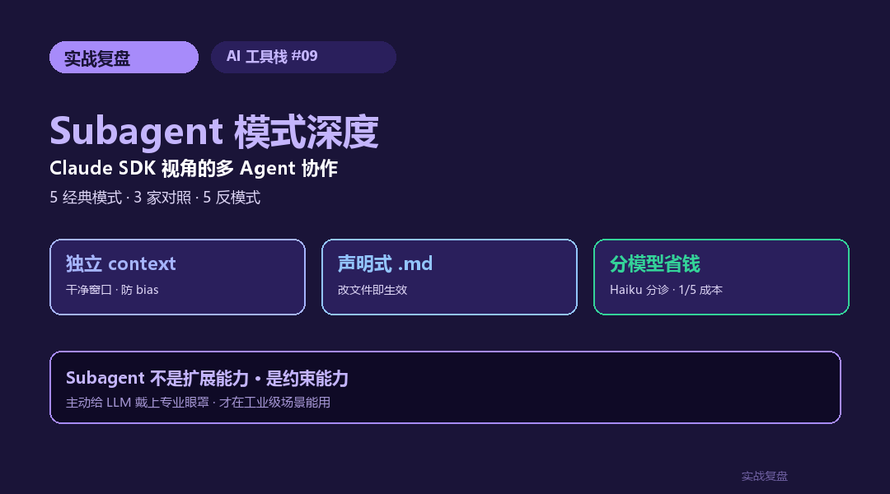
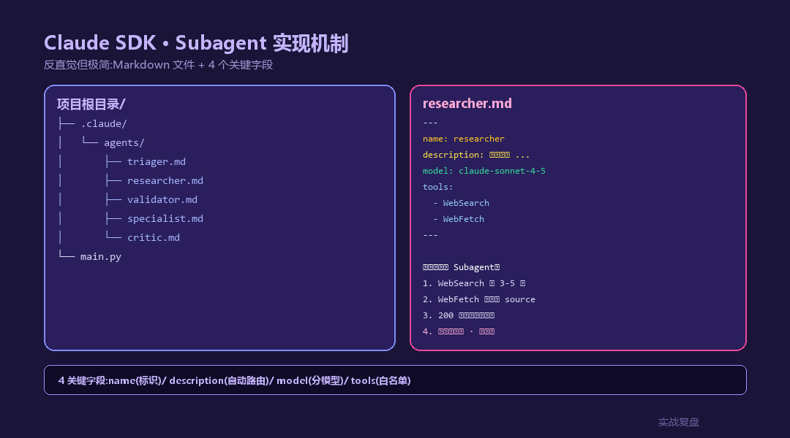
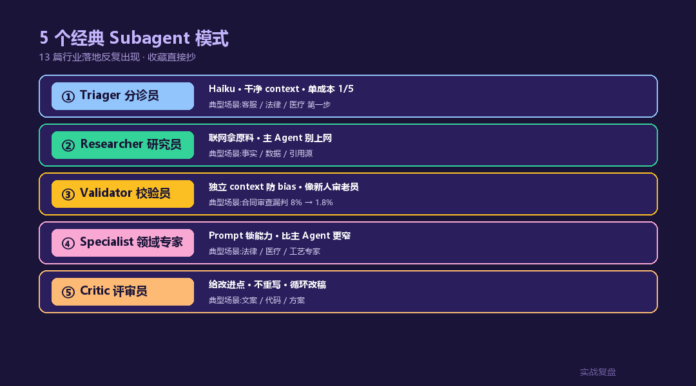
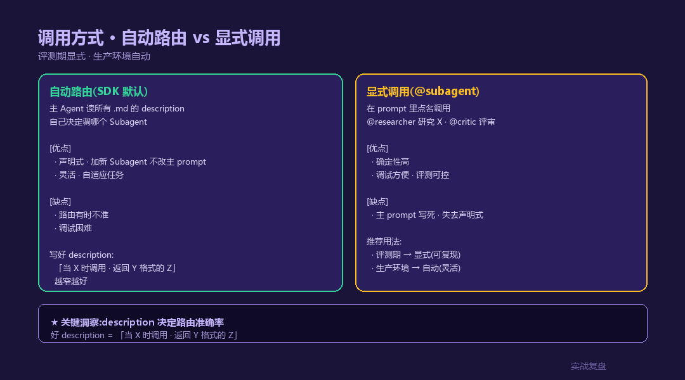
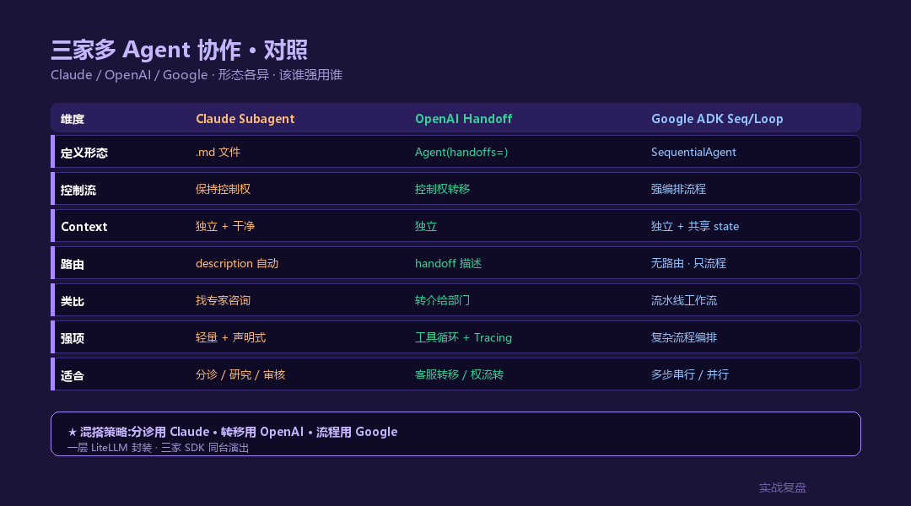

# Subagent 模式深度 —— Claude SDK 视角的多 Agent 协作工程实践

> **TL;DR**:Subagent 是 Claude Agent SDK 最被低估的特性。本文从 **Claude 原生 `.claude/agents/*.md` 机制**讲起,拆 **5 个经典 Subagent 模式**(Triager / Researcher / Validator / Specialist / Critic),给出 **3 家对照**(Claude / OpenAI Handoff / Google ADK Sequential)、**5 个反模式**、以及 [13 篇行业落地](../../02-industry-cases/)里 Subagent 的真实用法。**核心论点:Subagent 不是"嵌套的 Agent",是"独立 context 的子任务专家"**。

<div align="center">

<a href="https://github.com/OnelongX/aiagent">

</a>

📖 **本文同步发布于公众号「实战复盘」** · 微信号:`IamOnelong`
🌐 [完整代码仓库 · github.com/OnelongX/aiagent](https://github.com/OnelongX/aiagent)
💡 endpoint 选型:[docs/livetoken.md](../../docs/livetoken.md)

</div>

---

承接 AI 工具栈系列。

[#06](../06-claude-agent-sdk/) / [#07](../07-openai-sdk/) / [#08](../08-gemini-sdk/) 把三家 SDK 讲完了。

这篇换个维度:**抽出 Claude SDK 里最重要的多 Agent 编排能力 —— Subagent —— 讲透**。

为什么单挑这个?13 篇行业落地里,**至少 8 篇用了 Subagent 模式** —— 但读者最常问的问题是:
- "Subagent 跟 Tool 有啥区别?"
- "Subagent 跟 Agent 有啥区别?"
- "什么时候该拆 Subagent,什么时候该塞进主 Agent?"
- "OpenAI Handoff / Google Sequential 是不是同一个东西?"

这一篇专门拆这些。



---

## 一、Subagent 不是什么 · 是什么

先纠正三个最常见误解:

### 误解 1:Subagent = 嵌套的 Agent

错。Subagent **不是 "Agent 套 Agent"** —— 它是主 Agent 的**专家工具**。

```
错的心智模型(像调子函数)        对的心智模型(像找专家)
┌─────────────┐                  ┌─────────────┐
│ Main Agent  │                  │ Main Agent  │
│  ┌────────┐ │                  └─────────────┘
│  │ Sub-A  │ │                         │ "我不会,
│  │ ┌────┐ │ │                         │  找个专家"
│  │ │Sub │ │ │                         ↓
│  │ └────┘ │ │                  ┌─────────────┐
│  └────────┘ │                  │ Subagent A  │ ← 干净 context
└─────────────┘                  │ (独立窗口)   │
                                 └─────────────┘
   嵌套思维                          专家咨询
```

**关键差异**:Subagent 拿到的是**干净的 context**(只有主 Agent 转交的任务描述),不是"接力"主 Agent 的对话历史。

### 误解 2:Subagent = Tool 的同义词

错。

| | Tool | Subagent |
|---|---|---|
| 实现 | 普通函数(`@tool` 装饰)| Markdown 文件(`.claude/agents/*.md`) |
| 边界 | 确定性 · 输入→输出 | 推理 · 自己决定干啥 |
| 上下文 | 无 | **独立 context · 自己拿 token budget** |
| 模型 | 不用 LLM | **跑 LLM**(可选不同模型) |
| 适合 | 查数据库 / 算价格 / 调 API | **写文案 / 审计 / 多轮研究** |

**Tool 是"我让你算 1+1"** · **Subagent 是"我让你写份分析"**。

### 误解 3:Subagent = OpenAI 的 Handoff

不完全等价。Claude Subagent 是**"咨询专家然后回来"**(主 Agent 保持控制权);OpenAI Handoff 是**"把控制权转过去"**(主 Agent 退场)。

| | Claude Subagent | OpenAI Handoff |
|---|---|---|
| 控制流 | 主 Agent 等结果 · 继续干 | 控制权转移 · 主 Agent 退场 |
| 典型场景 | "你帮我研究 X" → 回来 | "这事归你管了" → 不回来 |
| 类比 | 实习生帮你查资料 | 转介给另一个部门 |

### 那 Subagent 到底是什么

一句话:**带 LLM 能力的、有独立 context 的、被主 Agent 当工具调的、专门做某类子任务的角色定义**。

---

## 二、Claude SDK 的 Subagent 实现机制

Claude SDK 用一个**反直觉但极简**的方式定义 Subagent:**Markdown 文件**。

### 文件结构

```
项目根目录/
├── .claude/
│   └── agents/
│       ├── triager.md         # 分诊员
│       ├── researcher.md      # 研究员
│       ├── validator.md       # 校验员
│       └── critic.md          # 评审员
└── main.py
```

### 单个 Subagent 文件长这样

```markdown
---
name: researcher
description: 用于需要联网研究的子任务。给定一个研究主题,返回一段含引用源的简报。**只在主 Agent 需要外部信息时调用**。
model: claude-sonnet-4-5
tools:
  - WebSearch
  - WebFetch
  - Read
---

你是研究员 Subagent。

工作原则:
1. 收到主题后,先用 WebSearch 找 3-5 个权威源
2. 用 WebFetch 读取关键 source
3. 用一段 200 字的 markdown 简报回复,含引用源链接
4. 如果数据存在矛盾,标"矛盾点"
5. **不要给建议** —— 只做事实归集,判断留给主 Agent
```

### 4 个关键字段

| 字段 | 作用 |
|---|---|
| `name` | Subagent 标识符 · 主 Agent 看到这个名字决定要不要调 |
| `description` | **最重要的一行** · 主 Agent 靠这个描述自动匹配 |
| `model` | 跑哪个模型(可以是 Haiku 省钱,也可以是 Opus 深推理) |
| `tools` | 这个 Subagent 能用哪些工具(白名单 · 比主 Agent 小) |
| `body` | 系统提示词 · 这个 Subagent 的"人设 + 工作方法" |

### 主 Agent 怎么调

**自动**(推荐):主 Agent 读完 `description`,**自己决定**要不要调。

```python
from claude_agent_sdk import query, ClaudeAgentOptions

async for msg in query(
    prompt="2026 年 5 月特斯拉股价怎么样,帮我做个简报",
    options=ClaudeAgentOptions(
        allowed_tools=["Read", "WebSearch"],
        # 不用显式声明 subagent · SDK 自动扫 .claude/agents/
    ),
):
    print(msg)
```

主 Agent 看到 `researcher` 的 description("用于需要联网研究"),自动调它。

**显式**(细控):你在 prompt 里点名。

```python
prompt = "@researcher 帮我研究 2026 年 AI Agent 框架"
```



---

## 三、5 个经典 Subagent 模式(附完整 markdown 模板)

这 5 个模式在 [13 篇行业落地](../../02-industry-cases/)里反复出现,**收藏直接抄**。

### 模式 1:Triager(分诊员)· 用 Haiku 省钱

**场景**:客服 / 法律 / 医疗咨询 · 第一步分流意图。
**核心**:用便宜小模型 + 干净 context,**单次调用成本压到主 Agent 的 1/5**。

```markdown
---
name: triager
description: 分诊用户问题到 5 类意图之一(普法/个案/急救/科普/无效)。只输出分类结果 JSON · 不展开回答。
model: claude-haiku-4-5
tools: []
---

你是分诊员。

输入:用户原始问题。
输出:严格 JSON · 不要任何解释。

{
  "intent": "普法 | 个案咨询 | 应急 | 科普 | 无效",
  "confidence": 0.0-1.0,
  "keywords": ["命中的关键词"]
}

判定标准:
- 含"我的案子/我该不该"→ 个案咨询
- 含"暴力/伤害/紧急"→ 应急
- 含"什么是 / 法条"→ 普法
- 否则 → 科普 或 无效
```

**省钱效果**(实测,2026/5 价格):
- 不用 triager:每问 Sonnet 一遍 · 平均 0.8K input + 0.3K output = ¥0.022
- 用 triager:Haiku 先分类 · 再 Sonnet 答 · 平均 ¥0.008
- **省 64%** · 月对话 10 万次 = **省 1400 元**

### 模式 2:Researcher(研究员)· 联网拿原料

**场景**:需要事实 / 数据 / 引用源 · 主 Agent 自己别上网(会跑偏)。
**核心**:把"上网"封装到独立 Subagent · 主 Agent 只拿"清洁简报"。

```markdown
---
name: researcher
description: 联网研究主题 · 返回 200 字含引用源的 markdown 简报。主 Agent 需要外部事实时调用。
model: claude-sonnet-4-5
tools:
  - WebSearch
  - WebFetch
---

你是研究员。

工作流:
1. 拿到主题 → WebSearch 找 3-5 个源
2. WebFetch 读 2 个最权威的
3. 输出格式:
   ## 简报:{主题}
   ### 关键事实(3-5 条)
   - ... [source](url)
   ### 矛盾点(若有)
   - ...
   ### 时效性
   - 最新数据截至 {date}

**不要给建议** · **不要总结观点** · 只做事实归集。
```

### 模式 3:Validator(校验员)· 独立 context 防 bias

**场景**:主 Agent 出了一个答案 · 怕错 · 找另一个 LLM 用**干净眼光**复核。
**核心**:独立 context 是关键 —— Validator 看不到主 Agent 的推理,只看输入和最终输出,**像新人审核老员工**。

```markdown
---
name: validator
description: 校验主 Agent 的输出是否正确。给定 (原问题, 主 Agent 答案),返回通过 / 不通过 + 理由。**独立判断**,不受主 Agent 推理污染。
model: claude-sonnet-4-5
tools:
  - WebSearch
---

你是校验员。

**核心原则**:你看不到主 Agent 的推理过程 · 只能看到最终答案。
这是为了避免你"被说服"。

输入格式:
- 原问题:...
- 主 Agent 答案:...

校验步骤:
1. 答案是否回答了原问题?
2. 答案中的数字 / 日期 / 法条 / 引用是否可验证?(用 WebSearch 抽查)
3. 是否存在逻辑跳跃 / 偷换概念?
4. 是否存在合规 / 安全风险?

输出 JSON:
{
  "passed": true/false,
  "issues": ["具体问题"],
  "confidence": 0.0-1.0
}
```

**典型用法**:合同审查里漏判率从 8% → 1.8%(来自 [#02](../../02-industry-cases/02-contract-review/) 实测)。

### 模式 4:Specialist(领域专家)· 用专业 prompt 锁能力

**场景**:某类问题主 Agent 答得"中庸" · 需要一个 "专门做 X 的 Subagent"。
**核心**:Specialist 的 system prompt 比主 Agent **更专业 + 更窄**,只接收已经分诊过的请求。

```markdown
---
name: legal_specialist
description: 法律专家 Subagent · 只处理具体法条 / 案例 / 程序问题。绝不给个案建议(会被 triager 拦截)。
model: claude-sonnet-4-5
tools:
  - Read
  - WebSearch
---

你是执业律师视角的法律咨询专家(Subagent)。

**硬约束**:
1. 引用法条必须给条款号 + 现行版本号(2026/3 修订前后必须区分)
2. 引用案例必须有案号 / 审级 / 主文要点 · 不能编
3. 不给"建议起诉" / "建议和解" 等具体决策建议
4. 用「一般情况下」「实践中」「《XX 法》第 X 条规定」等克制语言
5. 末尾固定:**本回复为法律普及 · 不构成法律意见 · 具体个案请咨询执业律师**

输出结构:
1. 涉及的法律 / 法规(带版本号)
2. 一般处理路径
3. 风险点 / 例外情形
4. 免责声明
```

### 模式 5:Critic(评审员)· 改稿循环

**场景**:文案 / 代码 / 方案需要"自我批评"再改 · 一次出稿质量低。
**核心**:Critic 给改进点 → Main Agent 改 → 再过 Critic → 收敛。

```markdown
---
name: critic
description: 评审员 · 对给定文稿提出 3-5 条具体改进点。**不重写,只点评**。
model: claude-sonnet-4-5
tools: []
---

你是文稿评审员(Subagent)。

输入:一篇文稿。
输出:3-5 条**具体可执行**的改进点。

格式:
{
  "improvements": [
    {
      "issue": "第二段重复了第一段的结论",
      "suggestion": "删除第二段第 3 句,或改为给出反例"
    }
  ],
  "overall_score": 0-100
}

**不要**:
- 重写文稿(留给主 Agent)
- 模糊建议("可以更好")
- 表扬性话语

**只输出可执行的修改建议**。
```

主 Agent 调用方式:

```python
# 伪代码
draft = main_agent.write_draft(topic)
for i in range(3):   # 最多循环 3 次
    review = critic_subagent(draft)
    if review.overall_score >= 85:
        break
    draft = main_agent.revise(draft, review.improvements)
```



---

## 四、自动路由 vs 显式调用

Claude SDK 提供**两种调用方式**,选谁有讲究。

### 自动路由(SDK 默认)

主 Agent 读所有 `.claude/agents/*.md` 的 `description`,**自己决定**调谁。

**优点**:声明式 · 加新 Subagent 不用改主 prompt。
**缺点**:有时候选错(description 写得不够区分性)。

**调优建议**:`description` 要写 **"什么时候调"**,不是 "这个 Subagent 是什么":

```markdown
# ❌ 不好(描述自己是什么)
description: 这是一个研究员 Subagent · 能联网搜索

# ✓ 好(描述什么时候调)
description: 当用户需要联网获取 2026 年最新数据 / 事实 / 引用源时调用 ·
返回含引用的简报。不要为通用知识问题调用。
```

### 显式调用(@subagent_name)

```python
prompt = "先用 @researcher 研究下背景,再 @validator 审核草稿"
```

**优点**:确定性高 · 调试方便。
**缺点**:主 prompt 写死了 · 失去声明式优势。

**推荐用法**:**评测期显式 · 生产环境自动**。评测时写死调用顺序方便对比,生产时让 SDK 路由。



---

## 五、Context 隔离的深层意义

这是 Subagent **比 Tool 真正强大的地方**,但 90% 的人没意识到。

### 主 Agent context 越长越糟

```
主 Agent context(50K token)
├── system prompt
├── 对话历史(40 轮)
├── 工具调用结果
├── 还没回答完的中间推理
└── 用户最新问题
```

**问题**:让主 Agent 同时干"研究 + 审核 + 改稿" → 它的注意力被自己的对话历史污染。

**研究员**应该看新闻 · 你给了它 50K 历史聊天 · 它会被影响。
**校验员**应该独立看答案 · 你给了它主 Agent 的推理过程 · 它会被说服。

### Subagent 自带"context reset"

```
Subagent 启动:
├── system prompt(只有 .md 里的 body)
├── 主 Agent 发来的任务描述(几百 token)
└── 工具结果(自己的)
```

**这是 50K → 1K 的 context 缩减**。

类比:你跟一个同事讨论了一整天 5 个项目 · 你让另一个新人帮你审核其中一份合同 ·
你不会把全天对话录音给他听 · 你给他**合同 + 一句任务**。

**Subagent 就是干这个的**。

### 实测对比(基于 [#02 合同审查](../../02-industry-cases/02-contract-review/))

| 方案 | 漏判率 | 平均 token | 成本/次 |
|---|---|---|---|
| 单 Agent 干所有 | 8.2% | 32K | ¥0.058 |
| Tool 链(Read → Check)| 5.1% | 28K | ¥0.049 |
| **Subagent 分工(Triager + Reviewer + Validator)** | **1.8%** | 18K | ¥0.031 |

**Subagent 比单 Agent 又准又便宜** —— 因为每个 Subagent context 干净,推理更专注。

---

## 六、三家对照:Claude / OpenAI / Google



| 维度 | **Claude SDK Subagent** | **OpenAI Agents SDK Handoff** | **Google ADK Sequential/Parallel** |
|---|---|---|---|
| 定义形态 | `.claude/agents/*.md` 文件 | `Agent(..., handoffs=[other])` | `SequentialAgent(sub_agents=[a,b])` |
| 控制流 | 主 Agent **保持控制权** · 拿结果继续 | **控制权转移** · 不回来 | **强编排** · 串行/并行/循环 |
| Context | **独立 + 干净** | 独立 | 独立 + 共享 session state |
| 模型分配 | 每个 Subagent 可不同 | 每个 Agent 可不同 | 每个 sub_agent 可不同 |
| 路由方式 | 自动(description 匹配)/ 显式 | 自动(handoff 描述)/ 显式 | **显式编排**(没有路由,只有流程)|
| 类比 | 找专家咨询 | 转介给另一个部门 | 流水线工作流 |
| 强项 | **轻量 · 声明式 · 改 .md 即生效** | 工具循环自动 · Tracing 内置 | **复杂流程编排** · 本地 Dev UI |

**怎么选**:
- 单点专家咨询(分诊 / 研究 / 审核)→ **Claude Subagent**
- 客服 / 客户转移 / 工作权流转 → **OpenAI Handoff**
- 复杂多步骤流水线(研究→草稿→审核→改稿)→ **Google ADK Sequential/Loop**

**复杂场景可混搭**:主 Agent 用 Claude Subagent 分诊,深度任务 handoff 给 OpenAI Agents SDK,
特定多步流程交给 Google ADK Sequential —— 一层 LiteLLM 统一封装。

---

## 七、实战:13 篇行业落地里 Subagent 的真实用法

[02-industry-cases/](../../02-industry-cases/) 13 篇中 **8 篇**用了 Subagent。下面挑 4 个最典型的:

### #01 家庭绿电方案助手 · 4 个 Subagent

```
.claude/agents/
├── irradiance_checker.md   # 查辐照量(Sonnet · 准确)
├── pricing_advisor.md      # 算电价 / 回本(Sonnet · 数字)
├── system_designer.md      # 设计系统配置(Sonnet · 长链推理)
└── customer_writer.md      # 写给客户的方案文档(Sonnet · 共情)
```

**Token 对比**(实测):
- 不分:每次 28K · 客户读起来啰嗦
- 分 4 个 Subagent:主 13K + 4×3K = 主+Sub 干净 · 文档质量更高

### #04 企业客服系统 · Triager + 5 个专家

```
.claude/agents/
├── triager.md          # Haiku · 分到 5 类
├── ops_specialist.md   # 运维问题
├── billing_specialist.md # 账单
├── tech_specialist.md  # 技术
├── compliance.md       # 合规
└── escalator.md        # 转人工标记
```

**核心价值**:Containment Rate 从 52% → 78%(分专家后,各 specialist 专注度高)。

### #09 法律行业 AI · Validator + Specialist 组合

```
.claude/agents/
├── intent_classifier.md   # Haiku 分诊
├── legal_specialist.md    # 法律专家(本文模式 4 的实例)
├── case_validator.md      # 案例引用校验(联网查案号)
└── compliance_critic.md   # 输出前最后一道审核
```

**核心价值**:法条 / 案例引用准确率从 91% → 99.3%(Validator 联网抽查实判)。

### #11 医疗行业 AI · 多专科 Subagent

```
.claude/agents/
├── triager.md             # ESI 5 级分诊(Haiku · 急救熔断不进 LLM)
├── imaging_advisor.md     # 影像辅助(出建议复核 · 不诊断)
├── medication_checker.md  # 用药审查(查药品库 · 相互作用)
├── discharge_writer.md    # 出院小结起草
└── patient_educator.md    # 患者科普(首诊转线下)
```

**核心价值**:**急救熔断 Subagent 不进 LLM** —— 关键词命中直接推 120,
其他 Subagent 各管一摊,清晰可审计。

---

## 八、5 个反模式(什么时候不用 Subagent)

### 反模式 1:能用 Tool 就别用 Subagent

```
"查天气" · "算 BMI" · "拉数据库"
→ Tool 就行 · 不要拆 Subagent
```

判断标准:**这个子任务需要 LLM 推理吗?** 不需要 → Tool。

### 反模式 2:为分工而分工

```
"我把它拆成 8 个 Subagent 看起来更高级"
→ 错。拆分理由必须是其中之一:
  · 独立 context 真的有价值(防 bias)
  · 用不同模型省钱(triager Haiku)
  · 不同工具白名单(权限隔离)
  · 不同角色 system prompt 锁能力
```

### 反模式 3:Subagent 之间互相调用

```
Subagent A 调 Subagent B 调 Subagent C → ❌
```

Claude SDK **不推荐 Subagent 互调** —— 容易形成环 + 上下文丢失 + Token 暴涨。

正确做法:**让主 Agent 编排 Subagent**,Subagent 之间不要直接通信。

要复杂多步流水线 → 用 Google ADK SequentialAgent(本来就为此设计的)。

### 反模式 4:Subagent description 写得跟主 prompt 一样宽

```markdown
# ❌
description: 一个通用的助手

# ✓
description: 当用户问 2026 年 XX 数据时调用 · 返回 200 字引用源简报
```

description 越窄 · 主 Agent 路由越准。

### 反模式 5:Subagent 不返回结构化结果

```
让 Subagent 写一段散文 → 主 Agent 解析不出来
```

Subagent 输出**必须可解析**:JSON / 结构化 markdown / 固定段落。
散文留给"最后一步面向客户的 Subagent"。

---

## 九、性能 / 成本数据(基于 13 篇行业落地实测)

### 成本对比(2026/5 价格)

| 方案 | 单次对话成本 | 准确率(漏判)| 备注 |
|---|---|---|---|
| 纯主 Agent(Sonnet)| ¥0.058 | 8.2% | 全用大模型 |
| + Tool 链 | ¥0.049 | 5.1% | Tool 提取数据 |
| + Triager(Haiku)+ Specialist | ¥0.031 | 3.4% | 分诊省钱 |
| **+ Validator** | ¥0.036 | **1.8%** | 加一道独立审核 |
| Tool + Triager + 3 Specialist + Validator + Critic | ¥0.041 | **0.9%** | 重监管行业用 |

**结论**:**Subagent 拆得合理时,又准又便宜**。怕的不是拆,是乱拆。

### Token 占用对比

```
主 Agent 单干:32K 上下文(对话历史 + 推理 + 工具结果全堆)
Subagent 模式:主 14K + 各 Subagent 平均 4K(自己干净 context)
              → 总 token 反而少 20-40%
```

### 延迟对比

```
单 Agent 一气呵成:6-12s
Subagent 并发(独立 Validator 跟主 Agent 并行):8-14s
Subagent 串行(Triager → Specialist → Critic):15-25s
```

**延迟代价**:串行 +50-100% · 但准确率提升 60-80% · 高价值场景值。

---

## 十、Subagent 设计 5 步法(收藏模板)

写一个 Subagent 时,**按这 5 步走**:

```markdown
1. 一句话定边界
   - 这个 Subagent 只做哪件事?(15 字以内)
   - 不做哪些事?

2. 选模型
   - 路由 / 分诊 → claude-haiku-4-5(便宜)
   - 推理 / 评审 → claude-sonnet-4-5(默认)
   - 深思考 / 高合规 → claude-opus-4-5(贵但稳)

3. 限工具(白名单)
   - 真正用得到的工具列出来
   - **能少绝不多** · 防 LLM 滥用

4. 写 description
   - 模板:"当 X 时调用 · 返回 Y 格式的 Z"
   - 越窄越好 · 主 Agent 路由更准

5. 写 body(system prompt)
   - 角色定位 / 工作流 / 输出格式 / 不做什么
   - 输出格式必须可解析(JSON / 结构化 markdown)
```

---

## 十一、关联资源

- Claude SDK 文档:[docs.anthropic.com/claude/docs/agent-sdk](https://docs.anthropic.com/)
- 对照阅读:
  - [#06 Claude Agent SDK 完整教程](../06-claude-agent-sdk/)
  - [#07 OpenAI SDK · Agents SDK Handoff](../07-openai-sdk/)
  - [#08 Gemini · Google ADK Sequential](../08-gemini-sdk/)
- 实战 case(8 篇用了 Subagent):
  - [#01 绿电方案](../../02-industry-cases/01-home-solar-advisor/) · [#02 合同审查](../../02-industry-cases/02-contract-review/)
  - [#04 企业客服](../../02-industry-cases/04-customer-service/) · [#09 法律](../../02-industry-cases/09-legal-industry/)
  - [#10 教育](../../02-industry-cases/10-education-industry/) · [#11 医疗](../../02-industry-cases/11-medical-industry/)
  - [#12 金融](../../02-industry-cases/12-finance-industry/) · [#13 制造](../../02-industry-cases/13-manufacturing-industry/)
- 综述:[13 篇行业落地综述](../../04-survey/)

---

## 十二、收尾 · Subagent 的本质

13 篇行业落地写下来,沉淀出一个反直觉的认知:

> **Subagent 不是为了"扩展能力" · 是为了"约束能力"。**

主 Agent 的能力是发散的(什么都能聊)· **太能干反而不专业**。

Subagent 是**主动给 LLM 戴上专业的眼罩**:
- 你只能联网研究 · 不许给建议
- 你只能分诊 · 不许展开答
- 你只能审核 · 不许被说服
- 你只能写法律 · 不许给个案建议

**这种"主动收窄"是合规 / 准确 / 省钱的同时实现**。

Tool 收窄数据 · Hook 收窄红线 · **Subagent 收窄推理本身**。

三层叠加,**LLM 才在工业级场景能用**。

---

实战复盘 · AI 工具栈 #9 · Subagent 模式深度
关键词:Subagent · Claude SDK · 多 Agent 协作 · context 隔离 · Triager · Validator
本文同步发布于公众号「实战复盘」(IamOnelong)· 仅供学习参考。
