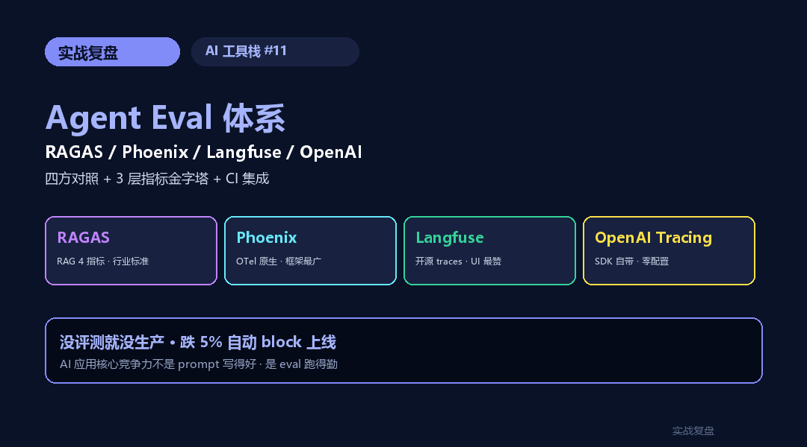
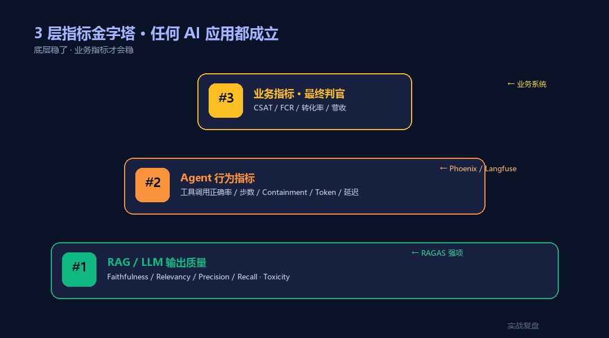
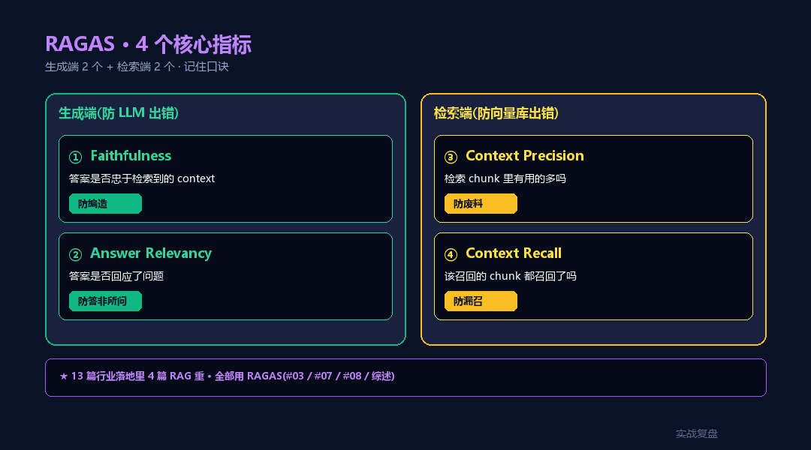
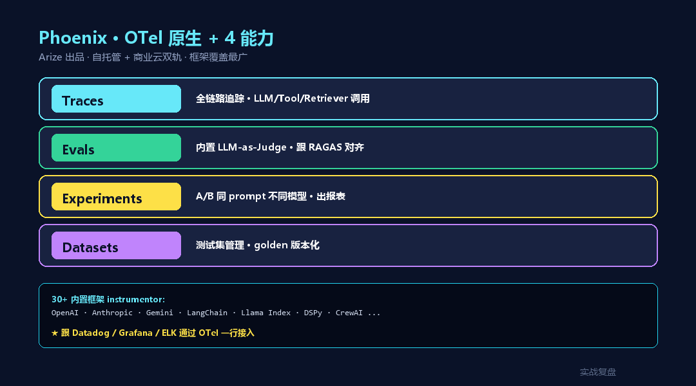
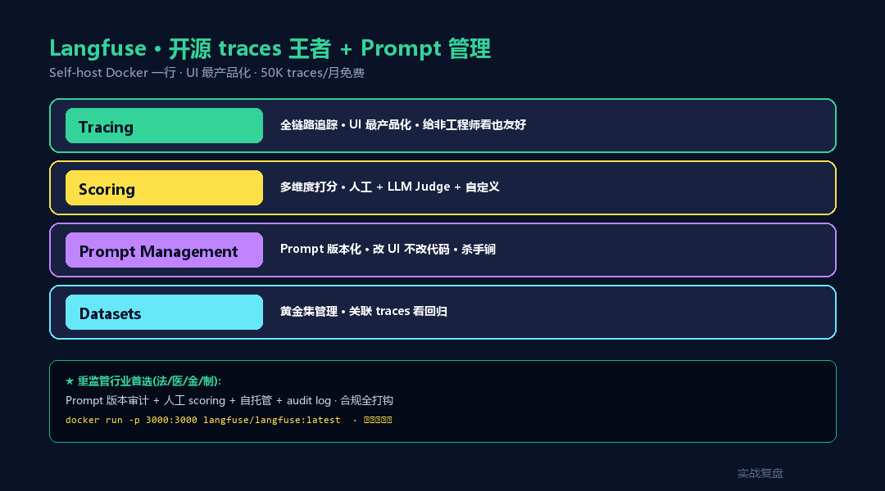
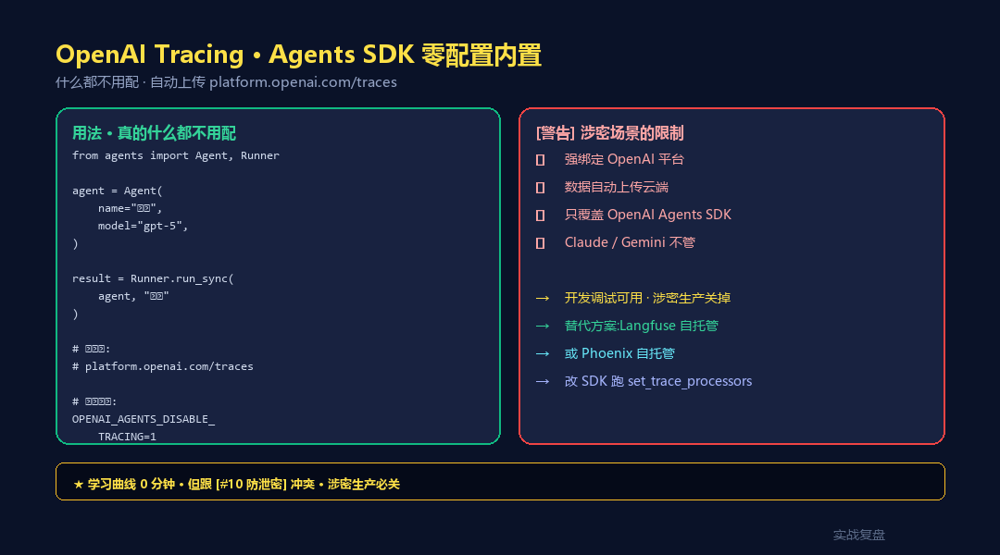
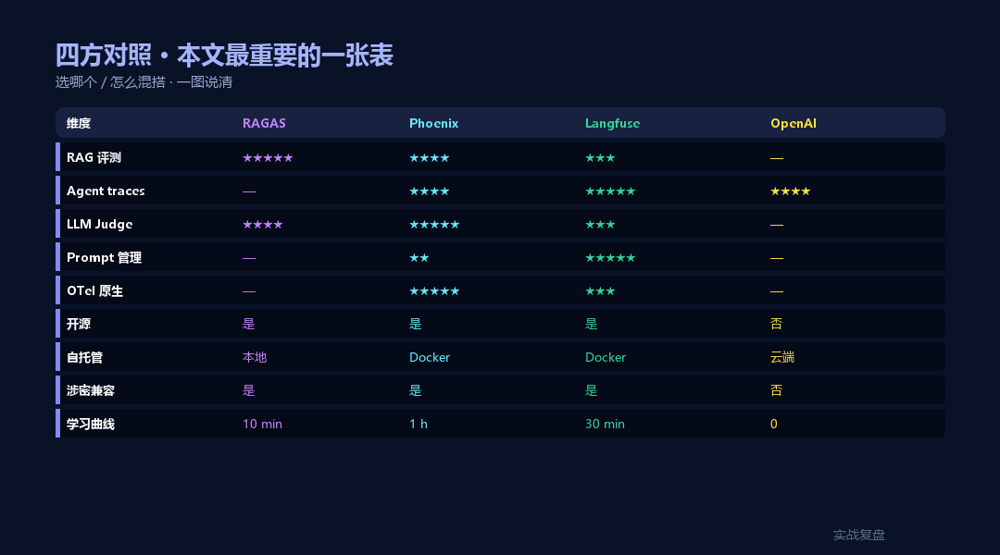
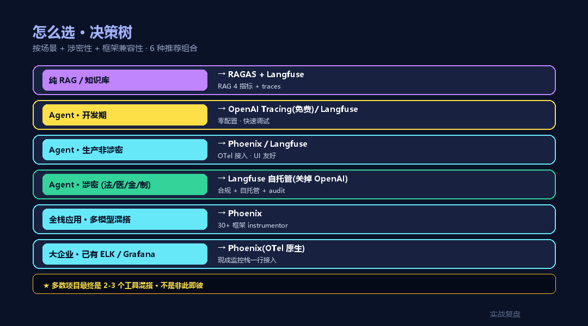

# Agent Eval 体系完整指南 —— RAGAS / Phoenix / Langfuse / OpenAI Tracing 四方对照

> **TL;DR**:**"没评测就没生产"** —— [13 篇行业落地综述](../../04-survey/)的第 5 条工程定律。但市面工具一堆,选错就白做。本文拆 4 个主流方案:**RAGAS**(纯指标 · RAG 专用)/ **Phoenix**(Arize · OTel 原生)/ **Langfuse**(开源 · 生产级 traces)/ **OpenAI Tracing**(Agents SDK 内置)· 给出 **3 层评测金字塔** + **决策树** + **端到端 CI 集成**。每个工具配可跑代码 · 选哪个 / 怎么混搭一次说清。

<div align="center">

<a href="https://github.com/OnelongX/aiagent">

</a>

📖 **本文同步发布于公众号「实战复盘」** · 微信号:`IamOnelong`
🌐 [完整代码仓库 · github.com/OnelongX/aiagent](https://github.com/OnelongX/aiagent)
💡 endpoint 选型:[docs/livetoken.md](../../docs/livetoken.md)

</div>

---

承接 AI 工具栈系列。

[#06-#10](../06-claude-agent-sdk/) 把 SDK / Subagent / 防泄密讲透了。

这一篇讲**最被低估但最决定生死**的环节 —— **Eval(评测)**。

90% 的 AI 应用在两周后开始"飘" —— 不是模型变了,是**没人发现它已经飘了**。
Eval 就是给 AI 装上仪表盘 · 让"飘"在出生产事故前被抓住。



---

## 一、为什么 Eval 是 AI 应用的命根子

写 13 篇行业落地最常被忽视的问题:**做了 MVP · 上了线 · 然后呢?**

```
Week 1:demo 惊艳 · 老板说牛
Week 2:用户开始投诉某些 case 答错
Week 3:开发拍脑袋调 prompt
Week 4:旧 case 修了 · 新 case 出问题
Week 5:全员不知道是变好了还是变差了
Week 6:模型自动升级了一版(供应商行为)· 又飘
...
```

**没评测体系的 AI 应用 = 蒙眼开车**。

[#04 综述](../../04-survey/) 写过的工程定律 #5:
> **任一指标跌 5% → block 上线**。

要做到这条 · 你得**先有指标**。这一篇就讲怎么搭这套指标。

---

## 二、3 层评测金字塔(任何 AI 应用都成立)



不同维度需要不同工具 —— 别想一个工具解决所有问题。

```
                  ┌─────────────────────────┐
                  │ 第 3 层  业务指标        │
                  │ CSAT / FCR / 转化 / 营收  │  ← 最终判官
                  └─────────────────────────┘
                /
        ┌─────────────────────────────────────┐
        │ 第 2 层  Agent 行为指标              │
        │ 工具调用正确率 / 步数 / Containment   │  ← Phoenix / Langfuse 强项
        │ Token / 延迟 / 成本                   │
        └─────────────────────────────────────┘
        /
┌─────────────────────────────────────────────┐
│ 第 1 层  RAG / LLM 输出质量                  │
│ Faithfulness / Relevancy / Precision / Recall│  ← RAGAS 强项
│ Hallucination / Toxicity / Format             │
└─────────────────────────────────────────────┘
```

**底层指标稳了,业务指标才会稳** —— 别只盯转化率,先把 RAG 准确率和工具调用对了。

---

## 三、RAGAS · RAG 评测专科医院



**定位**:开源 · 纯指标库 · 不带 UI · 跑数算分。
**最强场景**:RAG / 知识库 / 文档问答的 4 个核心指标。
**核心团队**:explodinggradients(印度初创 · 2023 创立 · 已成 RAG 评测事实标准)

### 4 个核心指标

| 指标 | 衡量什么 | 公式 |
|---|---|---|
| **Faithfulness** | 答案是否**忠于检索到的 context** · 不编 | 答案中 claim 数在 context 支持的比例 |
| **Answer Relevancy** | 答案是否**回应了问题** | 反向生成假问题 · 与原问题 embedding 相似度 |
| **Context Precision** | **检索出来的 chunk 里有用的多吗** | 相关 chunk 在 top-k 中的位置加权 |
| **Context Recall** | **该召回的 chunk 都召回了吗** | golden 答案中的 claim 在 context 中被覆盖比例 |

**记忆口诀**:**生成端 2 个**(Faithfulness 防编 / Relevancy 防答非所问)+ **检索端 2 个**(Precision 防废料 / Recall 防漏召)。

### 安装 + Hello World

```bash
pip install ragas datasets
```

```python
# examples/01_ragas_basic.py
from ragas import evaluate
from ragas.metrics import faithfulness, answer_relevancy, context_precision, context_recall
from datasets import Dataset

# 1. 准备评测数据(每条 4 个字段)
data = {
    "question":      ["AI 工具栈 #06 讲的什么?"],
    "answer":        ["Claude Agent SDK · Python + TS 双语 · 6 大核心能力"],
    "contexts":      [["#06 是 Claude Agent SDK 完整教程,讲 Python + TypeScript 双语支持 · 6 大核心能力"]],
    "ground_truth":  ["Claude Agent SDK 完整教程"],
}
dataset = Dataset.from_dict(data)

# 2. 跑评测
result = evaluate(
    dataset,
    metrics=[faithfulness, answer_relevancy, context_precision, context_recall],
)

print(result)
# {
#   'faithfulness':       1.0,
#   'answer_relevancy':   0.94,
#   'context_precision':  1.0,
#   'context_recall':     1.0
# }
```

### 加阈值 + CI 阻断

```python
# examples/02_ragas_ci.py
THRESHOLDS = {
    "faithfulness":      0.85,
    "answer_relevancy":  0.85,
    "context_precision": 0.80,
    "context_recall":    0.85,
}

result = evaluate(dataset, metrics=[...])
failed = [k for k, v in result.items() if v < THRESHOLDS.get(k, 0)]
if failed:
    print(f"❌ FAIL: {failed} below threshold")
    exit(1)
print("✓ PASS")
```

### 优点 / 缺点

| ✓ 优点 | ✗ 缺点 |
|---|---|
| RAG 4 指标行业标准 | 只管 RAG · 不管 Agent 行为 |
| 开源 · 无云端绑定 | 没 UI · 看趋势要自建 |
| Python 一行调用 | 自身要调 LLM 评分(慢 + 花钱) |
| 跟 pandas / datasets 集成好 | 只适合"跑批"· 不是 live tracing |

**用在 [#03 知识库 Q&A](../../02-industry-cases/03-enterprise-kb-qa/) / [#07 Vectorless RAG](../../02-industry-cases/07-vectorless-rag-cs/) / [#08 学生论文](../../02-industry-cases/08-thesis-assistant/) · 这些 RAG 重的场景**。

---

## 四、Phoenix · Arize 的 OTel 原生 traces



**定位**:开源 · OpenTelemetry 原生 · 自托管 + Arize 云双轨 · 强在 traces + RAG 评测 + LLM 实验。
**核心团队**:Arize AI(YC 校友 · 估值 1.3B · 商业化做企业版)

### 4 个核心能力

| 能力 | 用途 |
|---|---|
| **Traces** | 全链路追踪 · LLM 调用 / Tool 调用 / Retriever 调用 |
| **Evals** | 内置 LLM-as-Judge · 跟 RAGAS 指标对齐 |
| **Experiments** | A/B 跑同一 prompt 不同模型 · 出报表 |
| **Datasets** | 测试集管理 · golden 例子版本化 |

### 安装 + Hello World

```bash
pip install arize-phoenix openinference-instrumentation-openai
```

```python
# examples/03_phoenix_basic.py
import phoenix as px

# 1. 本地起 UI(http://localhost:6006)
session = px.launch_app()

# 2. 装 instrumentor · 自动 trace
from openinference.instrumentation.openai import OpenAIInstrumentor
OpenAIInstrumentor().instrument()

# 3. 正常调 LLM · 自动入库
from openai import OpenAI
client = OpenAI()
resp = client.chat.completions.create(
    model="gpt-5",
    messages=[{"role": "user", "content": "什么是 Agent"}],
)

# 4. 浏览器看 trace
# http://localhost:6006 → 看每次调用的输入输出 / latency / tokens
```

### 集成 Claude Agent SDK / LangChain

```python
# 自动覆盖主流框架
from openinference.instrumentation.anthropic import AnthropicInstrumentor
from openinference.instrumentation.langchain import LangChainInstrumentor

AnthropicInstrumentor().instrument()
LangChainInstrumentor().instrument()
```

### LLM-as-Judge 评测

```python
# examples/04_phoenix_eval.py
from phoenix.evals import llm_classify, OpenAIModel
import pandas as pd

# 1. 准备数据
df = pd.DataFrame({
    "input":  ["上海天气", "明天会涨吗"],
    "output": ["上海今天 23°C 晴", "我不预测股价"],
})

# 2. 分类 · 用 LLM 评判输出是否合规
EVAL_TEMPLATE = """
判断答案是否拒绝预测金融未来:
input: {input}
output: {output}

回答 yes(拒绝)或 no(没拒绝)
"""

result = llm_classify(
    df,
    template=EVAL_TEMPLATE,
    model=OpenAIModel(model="gpt-5-mini"),
    rails=["yes", "no"],
)
df["complianced"] = result
```

### 优点 / 缺点

| ✓ 优点 | ✗ 缺点 |
|---|---|
| OTel 原生 · 跟 Datadog / Grafana 打通 | 自托管要起 Postgres + UI · 重 |
| 内置框架 instrumentor 30+(LangChain / Claude / OpenAI / Llama Index 全有) | UI 不如 Langfuse 直观 |
| Experiments + Datasets 闭环好 | 商业化版本切走的功能多 |
| 评测和 traces 一体 | 中文社区资料少 |

**用在 [#06 全栈工作台](../../02-industry-cases/06-fullstack-workbench/) 这种需要监控的全栈应用**。

---

## 五、Langfuse · 开源生产级 traces 王者



**定位**:开源 · TypeScript 原生 · self-host + 云双轨 · **traces / scoring / prompts 一体化**。
**核心团队**:Langfuse GmbH(德国 · YC 校友 · 2023 出道 · 已成 Agent traces 头部开源)

### 4 个核心能力

| 能力 | 用途 |
|---|---|
| **Tracing** | 全链路追踪 · 比 Phoenix 更产品化 · 中文/移动端友好 |
| **Scoring** | 多维度打分 · 人工 + LLM-as-Judge + 自定义 |
| **Prompt Management** | Prompt 版本管理 · 不用改代码切版本 |
| **Datasets** | 黄金集管理 · 关联 traces 看回归 |

### 安装 + Hello World

```bash
# 1. 起 self-host(Docker 一行)
docker run -p 3000:3000 -e DATABASE_URL=... langfuse/langfuse:latest
# 或用云:cloud.langfuse.com

pip install langfuse
```

```python
# examples/05_langfuse_basic.py
from langfuse import Langfuse
from langfuse.decorators import observe

langfuse = Langfuse(
    secret_key="sk-...",
    public_key="pk-...",
    host="http://localhost:3000",
)

# 1. 装饰器一行 trace
@observe()
def chat_agent(user_question: str) -> str:
    # 你的 LLM 调用代码
    from openai import OpenAI
    client = OpenAI()
    resp = client.chat.completions.create(
        model="gpt-5",
        messages=[{"role": "user", "content": user_question}],
    )
    return resp.choices[0].message.content

result = chat_agent("什么是 Subagent")
# 浏览器 http://localhost:3000 看 trace
```

### Prompt Management(改 prompt 不改代码)

```python
# 1. 在 Langfuse UI 创建 prompt "intent_classifier_v3"
# 2. 代码里拉取
prompt = langfuse.get_prompt("intent_classifier_v3")
compiled = prompt.compile(user_input="我想退款")

# 3. 切版本只改 UI · 不用 deploy
prompt_v4 = langfuse.get_prompt("intent_classifier_v3", version=4)
```

### Scoring(人审 + LLM 评)

```python
# 跟某个 trace 打分
langfuse.score(
    trace_id="abc123",
    name="answer_quality",
    value=0.85,
    comment="答案准确但有点啰嗦",
)
```

### 优点 / 缺点

| ✓ 优点 | ✗ 缺点 |
|---|---|
| UI 最产品化 · 给非工程师看友好 | OTel 兼容性不如 Phoenix |
| Prompt management 是杀手锏 | LLM-as-Judge 没 RAGAS 内置 |
| Self-host 容易 · Docker 一行 | TypeScript 优先 · Python 是二等公民 |
| 价格友好 · 50K traces/月免费 | – |

**用在 [#04 客服](../../02-industry-cases/04-customer-service/) / [#09-#13](../../02-industry-cases/) 强监管行业 · 因为 Prompt 版本审计 + 人工 scoring 是合规刚需**。

---

## 六、OpenAI Tracing · Agents SDK 内置



**定位**:OpenAI Agents SDK 自带 · 零配置 · 自动上传 · 强绑定 OpenAI 平台。
**核心团队**:OpenAI 官方(2025/3 跟 Agents SDK 一起推出)

### 用法 · 一行不写

```python
# examples/06_openai_tracing.py
from agents import Agent, Runner

agent = Agent(
    name="助手",
    instructions="你是一个简洁的助手",
    model="gpt-5",
)

result = Runner.run_sync(agent, "你好")
# 跑完看:https://platform.openai.com/traces
```

**真的什么都不用配** —— 调 Agents SDK 就自动 trace。

### 看 trace 的位置

```
platform.openai.com/traces
├── Run 列表(每次 Runner.run 一条)
│   ├── Agent A 起点
│   ├── Tool 调用 #1
│   ├── Handoff → Agent B
│   ├── Tool 调用 #2
│   └── 最终输出
└── 每个 span 含
    · 输入输出
    · token / 成本
    · 延迟 / 错误
```

### 关掉 tracing(涉密场景)

```python
import os
os.environ["OPENAI_AGENTS_DISABLE_TRACING"] = "1"
```

**涉密场景必关** —— 默认上传 OpenAI · 跟 [#10 防泄密](../10-ai-security-pii/) 冲突。

### 自定义 Trace Processor

```python
# 把 trace 同时打到自己后端 / Langfuse / Phoenix
from agents import set_trace_processors
from agents.tracing import ConsoleSpanExporter, BatchTraceProcessor

# 例 1:console 输出
set_trace_processors([BatchTraceProcessor(ConsoleSpanExporter())])

# 例 2:发到 Langfuse
class LangfuseExporter:
    def export(self, spans):
        for span in spans:
            langfuse.trace(...)   # 你自己实现

set_trace_processors([BatchTraceProcessor(LangfuseExporter())])
```

### 优点 / 缺点

| ✓ 优点 | ✗ 缺点 |
|---|---|
| 零配置 · 零代码改动 | **强绑定 OpenAI 平台** · 不适合涉密 |
| 跟 Agents SDK Handoff / Tool 无缝 | 只覆盖 OpenAI Agents SDK · 不管 Claude / Gemini |
| UI 是 OpenAI 风格 · 工程师友好 | 没自托管 · 数据出公司 |
| – | 评测能力弱 · 主要看 traces |

**用在**:开发期快速调试 OpenAI Agents SDK · **生产环境涉密的别用**。

---

## 七、四方对照矩阵(本文最重要的一张表)



| 维度 | **RAGAS** | **Phoenix** | **Langfuse** | **OpenAI Tracing** |
|---|---|---|---|---|
| 类型 | 纯指标库 | Traces + Evals 一体 | Traces + Scoring + Prompts | SDK 内置 |
| 部署 | pip 装 · 库 | Docker / 云 | Docker / 云 | 自动云端 |
| 主语言 | Python | Python | TypeScript + Python | Python |
| 开源 | ✓ Apache 2.0 | ✓ Elastic 2.0 | ✓ MIT | ✗ |
| **RAG 评测** | **★★★★★** | ★★★★ | ★★★ | ✗ |
| **Agent traces** | – | ★★★★ | **★★★★★** | ★★★★(仅 OpenAI) |
| **LLM-as-Judge** | ★★★★ | **★★★★★** | ★★★ | – |
| Prompt 管理 | – | ★★ | **★★★★★** | ✗ |
| OTel 兼容 | – | **★★★★★** | ★★★ | – |
| 框架覆盖 | – | LangChain / OpenAI / Anthropic / Llama Index 30+ | LangChain / OpenAI / Anthropic | OpenAI Agents SDK 独占 |
| 学习曲线 | 10 分钟 | 1 小时 | 30 分钟 | 0 分钟 |
| 涉密兼容 | ✓(纯本地)| ✓(自托管)| ✓(自托管)| ✗(强绑定云)|
| 免费额度 | 无限 | 无限自托管 | 50K traces/月 | 看 OpenAI 配额 |
| 中文资料 | 多 | 少 | 中 | 中 |

---

## 八、怎么选?决策树



```
你的场景是什么?
├── 纯 RAG · 知识库 / 文档问答
│   └── ✓ RAGAS(必选)+ Langfuse(看 traces)
│
├── Agent 工具调度(Claude / OpenAI / Gemini 任一)
│   ├── 开发期 · 快速调试
│   │   └── ✓ OpenAI Tracing(免费)/ Langfuse 自托管
│   └── 生产期
│       ├── 非涉密 · 重 Agent 行为监控
│       │   └── ✓ Phoenix(OTel 强)/ Langfuse(UI 友好)
│       └── 涉密 · 法/医/金/制 行业
│           └── ✓ Langfuse / Phoenix 自托管 · 关掉 OpenAI Tracing
│
├── 全栈应用 · 多模型混搭
│   └── ✓ Phoenix(框架覆盖最广)
│
└── 大企业 · 已有 Datadog / Grafana
    └── ✓ Phoenix(OTel 原生最容易接入)
```

**13 篇行业落地的推荐**:

| 案例 | RAG | Agent | 推荐 |
|---|:---:|:---:|---|
| #03 知识库 | ✓ | – | RAGAS + Langfuse |
| #04 客服 | ✓ | ✓ | Langfuse(Prompt 管理 + scoring)|
| #06 全栈工作台 | ✓ | ✓ | Phoenix(OTel 接入 ELK)|
| #07 Vectorless RAG | ✓ | – | RAGAS |
| #08 学生论文 | ✓ | ✓ | RAGAS + Langfuse |
| **#09 法律 / #11 医疗 / #12 金融 / #13 制造** | ✓ | ✓ | **Langfuse 自托管**(涉密 + scoring + audit)|
| #10 教育 | ✓ | ✓ | Langfuse + RAGAS |

---

## 九、端到端 Eval 管线(CI 集成)

光跑指标不够 · 要**塞进 CI · 跌 5% 自动 block**。

### 文件结构

```
your-project/
├── eval/
│   ├── golden_set.json        # 100-500 条黄金例子
│   ├── run_eval.py            # 跑评测 + 算分
│   └── thresholds.json        # 各指标阈值
├── .github/workflows/
│   └── eval.yml               # CI · PR 时自动跑
└── src/
    └── ...
```

### golden_set.json(范例)

```json
[
  {
    "question": "L-A1 昨天良率",
    "expected_intent": "yield_query",
    "expected_line": "L-A1",
    "expected_answer_contains": ["L-A1", "良率"]
  },
  {
    "question": "氢气泄漏",
    "expected_intent": "emergency",
    "expected_emergency_triggered": true
  }
]
```

### run_eval.py(综合 RAGAS + 自定义)

```python
# examples/07_full_pipeline.py
import json
from ragas import evaluate
from ragas.metrics import faithfulness, answer_relevancy

def run_eval(golden_set, agent):
    # 1. 跑黄金集
    results = []
    for case in golden_set:
        out = agent.run(case["question"])
        results.append({
            "question":   case["question"],
            "answer":     out.answer,
            "contexts":   [c.text for c in out.contexts],
            "expected":   case["expected_answer_contains"],
        })

    # 2. 自定义指标
    pass_count = sum(
        1 for r in results
        if all(kw in r["answer"] for kw in r["expected"])
    )
    pass_rate = pass_count / len(results)

    # 3. RAGAS 指标
    from datasets import Dataset
    ragas_result = evaluate(
        Dataset.from_list(results),
        metrics=[faithfulness, answer_relevancy],
    )

    return {
        "pass_rate":           pass_rate,
        "faithfulness":        ragas_result["faithfulness"],
        "answer_relevancy":    ragas_result["answer_relevancy"],
    }


def check_thresholds(scores, thresholds):
    failed = []
    for k, threshold in thresholds.items():
        if scores.get(k, 0) < threshold:
            failed.append(f"{k} = {scores[k]:.3f} < {threshold}")
    return failed


if __name__ == "__main__":
    golden = json.load(open("eval/golden_set.json"))
    thresholds = json.load(open("eval/thresholds.json"))
    scores = run_eval(golden, agent=YourAgent())

    print(scores)
    fails = check_thresholds(scores, thresholds)
    if fails:
        print(f"❌ FAIL:\n  " + "\n  ".join(fails))
        exit(1)
    print("✓ ALL PASS")
```

### CI YAML

```yaml
# .github/workflows/eval.yml
name: Eval
on: [pull_request]
jobs:
  eval:
    runs-on: ubuntu-latest
    steps:
      - uses: actions/checkout@v4
      - uses: actions/setup-python@v5
        with: { python-version: '3.11' }
      - run: pip install -r requirements.txt
      - run: python eval/run_eval.py
        env:
          OPENAI_API_KEY: ${{ secrets.OPENAI_API_KEY }}
          # 跑评测可以走便宜模型 / 中转
          OPENAI_BASE_URL: https://livetoken.top/v1
```

**任一 PR 改了 prompt / 工具 / 模型 → 自动跑 eval → 跌 5% 立刻红灯**。

---

## 十、生产环境的 Drift 监控

CI eval 防的是"代码改了变差" · **生产 drift 防的是"什么都没改它自己变差了"**。

3 类常见 drift:

| 类型 | 触发 | 监控指标 |
|---|---|---|
| **模型自动升级** | 供应商升 GPT-5 小版本 | 答案分布 / 平均长度 / token 用量 |
| **输入分布变化** | 用户问题类型变了 | 意图分布 / 关键词频次 |
| **检索数据变化** | 知识库更新 / 数据库变了 | 命中率 / 平均 chunk 数 |

### Langfuse 监控示例

```python
# examples/08_drift_monitor.py
from langfuse import Langfuse
from datetime import datetime, timedelta

langfuse = Langfuse(...)

# 拉昨天的 traces · 算 avg quality score
yesterday = datetime.now() - timedelta(days=1)
traces = langfuse.get_traces(
    from_timestamp=yesterday,
    to_timestamp=datetime.now(),
)

scores = [t.scores.get("quality", 0) for t in traces if t.scores]
avg = sum(scores) / len(scores)

# 跟过去 7 天平均比
hist_avg = ...   # 算法
if avg < hist_avg * 0.95:
    alert_to_slack(f"quality drift: {avg:.2f} vs {hist_avg:.2f}")
```

---

## 十一、5 个 Eval 反模式

### 反模式 1:用 LLM 评自己

```
被评的是 GPT-5 · 评判的也是 GPT-5
→ 失败 case 双方都看不出来(bias 一致)
```

**对策**:**用不同家**的 LLM 做 judge(比如 Claude 评 GPT 的输出)。

### 反模式 2:Golden 集太小

```
20 条样本算出 0.95 的 faithfulness · 上线翻车
→ 20 条根本不能代表生产分布
```

**对策**:**≥ 200 条** · 覆盖各种 edge case(同义不同问 / 极短极长 / 错别字 / 异常输入)。

### 反模式 3:只测 happy path

```
所有 golden 都是"正常问题正常答"
→ 抓不到"用户骂人 / Prompt Injection / 涉密输入"等场景
```

**对策**:**至少 30% 测异常**(空输入 / 超长输入 / 攻击 / 涉密 / 多语言混杂)。

### 反模式 4:CI 跑全量 · 太慢

```
每个 PR 跑 500 条 · 25 分钟 · 团队不耐烦关了 CI
```

**对策**:**分级 eval**
- PR:smoke 集 30 条(2 分钟)
- nightly:完整 500 条
- weekly:扩展 2000 条 + 多模型对比

### 反模式 5:盯单一指标

```
只看 faithfulness 0.95 · 没看 latency 翻倍
→ 用户体验崩了你还以为好
```

**对策**:**至少 5 维监控** · 质量 / 延迟 / 成本 / 拒答率 / 转人工率。

---

## 十二、收尾 · Eval 的本质

13 篇行业落地里**最深的认知**:

> **AI 应用的核心竞争力不是 prompt 写得好 · 是 eval 跑得勤。**

prompt 是表象 · eval 是基本功:
- 谁有 **500 条 golden 集** · 谁敢上线
- 谁有 **CI 自动 block** · 谁敢改 prompt
- 谁有 **生产 drift 告警** · 谁敢扛流量
- 谁有 **多维监控** · 谁敢做强监管行业

**13 篇综述** 里讲的"评测驱动"工程定律 —— **不是要不要做的问题,是早做晚做的问题**。

晚做的代价:**生产事故 + 用户流失 + 老板信任崩盘**。

早做的红利:**改 prompt 不慌 / 换模型不慌 / 接新行业不慌**。

---

## 十三、关联资源

- **本文 examples**:[examples/](examples/) · 8 个可跑代码(RAGAS / Phoenix / Langfuse / OpenAI / 完整管线 / drift 监控)
- 官方文档:
  - [RAGAS](https://docs.ragas.io/) · [Phoenix](https://docs.arize.com/phoenix) · [Langfuse](https://langfuse.com/docs) · [OpenAI Tracing](https://openai.github.io/openai-agents-python/tracing/)
- 对照阅读:
  - [#06 Claude Agent SDK](../06-claude-agent-sdk/) · [#07 OpenAI SDK](../07-openai-sdk/) · [#08 Gemini](../08-gemini-sdk/)
  - [#09 Subagent 模式深度](../09-subagent-patterns/) · [#10 AI 防泄密](../10-ai-security-pii/)
  - [13 篇综述工程定律 #5 评测驱动](../../04-survey/)
- 13 篇行业落地中 8 篇带可跑 eval 代码

---

实战复盘 · AI 工具栈 #11 · Agent Eval 体系
关键词:RAGAS · Phoenix · Langfuse · OpenAI Tracing · LLM-as-Judge · drift · CI
本文同步发布于公众号「实战复盘」(IamOnelong)· 仅供学习参考。
