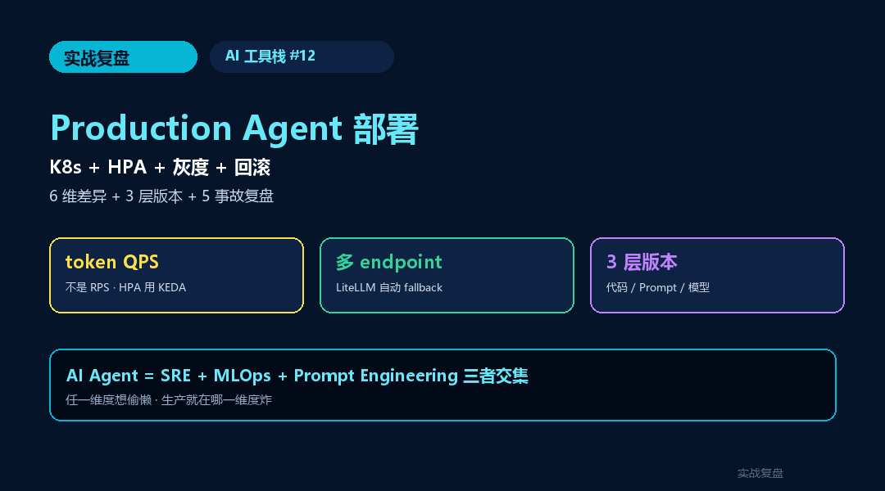
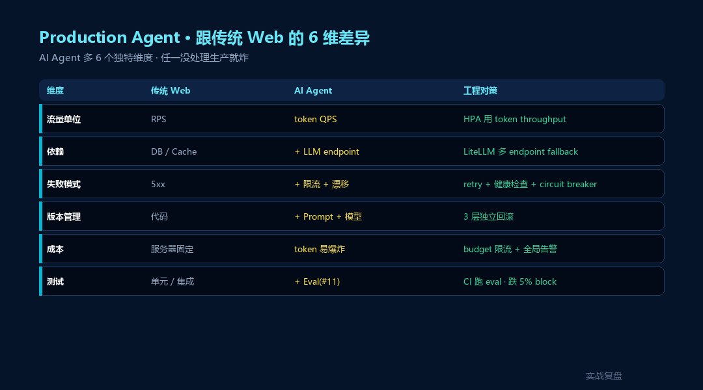
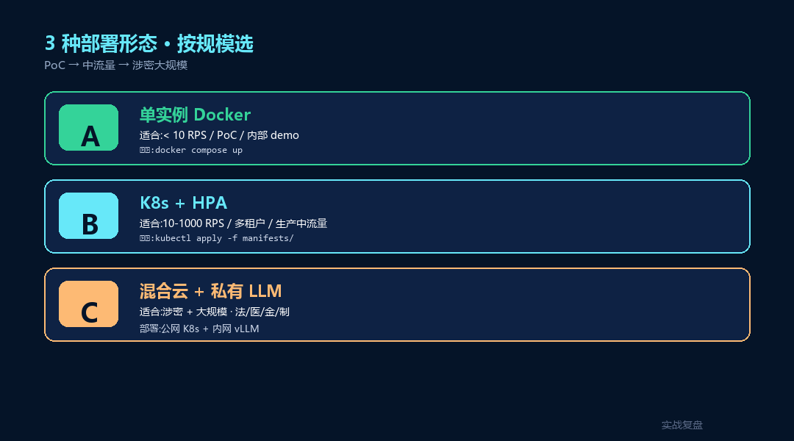
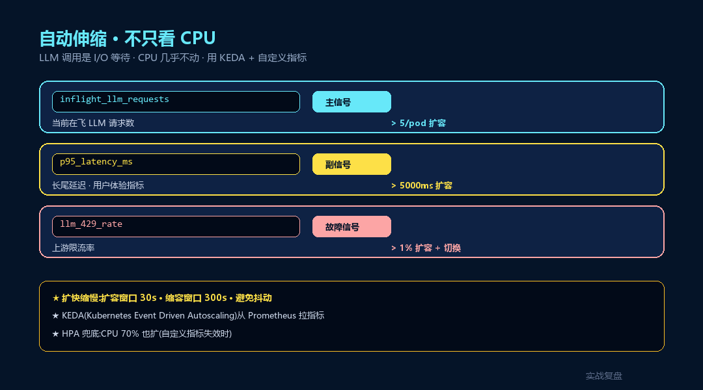
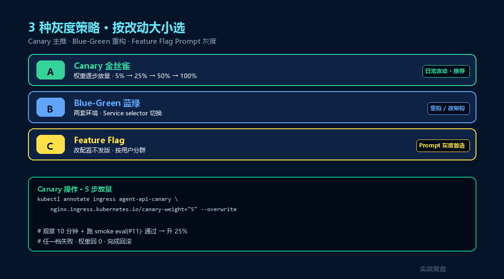
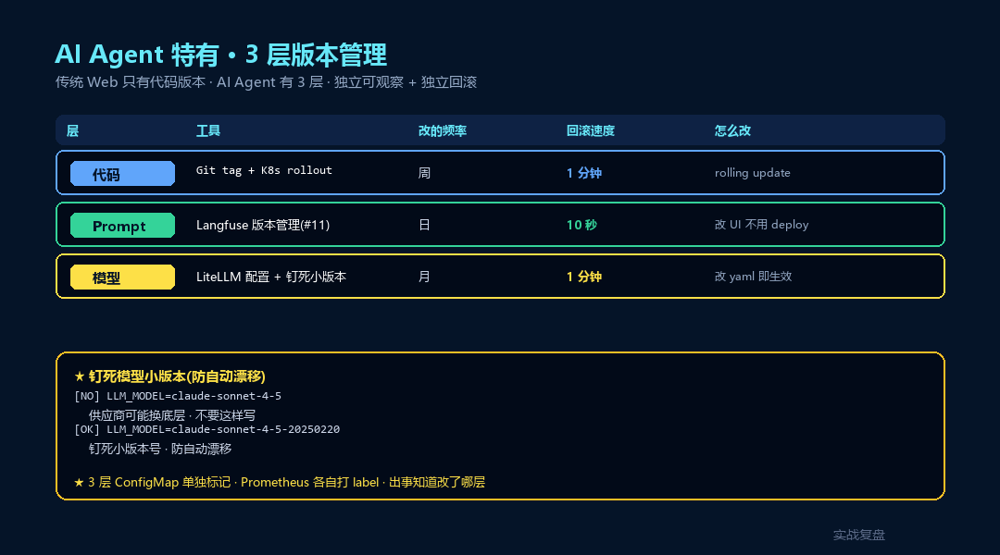
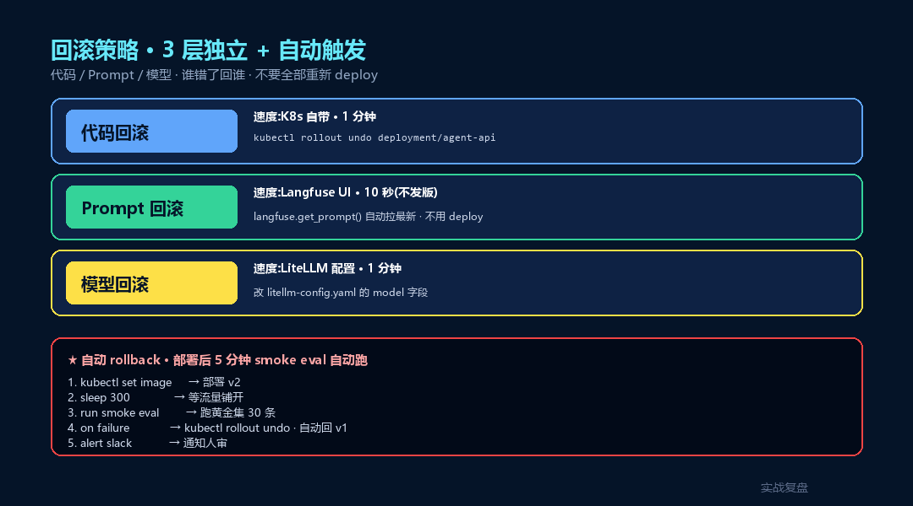
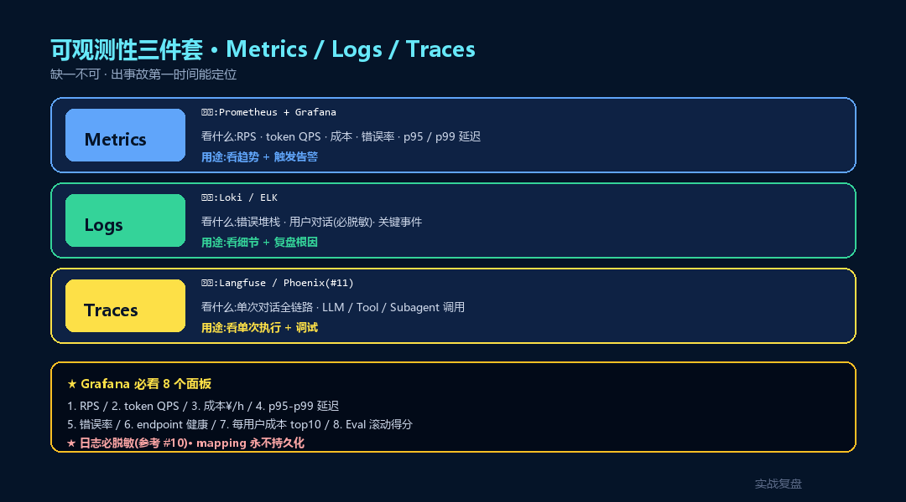

# Production Agent 部署指南 —— K8s / 自动伸缩 / 灰度 / 回滚

> **TL;DR**:把 AI Agent 从 demo 推上生产 · **6 个新维度**(token QPS / 多 endpoint 切换 / 模型版本 / Prompt 版本 / 成本爆炸 / 流量倾斜)是传统 Web 部署没遇到过的。本文给完整 **K8s 部署模板**(Deployment + HPA + PDB + Ingress)+ **LiteLLM 多 endpoint fallback** + **3 种灰度策略**(Canary / Blue-Green / Feature Flag)+ **3 层回滚**(代码 / Prompt / 模型)+ **5 个生产事故复盘**。**所有 YAML 都可以直接 `kubectl apply -f`**。

<div align="center">

<a href="https://github.com/OnelongX/aiagent">

</a>

📖 **本文同步发布于公众号「实战复盘」** · 微信号:`IamOnelong`
🌐 [完整代码仓库 · github.com/OnelongX/aiagent](https://github.com/OnelongX/aiagent)
💡 endpoint 选型:[docs/livetoken.md](../../docs/livetoken.md)

</div>

---

承接 AI 工具栈系列。

[#06-#11](../06-claude-agent-sdk/) 把 SDK / Subagent / 防泄密 / Eval 讲透了。

**Eval 跑通了 · CI 也接了 · 然后呢? —— 推上生产。**

很多人以为推生产跟传统 Web 没区别 —— 错。AI Agent 多 **6 个独特维度**:

1. **token QPS** 不是 RPS —— 一个长 prompt 比 100 个短 prompt 还重
2. **多 endpoint 切换** —— 供应商抽风 / 中转挂掉怎么办
3. **模型版本漂移** —— 供应商升级 gpt-5 小版本 · 你的输出突然变了
4. **Prompt 版本** —— 改一行 prompt 可能等价于上线一个新版本
5. **成本爆炸** —— RPS 翻 10 倍 · token 用量可能翻 100 倍
6. **流量倾斜** —— 1% 用户跑了 80% token

这一篇专治这 6 个问题。



---

## 一、Production Agent 跟传统 Web 部署的 6 个差异



| 维度 | 传统 Web | AI Agent | 工程对策 |
|---|---|---|---|
| **流量单位** | RPS | **token QPS** | HPA 用 token throughput 而非 CPU |
| **依赖** | DB / Cache | **+ LLM endpoint** | LiteLLM 多 endpoint fallback |
| **失败模式** | 5xx | **+ LLM 慢 / 限流 / 模型漂移** | retry + timeout + 健康检查 |
| **版本管理** | 代码 | **+ Prompt + 模型 + Subagent** | 3 层版本独立回滚 |
| **成本** | 服务器固定 | **token 按量 · 易爆炸** | budget 限流 + 告警 |
| **测试** | 单元 / 集成 | **+ Eval(#11)** | CI 必跑 eval · 跌 5% block |

**核心认知**:**AI Agent 部署是 SRE + MLOps + Prompt Engineering 三者交集**,
任一维度想偷懒,生产就在哪一维度炸。

---

## 二、3 种部署形态(按规模选)



### 形态 A:单实例 + Docker(适合 PoC / 小流量)

```
┌──────────────────────────┐
│  Docker container        │
│  ┌────────────────────┐  │
│  │ FastAPI · 1 worker │  │
│  │ + Agent SDK        │  │
│  └────────────────────┘  │
└──────────────────────────┘
          ↓
   公有云 LLM API
```

- 适合:**< 10 RPS** / 内部 demo / 单租户
- 13 篇行业落地的 8 个全栈 case 默认就是这个形态(`docker compose up`)

### 形态 B:K8s + HPA + 多 endpoint(适合生产中流量)

```
                  ┌─────────────┐
                  │  Ingress    │
                  └──────┬──────┘
                         ↓
                ┌────────────────┐
                │   Service      │
                └────────┬───────┘
                         ↓
        ┌────────────────┴────────────────┐
        ↓                ↓                 ↓
   ┌─────────┐      ┌─────────┐      ┌─────────┐
   │  Pod 1  │      │  Pod 2  │      │  Pod N  │     ← HPA 按 token QPS 伸缩
   │ FastAPI │      │ FastAPI │      │ FastAPI │
   └────┬────┘      └────┬────┘      └────┬────┘
        └────────────────┼────────────────┘
                         ↓
                 ┌───────────────┐
                 │   LiteLLM     │  ← 多 endpoint 路由 + fallback
                 │   Router      │
                 └──┬────┬───┬──┘
                    ↓    ↓   ↓
              Claude  GPT  Gemini (+ 私有 LLM)
```

- 适合:**10-1000 RPS** / 多租户 / 强监管行业
- 13 篇里 #9-#13 重监管行业生产形态

### 形态 C:混合云 + 私有 LLM 内网(适合涉密 + 大规模)

```
┌─────────────────────────────────────────┐
│         公网 K8s 集群                    │
│    (通用任务 · 公有 LLM)                 │
└─────────────────────────────────────────┘
                    ↕  涉密路由
┌─────────────────────────────────────────┐
│         内网 K8s 集群                    │
│    + vLLM + Qwen3 / DeepSeek            │  ← C3 任务走内网
│    + 完全隔离 · 数据不出机房              │
└─────────────────────────────────────────┘
```

- 适合:**法 / 医 / 金 / 制** 涉密 + 大规模混合
- 配合 [#10 防泄密](../10-ai-security-pii/) C3 分级路由

---

## 三、K8s 完整部署模板(可直接 apply)

完整 YAML 在 [`manifests/`](manifests/) 目录,这里挑 4 个关键的讲。

### 1. Deployment(`manifests/deployment.yaml`)

```yaml
apiVersion: apps/v1
kind: Deployment
metadata:
  name: agent-api
  labels:
    app: agent-api
    version: v1
spec:
  replicas: 3
  strategy:
    type: RollingUpdate
    rollingUpdate:
      maxSurge: 1
      maxUnavailable: 0      # 滚动 0 中断
  selector:
    matchLabels:
      app: agent-api
  template:
    metadata:
      labels:
        app: agent-api
        version: v1          # ← 灰度时按这个 label 区分
    spec:
      containers:
      - name: api
        image: your-registry/agent-api:v1.2.0
        ports:
        - containerPort: 8000
        resources:
          requests:
            cpu: 500m
            memory: 1Gi
          limits:
            cpu: 2
            memory: 2Gi
        envFrom:
        - configMapRef:
            name: agent-config
        - secretRef:
            name: agent-secrets
        # 健康检查(关键!)
        readinessProbe:
          httpGet:
            path: /api/health
            port: 8000
          initialDelaySeconds: 10
          periodSeconds: 5
          failureThreshold: 3
        livenessProbe:
          httpGet:
            path: /api/health
            port: 8000
          initialDelaySeconds: 30
          periodSeconds: 30
          failureThreshold: 3
        # 启动慢(SDK 初始化)
        startupProbe:
          httpGet:
            path: /api/health
            port: 8000
          failureThreshold: 30
          periodSeconds: 5
```

### 2. HPA · 按 token QPS 伸缩(`manifests/hpa.yaml`)

**关键**:不要按 CPU 伸缩 —— LLM 调用是 I/O 等待 · CPU 几乎不动。
应该按 **token QPS / 等待中的请求数**伸缩。

```yaml
apiVersion: autoscaling/v2
kind: HorizontalPodAutoscaler
metadata:
  name: agent-api-hpa
spec:
  scaleTargetRef:
    apiVersion: apps/v1
    kind: Deployment
    name: agent-api
  minReplicas: 2
  maxReplicas: 20
  behavior:
    scaleUp:
      stabilizationWindowSeconds: 30   # 快速扩
      policies:
      - type: Percent
        value: 100
        periodSeconds: 30              # 30 秒内最多翻倍
    scaleDown:
      stabilizationWindowSeconds: 300  # 慢慢缩(避免抖动)
      policies:
      - type: Percent
        value: 25
        periodSeconds: 60
  metrics:
  # 自定义指标:每 pod 处理中的请求数
  - type: Pods
    pods:
      metric:
        name: inflight_llm_requests
      target:
        type: AverageValue
        averageValue: "5"              # 每 pod 平均 5 个在飞 → 扩容
  # 兜底:CPU(避免自定义指标失效)
  - type: Resource
    resource:
      name: cpu
      target:
        type: Utilization
        averageUtilization: 70
```

**关键点**:
- `inflight_llm_requests` 自定义指标必须先暴露(Prometheus + KEDA)
- `stabilizationWindowSeconds` 扩快缩慢(避免抖动)
- `maxSurge: 1` 保证滚动期间不丢请求

### 3. PDB · Pod Disruption Budget(`manifests/pdb.yaml`)

防止 K8s 调度 / 节点维护时把所有 pod 一起干掉:

```yaml
apiVersion: policy/v1
kind: PodDisruptionBudget
metadata:
  name: agent-api-pdb
spec:
  minAvailable: 2                # 至少 2 个可用
  selector:
    matchLabels:
      app: agent-api
```

### 4. ConfigMap + Secret(`manifests/configmap.yaml`)

```yaml
apiVersion: v1
kind: ConfigMap
metadata:
  name: agent-config
data:
  LLM_API_BASE: "https://livetoken.top/v1"
  LLM_MODEL: "claude-sonnet-4-5"
  LANGFUSE_HOST: "http://langfuse.observability.svc.cluster.local:3000"
  # 限流配置
  MAX_TOKENS_PER_REQUEST: "8000"
  MAX_REQUESTS_PER_USER_PER_MIN: "30"
  MAX_COST_PER_USER_PER_DAY_RMB: "100"
---
apiVersion: v1
kind: Secret
metadata:
  name: agent-secrets
type: Opaque
stringData:
  LLM_API_KEY: "sk-xxxxx"
  LANGFUSE_SECRET_KEY: "sk-lf-xxxxx"
```

---

## 四、自动伸缩 · 不只看 CPU



### 自定义指标怎么暴露

```python
# 在 FastAPI 应用里
from prometheus_client import Gauge, make_asgi_app

inflight = Gauge("inflight_llm_requests", "Current in-flight LLM requests")

# 中间件
@app.middleware("http")
async def track_inflight(request, call_next):
    if request.url.path.startswith("/api/agent"):
        inflight.inc()
        try:
            return await call_next(request)
        finally:
            inflight.dec()
    return await call_next(request)

# 暴露 /metrics
app.mount("/metrics", make_asgi_app())
```

KEDA 配置(从 Prometheus 拉指标喂给 HPA):

```yaml
# manifests/keda-scaledobject.yaml
apiVersion: keda.sh/v1alpha1
kind: ScaledObject
metadata:
  name: agent-api-scaler
spec:
  scaleTargetRef:
    name: agent-api
  minReplicaCount: 2
  maxReplicaCount: 20
  triggers:
  - type: prometheus
    metadata:
      serverAddress: http://prometheus.monitoring.svc.cluster.local:9090
      metricName: inflight_llm_requests
      query: avg(inflight_llm_requests) by (app)
      threshold: '5'
```

### 3 个伸缩信号(混着用)

| 信号 | 触发什么 | 阈值参考 |
|---|---|---|
| `inflight_llm_requests` | 当前在飞请求数 | 每 pod > 5 → 扩 |
| `p95_latency_ms` | 长尾延迟 | > 5000ms → 扩 |
| `llm_429_rate` | 上游限流率 | > 1% → 扩 + 切换 endpoint |

---

## 五、灰度发布 · 3 种策略



### 策略 A:Canary(金丝雀 · 推荐)

按流量百分比逐步放量:`1% → 5% → 25% → 50% → 100%`,每档观察 30min。

用 **Istio VirtualService** 或 **Ingress 权重**实现:

```yaml
# manifests/canary-ingress.yaml
apiVersion: networking.k8s.io/v1
kind: Ingress
metadata:
  name: agent-canary
  annotations:
    nginx.ingress.kubernetes.io/canary: "true"
    nginx.ingress.kubernetes.io/canary-weight: "5"   # 5% 流量去 v2
spec:
  rules:
  - host: api.example.com
    http:
      paths:
      - path: /
        pathType: Prefix
        backend:
          service:
            name: agent-api-v2          # ← 新版本
            port:
              number: 8000
```

```bash
# 升级到 25%
kubectl annotate ingress agent-canary nginx.ingress.kubernetes.io/canary-weight=25 --overwrite

# 升级到 100%
kubectl annotate ingress agent-canary nginx.ingress.kubernetes.io/canary-weight=100 --overwrite

# 出问题:权重回 0
kubectl annotate ingress agent-canary nginx.ingress.kubernetes.io/canary-weight=0 --overwrite
```

### 策略 B:Blue-Green(蓝绿 · 适合大改)

两套完整环境 · 切流量瞬间完成 · 适合**重构 / 改架构**:

```yaml
# 蓝环境(当前)
metadata: { name: agent-api-blue }
# 绿环境(新版)
metadata: { name: agent-api-green }

# Service selector 切换
spec:
  selector:
    app: agent-api
    version: green     # 改这一行 = 切流量
```

**对 AI Agent 的优势**:可以**热切换**,不用滚动等 pod 起来。
**对 AI Agent 的劣势**:**double 成本**(LLM 调用 2 倍)。

### 策略 C:Feature Flag(特性开关 · 最灵活)

不发布新 pod · 改配置:

```python
# 用 Langfuse Prompt Management(参考 #11)
prompt_version = config.get_feature_flag(
    "agent_prompt_version",
    default="v3",
    user_segment=user.segment,    # 灰度按用户分群
)
prompt = langfuse.get_prompt("system", version=prompt_version)
```

**最适合 Prompt 灰度** —— 改 prompt 不用 deploy。

---

## 六、3 层版本管理(AI Agent 特有)



传统 Web 只有"代码版本"。AI Agent 有 **3 层**:

| 层 | 改的频率 | 工具 | 回滚速度 |
|---|---|---|---|
| **代码版本** | 周 | Git + K8s rollout | 1 min |
| **Prompt 版本** | 日 | Langfuse Prompt Management | 10 秒(不用 deploy)|
| **模型版本** | 月(供应商决定)| LiteLLM 配置 | 1 分钟(改 yaml) |

### 3 层都要独立可观察 + 可回滚

```yaml
# manifests/configmap.yaml
data:
  CODE_VERSION:   "v1.2.0"      # 跟 git tag 走
  PROMPT_VERSION: "v3"           # Langfuse 里的版本
  MODEL_VERSION:  "claude-sonnet-4-5-20250220"   # 钉死小版本(防漂移)
```

**钉死模型小版本** —— 不要用 `claude-sonnet-4-5`(供应商可能换底层)·
用完整版本号 `claude-sonnet-4-5-20250220`。

---

## 七、回滚策略 · 3 层独立



### 1. 代码回滚(最常见)

```bash
# K8s 自带 rollout undo
kubectl rollout undo deployment/agent-api
kubectl rollout undo deployment/agent-api --to-revision=3

# 看历史
kubectl rollout history deployment/agent-api
```

### 2. Prompt 回滚(最快)

```python
# 在 Langfuse UI 改默认版本
# 代码立即生效 · 不用 deploy
prompt = langfuse.get_prompt("system")   # 自动拉最新 default
```

### 3. 模型回滚(供应商搞事时)

```yaml
# litellm-config.yaml
model_list:
  - model_name: claude-sonnet
    litellm_params:
      model: anthropic/claude-sonnet-4-5-20250220   # 钉死小版本
      # 如果供应商把 20250220 下线 · 改成 20250115 上一版
```

### 自动回滚触发(Eval 集成)

```python
# 部署后 5 分钟自动跑 smoke eval
# 任一指标跌 5% → 自动 rollback

# .github/workflows/deploy.yml
- name: Deploy
  run: kubectl set image deployment/agent-api api=...:v2

- name: Wait & smoke eval
  run: sleep 300 && python eval/run_eval.py --smoke

- name: Auto rollback on fail
  if: failure()
  run: kubectl rollout undo deployment/agent-api
```

---

## 八、多 endpoint 故障转移(LiteLLM)

供应商抽风是常态 —— **不要赌 OpenAI 永远在线**。

```yaml
# examples/litellm-config.yaml
model_list:
  # 主:livetoken(国内稳定中转)
  - model_name: claude-sonnet
    litellm_params:
      model: anthropic/claude-sonnet-4-5-20250220
      api_base: https://livetoken.top/v1
      api_key: os.environ/LIVETOKEN_KEY

  # 备 1:Anthropic 官方
  - model_name: claude-sonnet
    litellm_params:
      model: anthropic/claude-sonnet-4-5-20250220
      api_key: os.environ/ANTHROPIC_API_KEY

  # 备 2:Bedrock(AWS)
  - model_name: claude-sonnet
    litellm_params:
      model: bedrock/anthropic.claude-sonnet-4-5
      aws_region_name: us-west-2

# fallback 顺序
litellm_settings:
  num_retries: 2
  request_timeout: 30
  fallbacks:
    - claude-sonnet: ["gpt-5", "gemini-2.5-pro"]   # claude 全挂 → 切 GPT → 再切 Gemini

router_settings:
  routing_strategy: "least-busy"   # 或 "latency-based"
```

```python
# 你的应用代码完全不用改 · LiteLLM 自动 fallback
from litellm import completion
resp = completion(
    model="claude-sonnet",
    messages=[{"role": "user", "content": "hi"}],
)
# 主挂了 → 自动重试 livetoken → 自动切 Anthropic 官方 → 自动切 Bedrock
# 三个都挂 → 切 GPT-5 → 切 Gemini
```

---

## 九、限流 + 限额 · 防成本爆炸

```python
# app/middleware/budget.py
from fastapi import Request, HTTPException
import redis

r = redis.Redis()

async def budget_middleware(request: Request, call_next):
    user_id = request.state.user_id
    today = datetime.now().strftime("%Y-%m-%d")

    # 1. RPS 限流(每用户 30 / min)
    rps_key = f"rps:{user_id}:{int(time.time() // 60)}"
    rps = r.incr(rps_key)
    r.expire(rps_key, 70)
    if rps > 30:
        raise HTTPException(429, "Too many requests")

    # 2. token 限流(每天 100 万)
    tokens_key = f"tokens:{user_id}:{today}"
    tokens_today = int(r.get(tokens_key) or 0)
    if tokens_today > 1_000_000:
        raise HTTPException(429, "Daily token budget exceeded")

    # 3. 成本限额(每天 ¥100)
    cost_key = f"cost:{user_id}:{today}"
    cost_today = float(r.get(cost_key) or 0)
    if cost_today > 100:
        raise HTTPException(402, "Daily budget exceeded")

    # 调下游
    response = await call_next(request)

    # 调用后更新(后置)
    r.incrby(tokens_key, response.headers.get("X-Tokens-Used", 0))
    r.incrbyfloat(cost_key, float(response.headers.get("X-Cost-RMB", 0)))
    r.expire(tokens_key, 86400)
    r.expire(cost_key, 86400)

    return response
```

### 全局 budget 告警

```python
# 每分钟跑 · 整体成本超 ¥1000/h 触发降级
@scheduler.scheduled_job("cron", minute="*")
def check_global_budget():
    cost_last_hour = r.get("cost:global:" + last_hour_key()) or 0
    if cost_last_hour > 1000:
        # 切到便宜模型
        feature_flag.set("emergency_cheap_model", True)
        alert_slack(f"🚨 成本爆炸:¥{cost_last_hour}/h · 已切换 haiku/flash-lite")
```

---

## 十、可观测性三件套(Metrics / Logs / Traces)



| 维度 | 工具 | 看什么 |
|---|---|---|
| **Metrics** | Prometheus + Grafana | RPS / token QPS / 成本 / 错误率 / p95 |
| **Logs** | Loki / ELK | 错误堆栈 / 用户对话 · **必脱敏**(见 #10) |
| **Traces** | Langfuse / Phoenix | 单次对话的完整链路(参考 #11) |

### 必看的 8 个 Grafana 面板

```
1. RPS(每分钟请求数)              · 流量趋势
2. token QPS(每分钟 token)         · 真实负载
3. 成本(¥/h)                       · 烧钱预警
4. p95 / p99 延迟                   · 用户体验
5. 错误率 by status code            · 5xx / 429 / 503
6. LLM endpoint 健康(fallback 次数)· 上游稳定性
7. 每用户成本 top 10                · 流量倾斜检测
8. Eval 滚动得分(faithfulness 等)  · 质量漂移
```

完整 Grafana JSON 在 [`examples/grafana_dashboard.json`](examples/grafana_dashboard.json)(略 · 太长)。

---

## 十一、5 个真实生产事故复盘

### 事故 1:OpenAI 限流连锁雪崩

**现象**:OpenAI 突然限流 · 我方 retry 没退避 · 50 pod 同时疯狂重试 · 拖垮 livetoken 中转。
**根因**:retry 没用 exponential backoff · 配置 `max_retries=10` 但 delay 太短。
**对策**:
- LiteLLM 加 `retry_after_seconds: 60` 严格遵守 Retry-After
- 加 circuit breaker(连续 5 次失败 30 秒不重试)
- 自动 fallback 到 Gemini

### 事故 2:模型自动升级 · 输出变了

**现象**:周一早上发现 RAG 答案突然啰嗦 + 加大量免责声明 · 用户投诉。
**根因**:供应商把 `claude-sonnet-4-5` 指向了新小版本 · prompt 没改但输出变了。
**对策**:
- **钉死小版本号**(`claude-sonnet-4-5-20250220`)
- Eval CI 必跑 · 任一指标跌 5% block

### 事故 3:Prompt 改一个字 · 工具不调用了

**现象**:周五下午改了 system prompt 一个字 · 周一发现工具调用率从 80% 跌到 12%。
**根因**:动了一个看似无关的指令短语 · LLM 行为变了。
**对策**:
- **任何 prompt 改动必走 Langfuse + smoke eval**
- 部署后 5 分钟自动跑 smoke eval · 跌 10% 自动回滚

### 事故 4:1% 用户烧了 80% token

**现象**:周末突然成本爆炸 · 一查发现 3 个用户在跑 reflection loop · 单人日烧 ¥2000。
**根因**:没做单用户 budget 限制。
**对策**:
- 单用户 daily budget(¥100 / token 100 万)
- 单 conversation 最多 20 轮
- reflection / max_iterations 硬封顶

### 事故 5:K8s 节点维护 · 服务中断 8 分钟

**现象**:云厂商节点维护 · pod 全被驱逐 · 启动慢(SDK 初始化 30s)· 用户感知中断。
**根因**:没配 PDB · 启动慢没配 startupProbe。
**对策**:
- PDB(`minAvailable: 2`)
- startupProbe(`failureThreshold: 30`)
- 预热脚本(启动后跑 5 个 warmup 请求)

---

## 十二、上线 checklist(收藏)

> 把这张表打印贴墙上 · **每次上线前自检** · 一项不过别 deploy。

### 代码 / 镜像层

- [ ] Dockerfile 多阶段构建 · 镜像 < 500MB
- [ ] 非 root 用户运行
- [ ] 健康检查 `/api/health` 实现
- [ ] /metrics 暴露 Prometheus 指标
- [ ] graceful shutdown(收到 SIGTERM 等当前请求完)

### K8s 层

- [ ] Deployment `maxSurge:1 maxUnavailable:0` 滚动不中断
- [ ] readinessProbe / livenessProbe / startupProbe 三件套
- [ ] resources.requests + limits 都配
- [ ] PDB `minAvailable >= 2`
- [ ] HPA 用自定义指标(不只 CPU)
- [ ] ConfigMap + Secret 分离

### AI 特有

- [ ] LLM 模型**钉死小版本**
- [ ] LiteLLM 配 3 个 fallback endpoint
- [ ] 单用户 RPS / token / 成本 限额
- [ ] 全局 budget 告警(¥/h 阈值)
- [ ] PII 进 LLM 前脱敏(#10)
- [ ] Injection 防御(#10)
- [ ] Prompt 走 Langfuse 版本管理(#11)
- [ ] Eval 集成 CI · 跌 5% block(#11)
- [ ] 涉密任务走私有 LLM(#10 + #11)

### 运维层

- [ ] Grafana 8 面板就位
- [ ] 告警渠道(Slack / 飞书 / 企微)
- [ ] 灰度策略选好(Canary 5%→25%→100%)
- [ ] 自动 rollback 触发器配好
- [ ] runbook 写好(出事故谁来 / 怎么 rollback)
- [ ] 每月做一次故障演练(挂掉 OpenAI 看是否自动切)

---

## 十三、收尾 · Production 的本质

13 篇行业落地写完 · 把 Agent 推上生产 · **最大的认知**:

> **AI Agent 部署不是"推上去就行" · 是要给 LLM 套上工程级的"工厂安全围栏"。**

传统 Web 你可以容忍偶尔崩 · 重启就行。
AI Agent 不行:
- LLM 输出错了 · 用户**信了**就是事故
- 模型漂移了 · 你**不知道**才是事故
- 成本爆炸了 · 月底**看到账单**已经晚了

**真正的 Production Agent = 4 层防御 + 3 层版本 + 自动回滚 + 实时观测 + budget 限流**。

把这 5 件事做扎实 · **AI 应用才真正能跑 24/7**。

---

## 十四、文件清单

- **manifests/**:完整 K8s YAML(`deployment / service / hpa / pdb / configmap / ingress / keda`)
- **examples/litellm-config.yaml**:多 endpoint fallback 完整配置
- **examples/canary_deploy.sh**:5 步灰度脚本
- **examples/budget_middleware.py**:单用户 + 全局 budget 限流
- **examples/Dockerfile.prod**:生产级多阶段镜像

---

## 十五、关联资源

- 对照阅读:
  - [#10 AI 防泄密](../10-ai-security-pii/) · 涉密路由 + Injection 防御
  - [#11 Agent Eval](../11-agent-eval/) · CI 集成 + drift 监控 + 自动回滚触发
- 实战 case:
  - [#06-#13 行业落地](../../02-industry-cases/) · 8 篇带 Docker Compose 是生产模板的雏形
- 外部参考:
  - [Kubernetes HPA v2](https://kubernetes.io/docs/tasks/run-application/horizontal-pod-autoscale/)
  - [KEDA](https://keda.sh/) · 自定义指标驱动伸缩
  - [LiteLLM Router](https://docs.litellm.ai/docs/routing) · 多 endpoint
  - [Argo Rollouts](https://argoproj.github.io/argo-rollouts/) · 高级灰度

---

实战复盘 · AI 工具栈 #12 · Production Agent 部署
关键词:K8s · HPA · KEDA · Canary · Blue-Green · 灰度 · 回滚 · LiteLLM Router · 多 endpoint
本文同步发布于公众号「实战复盘」(IamOnelong)· 仅供学习参考。
