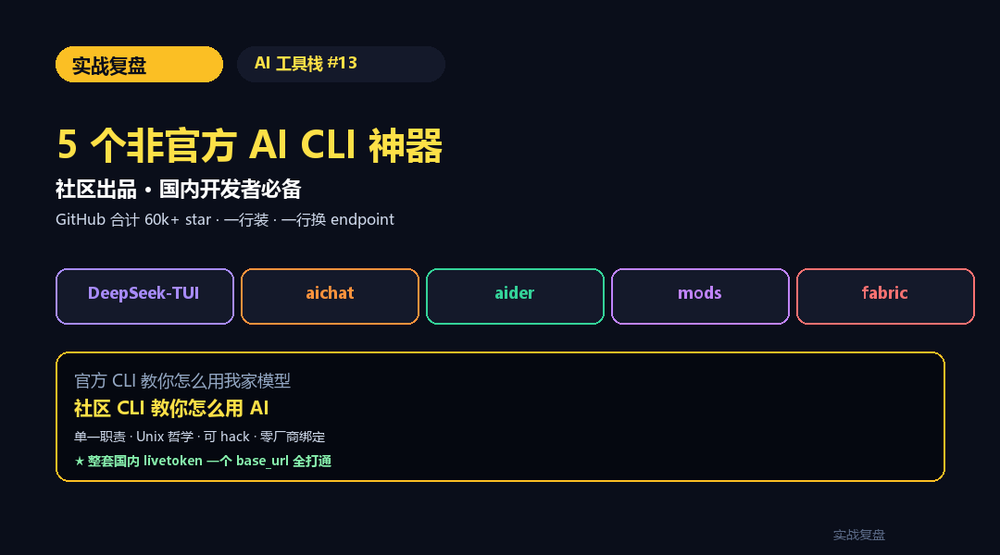
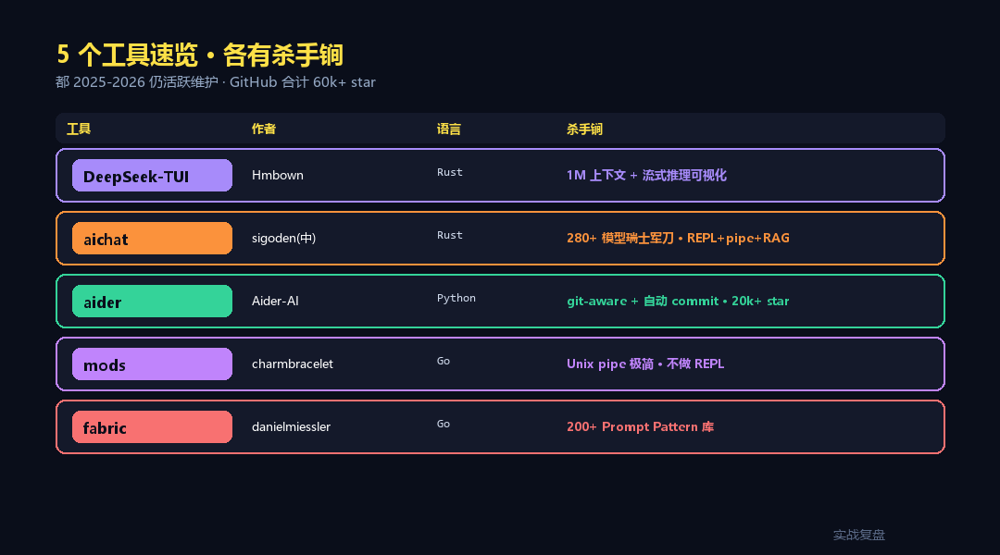
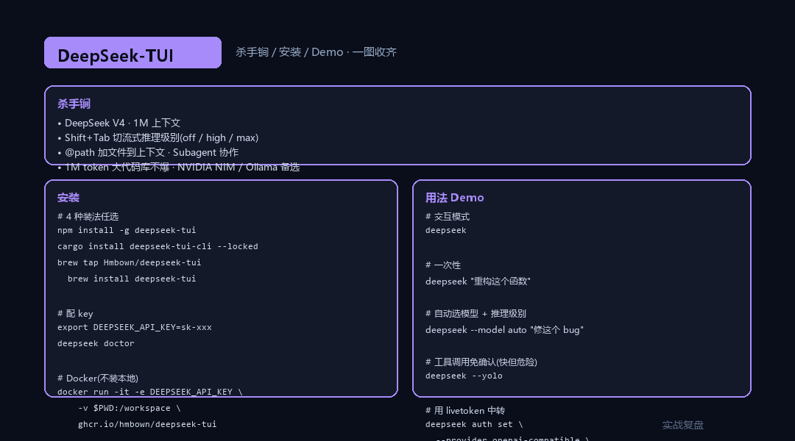
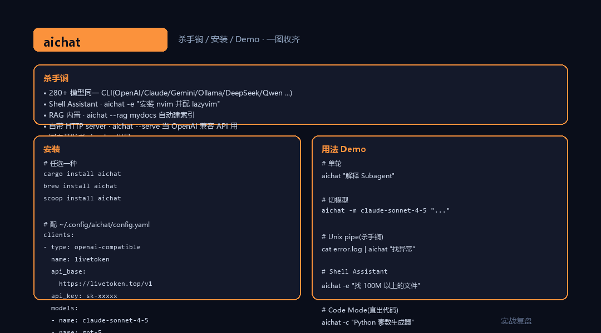
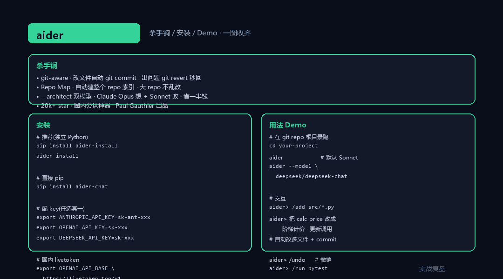
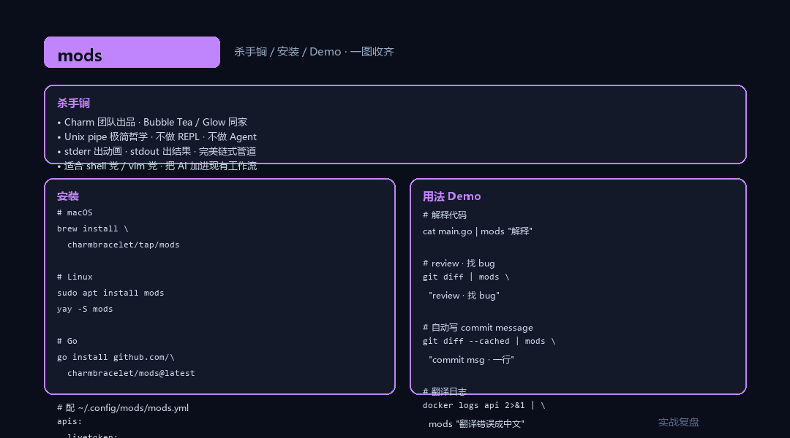
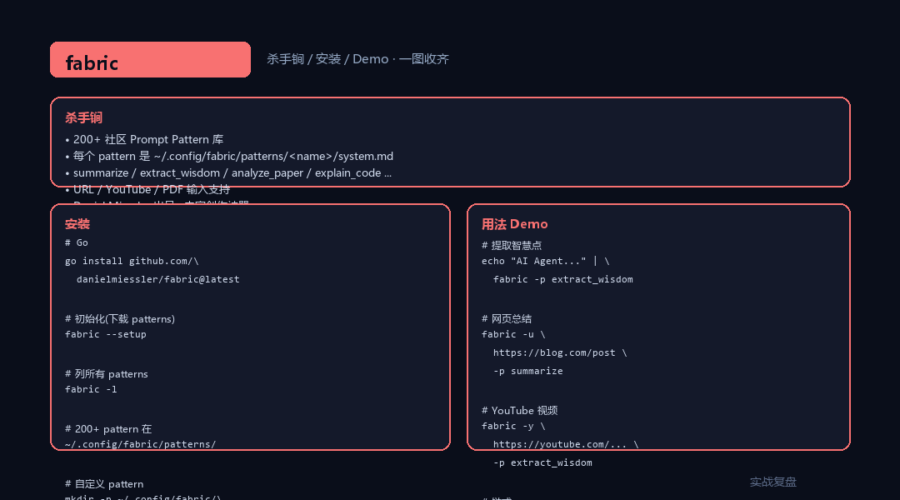
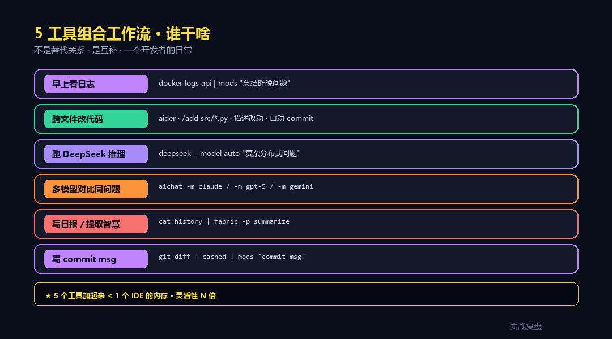
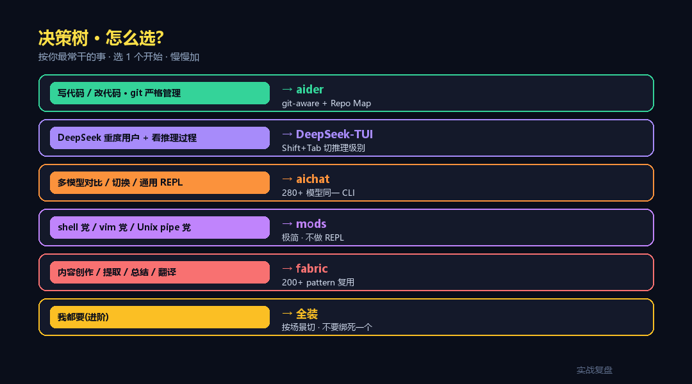

# 5 个非官方 AI CLI 神器 —— 社区出品 · 国内开发者必备

> **TL;DR**:OpenAI / Anthropic / Google 三家官方 CLI 各有局限,**社区做的反而更顺手**。本文挑 5 个真正生产可用的:**DeepSeek-TUI**(DeepSeek 专用 · 1M 上下文流式推理)/ **aichat**(280+ 模型瑞士军刀 · REPL+pipe+RAG)/ **aider**(**git-aware 代码助手 · 20k+ star**)/ **mods**(Unix pipe 极简 · Charm 出品)/ **fabric**(**200+ 个 prompt pattern**)。每个工具:**安装一行 + Hello World + 杀手锏 + 国内 endpoint 配法**。

<div align="center">

<a href="https://github.com/OnelongX/aiagent">

</a>

📖 **本文同步发布于公众号「实战复盘」** · 微信号:`IamOnelong`
🌐 [完整代码仓库 · github.com/OnelongX/aiagent](https://github.com/OnelongX/aiagent)
💡 endpoint 选型:[docs/livetoken.md](../../docs/livetoken.md)

</div>

---

承接 AI 工具栈系列。

[#01-05](../01-codex-cli/) 讲官方 CLI(Codex / Claude Code / opencode / Hermes / OpenClaw)·
[#06-08](../06-claude-agent-sdk/) 讲 SDK 三家 · [#09-12](../09-subagent-patterns/) 讲工程实践。

这一篇换个口味:**社区做的非官方 CLI 神器**。

为什么单挑社区版?

**官方 CLI 有 3 个共通短板**:
1. **绑定自家模型**(Codex 只爽 OpenAI / Claude Code 只爽 Anthropic)
2. **学习曲线** —— 命令多 / 配置复杂
3. **国内访问** —— 默认 endpoint 通常不通

**社区作者**为了好用,**完全反过来做**:**模型不限 / 极简上手 / 一行换 endpoint**。

下面 5 个全部 **2025-2026 仍在活跃维护**,**GitHub 加一起 60k+ star**。



---

## 一、5 个工具速览

| 工具 | 作者 | 主语言 | 定位 | 杀手锏 |
|---|---|---|---|---|
| **DeepSeek-TUI** | [Hmbown](https://github.com/Hmbown/DeepSeek-TUI) | Rust | DeepSeek 重度用户专用 TUI | 1M 上下文 + 流式推理可视化 |
| **aichat** | [sigoden](https://github.com/sigoden/aichat) | Rust | 280+ 模型瑞士军刀 | REPL + pipe + RAG + Agent + 自带 HTTP server |
| **aider** | [Aider-AI](https://github.com/Aider-AI/aider) | Python | git-aware AI pair programming | **修改自动 commit** · 跨多文件改 |
| **mods** | [charmbracelet](https://github.com/charmbracelet/mods) | Go | Unix pipe AI | `cat log \| mods "找异常"` 一行流 |
| **fabric** | [danielmiessler](https://github.com/danielmiessler/Fabric) | Go | Prompt pattern 框架 | **200+ 社区贡献的 pattern 库** |



---

## 二、DeepSeek-TUI —— DeepSeek 重度用户必装



### 定位

第三方 · 不是 DeepSeek 官方做的(美国开发者 [Hunter Bown](https://github.com/Hmbown))·
但完成度非常高 · **GitHub Trending 榜上过**。

围绕 **DeepSeek V4** 做的(deepseek-v4-pro / deepseek-v4-flash · 1M 上下文)·
**流式推理可视化是杀手锏** —— Shift+Tab 切推理级别(关 / 高 / 最大)。

### 安装(4 种方式任选)

```bash
# 1. npm(最简单)
npm install -g deepseek-tui

# 2. Cargo
cargo install deepseek-tui-cli --locked

# 3. Homebrew(macOS)
brew tap Hmbown/deepseek-tui && brew install deepseek-tui

# 4. Docker
docker run --rm -it -e DEEPSEEK_API_KEY \
    -v "$PWD:/workspace" \
    ghcr.io/hmbown/deepseek-tui:latest
```

### 配 + 跑

```bash
# 配 key(platform.deepseek.com 拿)
export DEEPSEEK_API_KEY="sk-xxxxx"
deepseek doctor                          # 验证

# 交互模式
deepseek

# 一次性
deepseek "重构这个函数"

# 自动选模型 + 推理级别(适合不知道用哪个)
deepseek --model auto "修这个 bug"

# 工具调用免确认(危险但快)
deepseek --yolo
```

### 核心快捷键

| 键 | 用 |
|---|---|
| `Shift+Tab` | **切推理级别**(off / high / max) |
| `Tab` | 自动补全 / 运行中排队下条 |
| `Ctrl+K` | 命令面板 |
| `Ctrl+R` | 恢复早期会话 |
| `@path` | 把文件 / 目录加到上下文 |

### 其他 provider

```bash
# NVIDIA NIM(走 NVIDIA 的 DeepSeek)
deepseek auth set --provider nvidia-nim --api-key "..."

# 本地 Ollama(完全离线 · 适合涉密)
ollama pull deepseek-coder:1.3b
deepseek --provider ollama --model deepseek-coder:1.3b
```

### 国内 endpoint

走 livetoken 中转(走 OpenAI 兼容 endpoint):

```bash
# 通过自定义 base_url(看 docs/CONFIGURATION.md)
deepseek auth set --provider openai-compatible \
    --api-base https://livetoken.top/v1 \
    --api-key sk-livetoken-xxxxx
deepseek --model deepseek-chat
```

---

## 三、aichat —— 一个 CLI 通吃 280+ 模型



### 定位

[sigoden](https://github.com/sigoden) 出品(国内开发者!)· Rust 写的 · **280+ 模型同一 CLI**:
OpenAI / Claude / Gemini / Ollama / Groq / Azure / Bedrock / VertexAI /
Mistral / DeepSeek / xAI Grok / Cohere / Perplexity / Cloudflare / OpenRouter /
Moonshot / ZhipuAI / MiniMax / Ernie / Qianwen / DeepInfra / VoyageAI ...

**最像"瑞士军刀"** —— REPL + pipe + RAG + Function Calling + AI Agents + 自带 HTTP server + Shell Assistant **全都有**。

### 安装

```bash
# Rust
cargo install aichat

# macOS
brew install aichat

# Windows
scoop install aichat

# Linux 各种包管理器都有
```

### 配 + 跑

`~/.config/aichat/config.yaml`:

```yaml
model: claude:claude-sonnet-4-5
clients:
- type: openai-compatible
  name: livetoken
  api_base: https://livetoken.top/v1
  api_key: sk-livetoken-xxxxx
  models:
    - name: claude-sonnet-4-5
    - name: gpt-5
    - name: gemini-2.5-pro
    - name: deepseek-chat

- type: claude
  api_key: sk-ant-xxxxx
  api_base: https://livetoken.top    # 走中转

- type: openai
  api_base: https://livetoken.top/v1
  api_key: sk-livetoken-xxxxx
```

```bash
# 单轮
aichat "解释什么是 Subagent"

# 切模型
aichat -m livetoken:claude-sonnet-4-5 "重构这段代码"

# REPL 多轮交互
aichat
> /model openai:gpt-5
> 你好

# Unix pipe(杀手锏 1)
cat error.log | aichat "找异常 · 给修复建议"
ls -la | aichat "哪个文件最大"

# Shell Assistant(杀手锏 2)
aichat -e "安装 nvim 并配置 lazyvim"   # AI 给 shell · 你确认执行

# Code Mode(杀手锏 3)
aichat -c "用 Python 写一个素数生成器"   # 直接出代码 · 无解释

# RAG(杀手锏 4 · 把本地文档变成知识库)
aichat --rag mydocs   # 进入 RAG · 自动建索引 + 检索

# 自带 HTTP server(杀手锏 5 · 把 aichat 变成 OpenAI 兼容 API)
aichat --serve 0.0.0.0:8080
# 任何 OpenAI SDK 都能调你的 aichat 实例
```

### 为什么强

5 个杀手锏全部内置 · **不用装 5 个工具** —— 这是 aichat 跟 ChatGPT 网页 / 其他 CLI 最大差异。

特别推荐 `aichat -e "..."` 这个 Shell Assistant 模式 —— 比记 100 个 Linux 命令好用 N 倍。

---

## 四、aider —— git-aware 代码助手(20k+ star 神器)



### 定位

[Paul Gauthier](https://github.com/paul-gauthier) 出品(后转移到 Aider-AI 组织)·
Python · **AI pair programming in your terminal** ·
**20k+ GitHub star** · 圈内公认的代码 AI 神器。

**核心特性**:**git-aware** —— 改文件 = 自动 git commit · 出问题 `git revert` 秒回滚。

### 安装

```bash
pip install aider-install
aider-install         # 装到独立 Python · 不污染环境

# 或者
pip install aider-chat
```

### 配 + 跑

```bash
# 配 key
export ANTHROPIC_API_KEY="sk-ant-xxxxx"     # Claude
# 或
export OPENAI_API_KEY="sk-xxxxx"            # GPT
# 或
export DEEPSEEK_API_KEY="sk-xxxxx"          # DeepSeek

# 启动(在你的 git repo 根目录)
cd your-project
aider                                       # 默认 Claude Sonnet
aider --model deepseek/deepseek-chat        # 切 DeepSeek
aider --model gemini/gemini-2.5-pro         # 切 Gemini
aider --model openai/gpt-5                  # 切 GPT-5
```

### 核心交互

```
aider> /add src/utils.py src/main.py        # 加文件到上下文
aider> /tokens                              # 看 token 用量
aider> 把 utils.py 里的 calc_price 改成阶梯计价 · 然后更新 main.py 调用
# aider 自动改 2 个文件 · 自动 commit · 给你 diff 看
aider> /undo                                # 撤销上次 AI 改动
aider> /run pytest                          # 让 aider 跑测试 · 失败它自己 fix
```

### 杀手锏 1:Repo Map

aider **自动建整个 repo 的索引**(函数 / 类 / 依赖图)· LLM 即使没看完整代码也"知道"代码结构。
**改大 repo 不会乱** —— 比简单"塞文件给 LLM"准很多。

### 杀手锏 2:自动 commit

每次 AI 改完文件自动 `git commit` · message 写"AI: 实现 X 功能"。
**所有改动可追溯 · 出问题 `git revert` 秒回**。

### 杀手锏 3:`aider --architect` 双模型

- **architect 模型**(Claude Opus / GPT-5)负责"想"
- **editor 模型**(Sonnet / Haiku)负责"改"
- **同一任务用便宜模型 60% 实现 · 总成本省一半**

### 国内 endpoint

```bash
# 走 livetoken
export OPENAI_API_BASE="https://livetoken.top/v1"
export OPENAI_API_KEY="sk-livetoken-xxxxx"
aider --model openai/claude-sonnet-4-5
```

### 跟其他工具对照

| | aider | DeepSeek-TUI | opencode | Claude Code |
|---|---|---|---|---|
| **git-aware** | **★★★★★** | ★★ | ★★★ | ★★★ |
| Repo Map | **★★★★★** | – | ★★ | ★★ |
| 多模型 | ★★★★ | – | ★★★★★ | ★★ |
| 自动 commit | **★★★★★** | ★ | ★★ | ★★ |
| 适合 | **专业 dev · git 流程严格** | DeepSeek 重度 | 多模型试错 | 通用 |

---

## 五、mods —— Unix pipe 极简神器



### 定位

[charmbracelet](https://github.com/charmbracelet) 出品(那个做 Bubble Tea / Glow / Gum 的团队)·
Go 写 · **极简哲学** —— **不做 REPL · 不做 Agent · 只做 Unix pipe**。

> "把 AI 接进你已有的 shell 工作流。"

### 安装

```bash
# macOS
brew install charmbracelet/tap/mods

# Linux
sudo apt install mods       # Debian / Ubuntu
yay -S mods                 # Arch

# Go
go install github.com/charmbracelet/mods@latest
```

### 配

`~/.config/mods/mods.yml`:

```yaml
default-model: livetoken-claude
apis:
  livetoken:
    base-url: https://livetoken.top/v1
    api-key-env: LIVETOKEN_KEY
    models:
      livetoken-claude:
        aliases: ["claude"]
        max-input-chars: 200000
      livetoken-gpt:
        aliases: ["gpt"]
```

### 用法 · 全是 pipe

```bash
# 解释代码
cat main.go | mods "解释这段代码"

# 找 bug
git diff | mods "review · 找 bug"

# 翻译错误日志
docker logs my-app 2>&1 | mods "翻译关键错误成中文"

# 自动写 commit message
git diff --cached | mods "写 commit message · 中文 · 一行"

# 改写文档
cat README.md | mods "改写得更简洁" > README.new.md

# 链式
cat report.csv | mods "找异常数据" | mods "总结一句话"

# 续传(让 mods 记住上次的)
echo "继续详细解释" | mods --continue
```

### 杀手锏:无侵入式集成

```bash
# 包成自己的 alias / 函数
alias ?='mods'
cat thing | ?  "..."

# 套进 jq / awk 管道
curl -s api.com/data | jq '.items[]' | mods "找异常" | tee report.md
```

**理念**:**不替代你的工作流 · 而是给你的工作流加一勺 AI**。

如果你是 vim 党 / shell 党 · `mods` 就是你的 AI · 不要装 REPL CLI。

---

## 六、fabric —— 200+ Prompt Pattern 库



### 定位

[Daniel Miessler](https://github.com/danielmiessler) 出品 · Go 写 ·
**不是普通 AI CLI · 是 prompt 模式库 + 执行器**。

核心理念:**AI 不缺能力 · 缺集成**。

把"提示词"做成 **可复用、可分享、可版本管理** 的 Pattern · 配上 CLI 执行。

### 安装

```bash
# Go
go install github.com/danielmiessler/fabric@latest

# 然后初始化(下载所有 patterns)
fabric --setup
```

### 用法 · 100% 围绕 pattern

```bash
# 列所有 pattern
fabric -l
# 输出:
#   summarize / extract_wisdom / improve_writing / analyze_paper /
#   create_quiz / explain_code / write_essay / extract_main_idea ...
#   (共 200+ 个)

# 用 pattern 处理输入
echo "AI Agent 是工具调度器" | fabric -p extract_wisdom

# 网页内容总结
fabric -u https://example.com/article -p summarize

# YouTube 视频
fabric -y https://youtube.com/watch?v=xxx -p extract_wisdom

# 链式
fabric -u https://blog.com/post -p summarize | fabric -p extract_main_idea

# 自定义模型
fabric -p analyze_paper --model gpt-5 < paper.pdf.txt
```

### 杀手锏:Pattern 是"AI 工作流的 Unix 命令"

每个 pattern 是 `~/.config/fabric/patterns/<name>/system.md` 一个 markdown 文件:

```markdown
# IDENTITY
You are an expert in summarizing complex content.

# STEPS
1. Read the input.
2. Extract 5 most important wisdom points.
3. Format as markdown list.

# OUTPUT
- Wisdom 1
- Wisdom 2
...
```

**社区贡献 200+ pattern** · 你也可以自己写 · 放到 `~/.config/fabric/patterns/` 就能用。

### 跟 prompt 管理工具对照

| | fabric | Langfuse Prompt(#11) | LangChain Hub |
|---|---|---|---|
| 形式 | **本地 markdown 文件** | 云端 UI | 云端 |
| 版本管理 | git | UI 内置 | UI |
| 用法 | CLI pipe | SDK 调用 | SDK 调用 |
| 适合 | **个人工作流 · pattern 复用** | 生产 Agent | LangChain 生态 |

**最适合**:做内容(写作 / 总结 / 提取)+ 个人知识管理工作流。

---

## 七、5 工具组合工作流(谁干啥)



5 个工具**不是替代关系** · 是**互补**:

```
日常 shell 链式            → mods(unix pipe 极简)
跨多文件改代码             → aider(git-aware + repo map)
DeepSeek 跑深推理任务      → DeepSeek-TUI(流式推理可视化)
任意模型 REPL / pipe / RAG → aichat(瑞士军刀)
内容创作 / 总结 / 提取     → fabric(200+ pattern)
```

### 一个真实开发者的"日常组合"

```bash
# 早上看日志
docker logs api 2>&1 | mods "总结昨晚问题"

# 决定要改代码
cd ~/projects/my-app
aider --model deepseek/deepseek-chat
> /add src/main.py
> 把分页逻辑改成游标分页

# 改完跑测试
> /run pytest

# 写 commit message
git diff --cached | mods "写 commit message"

# 总结今天工作日报
cat ~/.bash_history | grep "$(date +%Y-%m-%d)" \
    | fabric -p summarize > today.md

# 跑 DeepSeek 推理一道复杂题
deepseek --model auto "如果用 Postgres 做向量库 · 100M 数据怎么分片"

# 多模型对比同一问题
aichat -m claude:claude-sonnet-4-5 "Postgres 100M 向量分片"
aichat -m openai:gpt-5            "Postgres 100M 向量分片"
aichat -m google:gemini-2.5-pro   "Postgres 100M 向量分片"
```

**5 个工具加起来 < 1 个 IDE 的内存** · 但灵活性 N 倍。

---

## 八、国内 endpoint 统一配置(livetoken)

5 个工具**都兼容 OpenAI 协议** · 走 livetoken 一个 base_url 全部打通:

```bash
# .bashrc / .zshrc
export OPENAI_API_BASE="https://livetoken.top/v1"
export OPENAI_API_KEY="sk-livetoken-xxxxx"

# 大部分工具直接读这两个 env
# 个别工具(aichat / mods / fabric)看上面各自配置示例
```

**livetoken 280+ 模型同 endpoint**:
- Claude Sonnet 4.5 / Opus 4.5
- GPT-5 / GPT-5-mini / GPT-5-nano
- Gemini 2.5 Pro / Flash / Flash-Lite
- DeepSeek-V4 / R1
- Qwen3 / Kimi / GLM-4.6
- Llama-3.3 / Mistral

**国内直连稳 · 官方价 2.21~3.42 折**。

详见 [docs/livetoken.md](../../docs/livetoken.md)。

---

## 九、跟官方 CLI 对照(本系列 #01-#05)

| | 官方 CLI(#01-05) | 社区 CLI(本篇) |
|---|---|---|
| 维护 | 厂家(OpenAI / Anthropic / Google) | 个人 / 开源社区 |
| 模型 | 自家为主 | **任意 OpenAI 兼容 endpoint** |
| 学习曲线 | 中(命令多) | **低**(单一职责) |
| 国内开箱 | 部分通 | **几乎全通**(走中转) |
| 创新速度 | 慢(企业流程) | **快**(社区迭代) |
| 适合 | 生产 / 团队 | **个人 / 极客 / 重度用户** |

**结论**:**官方 CLI 做生产 · 社区 CLI 做日常** —— 大多数开发者两边都装。

---

## 十、5 个工具选择决策树



```
你最想干什么?
├── 写代码 / 改代码(git 严格管理)
│   └── ✓ aider
│
├── DeepSeek 重度用户 + 看流式推理
│   └── ✓ DeepSeek-TUI
│
├── 多模型对比 / 切换 / 通用 REPL
│   └── ✓ aichat
│
├── shell 党 · Unix pipe 党
│   └── ✓ mods
│
├── 内容创作 / 提取 / 总结
│   └── ✓ fabric(+ 200 patterns)
│
└── 我都要(进阶玩家)
    └── ✓ 5 个全装 · 按场景切
```

---

## 十一、收尾 · 社区 CLI 的工程哲学

5 个工具看似各做各的 · 但**有共同的"反企业"基因**:

1. **单一职责** —— 不做大杂烩(对比 ChatGPT 网页什么都塞)
2. **Unix 哲学** —— `do one thing well` + pipe 友好
3. **可 hack** —— 配置文件公开 · 二次开发容易
4. **零厂商绑定** —— OpenAI 协议是底层 · 模型可换
5. **极简上手** —— 一行装 + 一行跑 + 一行换 endpoint

**这才是真正"国内开发者友好"的样子** ——
不靠官方关怀 · 不需要 VPN · 不被厂商行为绑死。

整个本系列写到这,有个反直觉的认知:

> **官方 CLI 教你"怎么用我家模型"** ·
> **社区 CLI 教你"怎么用 AI"。**
>
> 后者远比前者重要。

---

## 十二、关联资源

### 5 个工具的 GitHub

- [Hmbown/DeepSeek-TUI](https://github.com/Hmbown/DeepSeek-TUI)
- [sigoden/aichat](https://github.com/sigoden/aichat)
- [Aider-AI/aider](https://github.com/Aider-AI/aider)
- [charmbracelet/mods](https://github.com/charmbracelet/mods)
- [danielmiessler/Fabric](https://github.com/danielmiessler/Fabric)

### 本系列对照阅读

- [#01-05](../01-codex-cli/) 5 个官方 CLI(Codex / Claude / opencode / Hermes / OpenClaw)
- [#06-08](../06-claude-agent-sdk/) SDK 三家(Claude / OpenAI / Gemini)
- [#11 Agent Eval](../11-agent-eval/) 评测体系
- [#12 Production Deploy](../12-production-deploy/) 生产部署

### 国内 endpoint

- [docs/livetoken.md](../../docs/livetoken.md)
- [docs/endpoints.md](../../docs/endpoints.md)

---

实战复盘 · AI 工具栈 #13 · 5 个非官方 AI CLI 神器
关键词:DeepSeek-TUI · aichat · aider · mods · fabric · 社区 CLI · Unix pipe · livetoken
本文同步发布于公众号「实战复盘」(IamOnelong)· 仅供学习参考。
