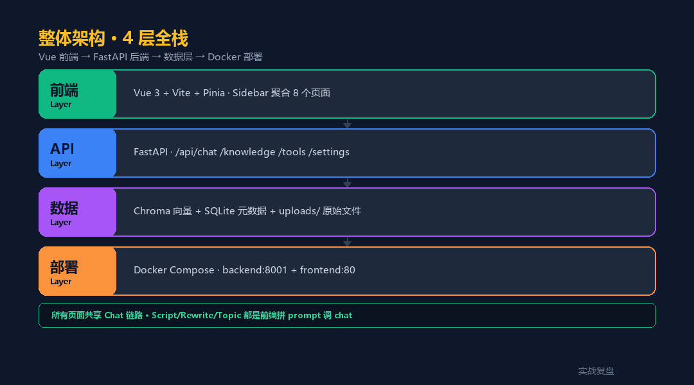
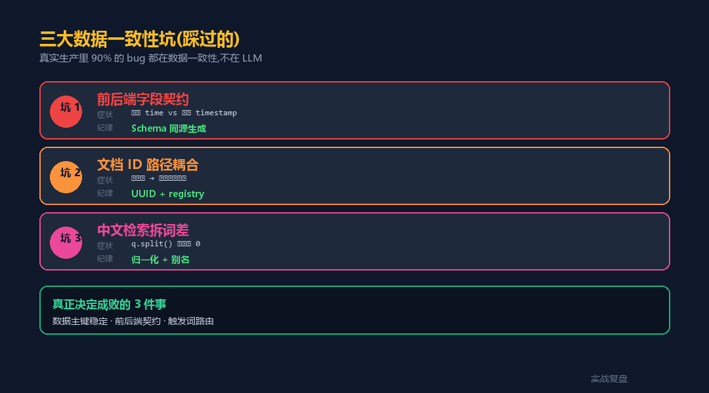
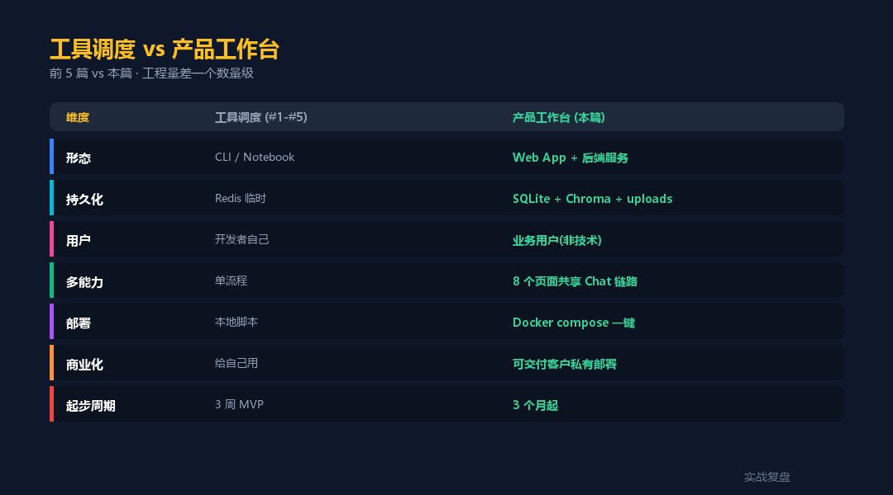

# 全栈 AI 工作台 · livetoken 案例 — 从工具调度到产品级 Agent

> 实战复盘 · AI 工具栈 · 行业落地 #6 · 集大成压轴
>
> 前 5 篇都在讲 Agent SDK 编排工具,这一篇换姿势 —— 真造一个**全栈产品**。
> 配套**完整可运行代码**(Vue + FastAPI + Chroma + Docker)。

<div align="center">

📖 **本文同步发布于公众号「实战复盘」** · 每周更新 AI Agent 行业落地实战
🌐 完整代码仓库:[github.com/OnelongX/aiagent](https://github.com/OnelongX/aiagent)
💡 endpoint 选型推荐:[docs/endpoints.md](../../docs/endpoints.md) · [docs/livetoken.md](../../docs/livetoken.md)

</div>

---

## TL;DR

| 项 | 内容 |
|---|---|
| **案例** | `ai-workbench` —— 开源全栈 AI 工作台 demo |
| **架构** | Vue 3 + FastAPI + Chroma + SQLite + Docker |
| **模型** | OpenAI 协议兼容 endpoint(推荐 [livetoken](https://livetoken.top)) |
| **代码** | [code/](code/) 目录,**Docker compose 一键起** |
| **能力** | 流式聊天 + RAG 知识库 + 可观测日志 + 配置热改 |
| **跑通时间** | **5 分钟**(填完 .env 后 `docker compose up`) |

---

## I. 前 5 篇漏讲的一件事

回顾行业落地 1-5 篇:

| # | 关键词 | 形态 |
|---|---|---|
| 1 | 确定性 | 单 CLI / 工具调度 |
| 2 | 降漏判 | 多模型 / 工具调度 |
| 3 | 准确 | RAG / 工具调度 |
| 4 | 克制 | State 机 / 工具调度 |
| 5 | 闭环 | OMS / 工具调度 |

**全都在 Agent SDK 内编排工具**。但真实生产里,AI 产品 ≠ 单 Agent。它是:

> **Vue 前端 + FastAPI 后端 + Chroma 向量库 + SQLite 元数据 + Docker 一键部署**

工具调度是骨架,**产品工作台是器官**。从骨架到器官,工程量翻 10 倍。

---

## II. ai-workbench 是什么

一个**最小可跑、行业无关**的全栈 AI 工作台 demo,3 个页面:

| 页面 | 能力 |
|---|---|
| 💬 **聊天** | 流式 SSE · RAG 上下文 · 引用展示 · 历史记忆 |
| 📚 **知识库** | 文档 ingest · UUID 主键 · 向量检索 · 分类管理 |
| ⚙️ **设置** | 当前配置展示 · 请求日志(字段契约示范) |

**模型层**走 OpenAI 协议兼容 endpoint —— 一行 `LLM_API_BASE` 切换:

- 推荐:[**livetoken**](https://livetoken.top)(一个 base_url 覆盖 GPT-5 / Claude / Gemini / DeepSeek,详见 [docs/livetoken.md](../../docs/livetoken.md))
- 也可以走 OpenAI 官方 / OpenRouter / DeepBricks / AnyRouter

---

## III. 整体架构 · 4 层全栈



```
┌──────────────────────────────────────────────────┐
│  Vue 3 + Vite + Pinia                            │
│  Sidebar · 3 个页面(Chat / Knowledge / Settings) │
└────────────────┬─────────────────────────────────┘
                 │  REST(axios) + SSE(fetch)
                 ▼
┌──────────────────────────────────────────────────┐
│  FastAPI                                          │
│  ├ /api/chat/stream      流式聊天 + RAG          │
│  ├ /api/knowledge        文档 ingest + 检索       │
│  └ /api/settings         配置 + 日志             │
└────────┬────────────────────┬────────────────────┘
         │                    │
         ▼                    ▼
┌────────────────┐    ┌─────────────────────────┐
│  SQLite        │    │  Chroma + sentence-tf   │
│  对话历史      │    │  doc_registry + 向量库  │
│  日志缓冲      │    │  BGE-M3 embedding       │
└────────────────┘    └─────────────────────────┘
         │                    │
         └────────┬───────────┘
                  ▼
┌──────────────────────────────────────────────────┐
│  Docker Compose                                   │
│  backend:8001 + frontend:8080                    │
│  hf_cache volume 持久化 embedding 模型           │
└──────────────────────────────────────────────────┘
```

**关键模型层抽象**:

```python
# code/backend/app/services/chat.py
self.client = OpenAI(
    api_key=settings.llm_api_key,
    base_url=settings.llm_api_base,   # ← 这一行决定走哪家
)
```

设 `LLM_API_BASE=https://livetoken.top` → 跑 livetoken
设 `LLM_API_BASE=https://api.openai.com/v1` → 跑官方

---

## IV. 5 分钟跑通

### 1. 拉代码

```bash
git clone https://github.com/OnelongX/aiagent.git
cd aiagent/02-industry-cases/06-fullstack-workbench/code
```

### 2. 配 endpoint(`.env`)

```bash
cp .env.example backend/.env
```

编辑 `backend/.env`:

```bash
# 推荐用 livetoken
LLM_API_BASE=https://livetoken.top
LLM_API_KEY=sk-xxxxx              # ← 你的 token
LLM_MODEL=gpt-5
```

> 没 token 的话先去 [livetoken.top](https://livetoken.top) 注册 + 充 ¥10。完整介绍:[docs/livetoken.md](../../docs/livetoken.md)

### 3. Docker 一键起

```bash
docker compose up -d
```

首次启动需 1-2 分钟(下载 embedding 模型 BGE-M3 到 `hf_cache` volume)。

### 4. 访问

- 前端:http://localhost:8080
- 后端 API 文档:http://localhost:8001/docs
- 健康检查:http://localhost:8001/api/health

---

## V. 工程决策 1:统一 endpoint + 模型层抽象

**1 行配置切模型**。`config.py` 用 pydantic-settings 读 `.env`:

```python
class Settings(BaseSettings):
    llm_api_base: str = "https://livetoken.top"  # 推荐
    llm_api_key: str = "sk-xxxxx"
    llm_model: str = "gpt-5"
```

ChatService 用 OpenAI Python SDK 直接调:

```python
self.client = OpenAI(api_key=settings.llm_api_key, base_url=settings.llm_api_base)
stream = self.client.chat.completions.create(
    model=settings.llm_model, messages=messages, stream=True,
)
```

**这就是 OpenAI 协议兼容的好处** —— 切 livetoken / OpenRouter / 官方 都不用改第二行代码。

---

## VI. 工程决策 2:RAG + 历史的 3 源融合

聊天主链路不是「LLM 直答」,而是**至少 3 源拼上下文**:

```python
def stream_reply(self, message, history):
    # 1. RAG 检索(始终跑)
    rag_context, refs = self._build_rag_context(message)

    # 2. 历史压缩(只保留最近 20 轮)
    compact_history = history[-MAX_HISTORY_PAIRS * 2:]

    # 3. 拼 system prompt
    sys_prompt = get_system_prompt()
    if rag_context:
        sys_prompt += f"\n\n# 知识库参考内容:\n{rag_context}"

    messages = [{"role": "system", "content": sys_prompt}]
    messages.extend(compact_history)
    messages.append({"role": "user", "content": message})
    # → LLM 流式调用
```

**纪律**:确定性逻辑(始终跑 RAG / 始终带历史)放工具层,**不让 LLM 自己决定要不要检索**。

---

## VII. 工程决策 3:系统 Prompt 工程化

不写死在代码里 —— 写到文件 + 可热改:

```python
_PROMPT_FILE = Path(...) / "data" / "system_prompt.txt"

def get_system_prompt() -> str:
    if _PROMPT_FILE.exists():
        custom = _PROMPT_FILE.read_text(encoding="utf-8").strip()
        if custom:
            return custom
    return DEFAULT_SYSTEM_PROMPT   # 兜底
```

部署到客户那里,通过 Settings 页面热改,**一个 codebase 适配 N 个行业**。

---

## VIII. 数据一致性三大坑



### 坑 1:前后端字段契约不一致

**症状**:设置页日志时间忽显示忽空。
**根因**:后端输出 `time`,前端读 `timestamp` —— **字段名错位**。
**修复**(本仓库代码已修):

```python
# code/backend/app/api/settings.py
def log_request(method, path, status, duration_ms):
    _LOG_BUFFER.append({
        "timestamp": time.strftime("%Y-%m-%dT%H:%M:%S"),  # ← 不是 time
        "method": method, "path": path,
        "status": status, "duration_ms": round(duration_ms, 2),
    })
```

```vue
<!-- code/frontend/src/views/SettingsView.vue -->
<td class="ts">{{ l.timestamp }}</td>   <!-- ← 跟后端对齐 -->
```

**纪律**:Schema 写一次,前后端共享。本仓库的 `models/schemas.py` 是这个约束的体现。

### 坑 2:知识库文档 ID 与路径耦合 → 文档身份漂移

**症状**:移动分类 / rebuild / 覆盖上传 → 文档变成"逻辑新文档",registry 和向量库错位。
**根因**:`doc_id` 按路径 hash 推导,路径变 → ID 变 → 一致性崩。
**修复**(本仓库代码已修):

```python
# code/backend/app/services/rag.py
def ingest_document(title, content, doc_id=None, category=None):
    if doc_id is None:
        doc_id = str(uuid.uuid4())   # ← 首次生成 UUID
    # rebuild / 改分类:传入原 doc_id
    # registry + 向量库 + 原始文件 三方对齐
    ...
```

**纪律**:**业务实体的稳定主键不能从外部状态推导**。UUID + registry 是唯一正解。

### 坑 3:中文检索拆词差

**症状**:用户问"6500W 三相",老逻辑用 `q.split()` 拆词,中文连写 → 召回为 0。
**根因**:`split()` 按空格分,中文规格表达无空格。
**修复纪律**:

- 归一化(去空格 / 大小写 / 标点)
- 别名映射(常见缩写、口语词)
- 字段加权(品牌 > 型号 > 规格)

(本 demo 用 BGE-M3 多语言 embedding 兜底,生产场景需要加上面 3 层。)

---

## IX. 工具调度 vs 产品工作台



| 维度 | Agent SDK 工具调度(#1-#5) | 产品工作台(本篇) |
|---|---|---|
| 形态 | CLI / Notebook | Web App + 后端服务 |
| 持久化 | 内存 + Redis 临时 | **SQLite + Chroma + uploads/** |
| 用户 | 开发者自己 | **业务用户(非技术)** |
| 多能力 | 单流程 | **多页面共享 Chat 链路** |
| 部署 | 本地脚本 | **Docker compose 一键** |
| 商业化 | 给自己用 | **可交付客户私有部署** |
| 起步周期 | 3 周 | **3 个月起** |

**核心认知**:**Agent SDK 工具调度**适合「快速验证想法」,**产品工作台**适合「真正卖出去」。两条路径都对,只是阶段不同。

---

## X. 代码结构

```
code/
├── docker-compose.yml          # 一键启动
├── .env.example                # endpoint 配置模板
├── backend/
│   ├── Dockerfile
│   ├── requirements.txt
│   └── app/
│       ├── main.py             # FastAPI 入口
│       ├── config.py           # pydantic-settings
│       ├── api/
│       │   ├── chat.py         # /api/chat/stream
│       │   ├── knowledge.py    # /api/knowledge/*
│       │   └── settings.py     # /api/settings/*
│       ├── services/
│       │   ├── chat.py         # ⭐ 编排核心
│       │   └── rag.py          # ⭐ Chroma + registry
│       └── models/
│           └── schemas.py      # ⭐ 字段契约统一
└── frontend/
    ├── Dockerfile
    ├── nginx.conf              # SSE 长连接配置
    ├── package.json
    ├── vite.config.js
    └── src/
        ├── main.js
        ├── router.js
        ├── App.vue             # Sidebar layout
        ├── api/index.js        # axios 实例
        └── views/
            ├── ChatView.vue    # ⭐ 流式 SSE 消费
            ├── KnowledgeView.vue
            └── SettingsView.vue
```

---

## XI. 加能力的路径(扩展指南)

代码只放了**最关键的 3 个页面**作为骨架。要加功能很简单:

### 加一个新页面(如 "脚本生成")

1. `frontend/src/views/ScriptView.vue` —— UI + 前端拼 prompt
2. `frontend/src/router.js` —— 加路由
3. `frontend/src/App.vue` —— sidebar 加 nav-item

**不用动后端** —— 复用 `/api/chat/stream`,前端拼好 prompt 直接调。

### 加一个垂类工具(如 "ROI 计算器")

1. `backend/app/services/tools.py` —— 写计算函数
2. `backend/app/api/tools.py` —— 暴露 REST 接口
3. 前端 `ToolsView.vue` —— 表单 + 调用 + 展示

### 加一个 LLM "技能"(如多模型路由)

1. 改 `services/chat.py`,按 task_type 切换 model
2. 用 LiteLLM 封装(参考 [docs/livetoken.md](../../docs/livetoken.md) 的 LiteLLM 代码片段)

---

## XII. 工程账本

| 项 | 数量 | 说明 |
|---|---|---|
| 前端文件 | 8 个 | 3 view + App + main + router + api + nginx |
| 后端 Python 文件 | 9 个 | 3 API + 2 service + 1 model + main + config + init |
| 数据库表 | 3 个 | conversations / messages / doc_registry |
| Docker 镜像 | 2 个 | backend + frontend(+ hf_cache volume) |
| **代码总量** | **~600 行** | 不算 package.json / Docker 配置 |

**这是骨架**。EnergyAI 等真实产品在这个基础上扩展:

- 加 5+ 个页面(脚本 / 改写 / 选题 / 工具 / 产品库)
- 加领域知识库(钙钛矿 / 逆变器 / BMS 文档)
- 加垂类工具(IRR / 系统选型 / 容量配置)
- 加权限 / 多租户 / SSO

**骨架 → 产品 工程量 5-10 倍。**

---

## XIII. 3 件真正决定成败的事

如果你也在做类似工作台:

1. **数据主键稳定性** —— UUID + registry,从 day 1 就用
2. **前后端契约一致性** —— Schema 写一次(Pydantic + TypeScript 同源)
3. **触发词 vs LLM 分类** —— 确定性逻辑放工具层,不让 LLM 决定路由

这 3 件事是行业落地系列 6 篇里反复出现的主题。本篇用代码把它们落到了实处。

---

## XIV. 行业落地系列收官

6 篇行业落地完整图谱:

| # | 关键词 | 工程量 |
|---|---|---|
| 1 | 确定性 | 3 周 |
| 2 | 降漏判 | 3 周 |
| 3 | 准确 | 3 周 |
| 4 | 克制 | 3 周 |
| 5 | 闭环 | 3 周 |
| **6** | **跃迁(本篇)** | **3 个月** |

前 5 篇是 Claude Agent SDK 的能力地图,**本篇是从能力到产品的跃迁路径,并配套完整可跑代码**。

---

## 关联文档

- [code/](code/) —— 完整代码 + Docker 部署
- [docs/livetoken.md](../../docs/livetoken.md) —— livetoken 深度介绍
- [docs/endpoints.md](../../docs/endpoints.md) —— endpoint 选型综述
- [主仓库 README](../../README.md) —— 全系列 14+ 篇索引

---

实战复盘 · AI 工具栈 · 行业落地 #6 · 集大成压轴
本文仅供学习参考。涉及的所有外部服务请按其官方文档使用。
