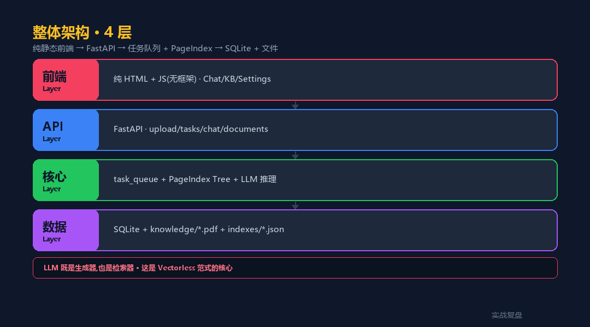

# Vectorless RAG 智能客服 —— PageIndex 中文实战 + 完整可跑代码

> 实战复盘 · AI 工具栈 · 行业落地 #7
>
> #6 用 Chroma 向量库,这一篇换条路 —— **不切块、不向量、按文档结构 + LLM 推理**。
> 配套**完整可跑代码**(FastAPI + PageIndex + Docker)。

<div align="center">

<a href="https://github.com/OnelongX/aiagent">

</a>

📖 **本文同步发布于公众号「实战复盘」** · 微信号:`IamOnelong`
🌐 [完整代码仓库 · github.com/OnelongX/aiagent](https://github.com/OnelongX/aiagent)
💡 endpoint 选型:[docs/livetoken.md](../../docs/livetoken.md)

</div>

---

## TL;DR

| 项 | 内容 |
|---|---|
| **核心范式** | Vectorless RAG —— **不用向量库,LLM 直接推理文档树** |
| **依赖** | [PageIndex](https://github.com/VectifyAI/PageIndex)(MIT · Vectify AI 开源) |
| **适用** | 结构化长文档(产品规格 / 法律 / 技术手册) |
| **架构** | FastAPI + PageIndex + SQLite + 异步任务队列 |
| **跑通时间** | **5 分钟**(Docker 一键 · 自动拉 PageIndex) |
| **代码** | [code/](code/) 目录,完整可跑 |

---

## I. 行业落地 #6 vs #7 —— 两条 RAG 路线

| 维度 | #6 Chroma 向量 RAG | #7 PageIndex Vectorless |
|---|---|---|
| 切块 | 固定 size + overlap | **按文档结构(章节)** |
| 检索 | embedding + cosine | **LLM 推理选章节** |
| 依赖 | 向量库 + embedding 模型 | **不要向量库** |
| 长文档 | 切块易失语义 | **保留章节完整性** |
| 中文 | 看 embedding 质量 | **不依赖 embedding** |
| 速度 | 毫秒级 | 秒级(LLM 推理) |
| 成本 | 一次 embedding 长期用 | **每次查询付 LLM 钱** |
| 适合 | 通用 / 短文档 / 大量 | **长结构化文档 / 高精度** |

**不是替代关系,是互补**。本仓库 #6 和 #7 各自有完整可跑代码,你可以选择,也可以混用。

---

## II. 什么是 PageIndex?

[PageIndex](https://github.com/VectifyAI/PageIndex) 是 Vectify AI 开源的 **Vectorless, Reasoning-based RAG** 框架。

```
传统向量 RAG:
   PDF → 切块 → embedding → 向量库 → 余弦相似度检索 → LLM 生成

PageIndex:
   PDF → 按目录切章节 → 章节描述 + keywords → 树状 JSON
   → 查询时 LLM 看树状目录决定看哪几章 → 读章节原文 → 生成
```

**核心创新**:把检索任务交给 LLM 自己,通过推理选章节 —— 跟人类阅读长文档的方式一致。

---

## III. 为什么不用向量库?

3 个真实痛点:

### 痛点 1:向量 RAG 在长文档上语义漂移

切块大小 vs 语义完整性 永远是 trade-off:

- 切太小 → embedding 失去上下文(一段技术参数被切到两块)
- 切太大 → 一块里多个话题,检索混淆

**长文档(规格书 / 合同 / 手册)的章节本身就是天然语义单元**,按章节切最稳。

### 痛点 2:中文场景下 embedding 质量参差

虽然 BGE-M3 / Cohere 在中文上不错,但:

- 同一概念多种表达(华为逆变器 = HW 逆变器 = SUN2000)
- 行业术语 / 缩写没归一化
- 数字 / 规格表达 split 不友好

**LLM 推理可以理解这些表达变体**,不靠 embedding 距离。

### 痛点 3:可解释性

向量检索告诉你"top-5 相似",但**没法解释为什么**。
PageIndex 让 LLM 显式输出"我看了第 3 章和第 7 章,理由是 ..."。**审计 / 合规场景关键**。

---

## IV. ai-customer-service 是什么

一个用 PageIndex 搭的**智能客服系统**,**完整可跑**。

### 真实落地场景

光储产品方的客服痛点:

- 客户问:"CHSM78N 这个组件能不能用在屋顶?"
- 客户问:"THI-6000LVL 支持哪些电池协议?"
- 客户问:"51.2V 314Ah 电池冬天能用吗?"

**传统客服**:翻产品规格书 PDF(几十页),人工找答案。
**Vectorless RAG**:LLM 看完文档目录树,精准定位到"产品参数 → 工作温度"章节,读原文生成答案 + 引用页码。

### 3 个核心能力

| 能力 | 说明 |
|---|---|
| **PDF 智能索引** | PyMuPDF + RapidOCR 抽文本 → PageIndex 按章节切 → LLM 生成描述 |
| **章节级检索** | LLM 看目录树 → 推理选章节 → 读章节原文 |
| **异步任务队列** | 索引 PDF 耗时(几十秒~几分钟),前端轮询进度 |

---

## V. 整体架构



```
┌──────────────────────────────────────────────────┐
│  纯静态前端 (HTML + JS · 无框架)                 │
│  Chat / Knowledge / Settings / Analytics         │
└────────────────┬─────────────────────────────────┘
                 │  REST(轮询任务进度)
                 ▼
┌──────────────────────────────────────────────────┐
│  FastAPI                                          │
│  ├ /api/upload         上传 PDF + 启异步索引     │
│  ├ /api/tasks/{id}     任务进度查询              │
│  ├ /api/chat           同步问答                  │
│  ├ /api/documents      文档列表                  │
│  └ /api/settings       AI 配置(model/temp)     │
└────────┬────────────────────┬────────────────────┘
         │                    │
         ▼                    ▼
┌────────────────┐    ┌─────────────────────────┐
│  task_queue.py │    │  PageIndex (开源依赖)   │
│  自写异步队列  │    │  Tree-based 切章节      │
│  PDF 索引任务  │    │  + Description LLM 生成 │
└────────────────┘    └─────────────────────────┘
         │                    │
         ▼                    ▼
┌────────────────┐    ┌─────────────────────────┐
│  SQLite        │    │  knowledge/ + indexes/  │
│  doc_registry  │    │  PDF 原文 + structure   │
│  events        │    │  .json(树状目录)       │
└────────────────┘    └─────────────────────────┘
                  ↓
┌──────────────────────────────────────────────────┐
│  LLM(OpenAI 协议 · 推荐 livetoken)              │
│  · 索引时:生成 章节 description + keywords      │
│  · 查询时:看树推理 → 选章节 → 生成答案          │
└──────────────────────────────────────────────────┘
```

---

## VI. 工程决策 1:PageIndex 的树状索引

每个 PDF 索引完会落一个 `<filename>_structure.json`:

```json
{
  "doc_name": "CHSM78N(DG)-F-BH 产品规格书",
  "doc_description": "本规格书介绍 CHSM78N 双玻光伏组件...",
  "doc_type": "product_spec",
  "keywords": ["solar module", "bifacial", "490W", "TOPCon"],
  "structure": [
    {
      "title": "1. Product Overview",
      "page_range": [1, 2],
      "description": "Product family and main specifications",
      "keywords": ["overview", "specifications"]
    },
    {
      "title": "2. Electrical Performance",
      "page_range": [3, 5],
      "children": [
        {
          "title": "2.1 STC Conditions",
          "page_range": [3, 3],
          "description": "Nominal power 490-515W..."
        }
      ]
    },
    ...
  ]
}
```

**关键**:**结构 + 描述 + 关键词**,LLM 看完就知道哪章有什么。

---

## VII. 工程决策 2:Reasoning-based 检索

查询时不查向量,**让 LLM 看树**:

```python
# code/app/retriever.py

def retrieve_context(question, library_id="default"):
    # 1. 拉所有 indexed 文档的 structure
    all_structures = get_all_structures(library_id)

    # 2. 让 LLM 看树,选出最相关的章节
    selected = _llm_select_chapters(question, all_structures)
    # selected = [{"doc": "CHSM78N", "chapters": ["2.1", "2.2"]}, ...]

    # 3. 读章节原文(PyMuPDF 按 page_range)
    contexts = []
    for sel in selected:
        for ch in sel["chapters"]:
            text = _read_pdf_pages(doc_path, ch.page_range)
            contexts.append({"doc": sel["doc"], "chapter": ch, "text": text})

    # 4. 喂给 LLM 生成答案
    return contexts


def generate_answer(question, contexts):
    prompt = f"""根据以下文档章节回答问题:

{format_contexts(contexts)}

问题:{question}

要求:
- 引用文档名 + 章节号 + 页码
- 数据要精确(规格 / 参数)
- 不知道就说不知道"""

    return call_llm(prompt)
```

---

## VIII. 工程决策 3:异步任务队列

PDF 索引耗时长(LLM 生成每章描述要时间),不能阻塞 HTTP 请求:

```python
# code/app/task_queue.py(自写,~150 行)

class TaskQueue:
    def submit(self, task_type, input_data):
        task_id = uuid.uuid4().hex
        # 落 SQLite + 推到工作线程
        return task_id

    def get_status(self, task_id):
        # 返回 {progress: 50, message: "正在生成第 3 章描述..."}
        ...

# 注册处理器
tq.register_handler("index_document", _handle_index_task)
```

**前端轮询 `/api/tasks/{id}` 看进度条**,大文件(100+ 页)体验流畅。

---

## IX. 工程决策 4:扫描件 OCR 兜底

很多产品规格书是扫描件 PDF(图像化的)。流程:

```python
def index_pdf(path):
    text = extract_with_pymupdf(path)
    if not text.strip() or len(text) < MIN_TEXT_LEN:
        # 扫描件 → OCR
        text = ocr_with_rapidocr(path)
    return text
```

**RapidOCR** 是个轻量 OCR(几十 MB,纯 Python · ONNX Runtime),不需要 GPU。

生产环境建议:

- 文本 PDF → PyMuPDF(快、准)
- 扫描件 → PaddleOCR / Tesseract(更高精度)
- 图表密集 → **Gemini 2.5 Pro 多模态**(看图说话)

---

## X. 选型决策矩阵 —— 什么时候用哪种 RAG

| 场景 | 向量 RAG(#6) | Vectorless(本篇) |
|---|---|---|
| 短文档 / FAQ pairs | ✅ | 不划算 |
| 长结构化文档 | 切块痛点多 | ✅ |
| 高并发查询 | ✅ | LLM 推理慢 |
| 中文表达多变 | embedding 漂移 | ✅ |
| 需要精确引用页码 | 不天然 | ✅ |
| 文档数 1000+ | ✅ | 树太大喂不进 |
| 文档数 < 100 | 浪费 | ✅ |
| 实时性强(IM 客服) | ✅ | 慢 |
| 合规审计场景 | 黑盒 | ✅ 可解释 |
| 多模态(图 / 表) | 难 | ✅ Gemini 配 |

**经验法则**:**文档数 ×长度 > 10万页 用向量,反之 Vectorless**。

---

## XI. 工程账本

| 项 | 数量 | 说明 |
|---|---|---|
| 后端 Python | 7 个 | main + indexer + retriever + spec_parser + database + task_queue + 1 测试 |
| 前端 JS | 6 个 | app + chat + kb + settings + analytics + utils |
| 前端 HTML | 3 个 | index + login + 404 |
| 静态资源 | 1 个 | style.css |
| 数据库表 | 3 个 | documents / events / libraries |
| 外部依赖 | 1 | PageIndex(Vectify AI 开源) |
| **代码总量** | **~1500 行** | 不算 PageIndex 库代码 |

**工程量**:**单人 2-3 周**(基于已有 PageIndex 库)。

---

## XII. 真实使用案例

光储行业 5 个真实产品文档 ingested(本仓库代码已开源,但 PDF 不公开 —— 客户私有):

- CHSM78N(DG)-F-BH 光伏组件规格书(中文,文本 PDF,~30 页)
- ASTRO N7s 490-515W EN(英文,文本 PDF,~5 页)
- 51.2V 314Ah 触摸圆屏储能电池(中文,扫描件,~50 页,**OCR 兜底**)
- THI-3600~6000LVL 混网逆变器英文彩页(英文)
- TG-OFG-8K2~11K2 离网逆变器英文彩页(英文)

**典型问答**(脱敏):

> Q:CHSM78N 的工作温度范围?
> A:根据 CHSM78N(DG)-F-BH 产品规格书第 2.3 章「环境参数」(第 4 页):
> - 工作温度:-40°C ~ +85°C
> - 储存温度:-40°C ~ +85°C
> - 相对湿度:0 ~ 100%

精度 + 引用 + 页码,客服一线场景刚需。

---

## XIII. 5 分钟跑通

```bash
git clone https://github.com/OnelongX/aiagent.git
cd aiagent/02-industry-cases/07-vectorless-rag-cs/code

# 配 endpoint
cp .env.example .env
# 编辑 .env 填 CHATGPT_API_KEY(推荐 livetoken)

# 一键启动(Docker 自动拉 PageIndex)
docker compose up -d

# 访问
# http://localhost:8000
```

详细部署见 [code/README.md](code/README.md)。

---

## XIV. 接下来怎么扩展

### 1. 加多模态文档(图表 / 公式 / 工程图纸)

把 indexer 里的 PyMuPDF 调用换成 **Gemini 2.5 Pro** 多模态:

```python
# 喂整页 PDF 图像 + 文字给 Gemini
# 生成包含图表理解的章节描述
```

### 2. 加权限隔离(B2B 多租户)

`library_id` 已经预留 —— 每个客户一个 library,检索时强制 filter。

### 3. 加 Agent 链式查询

查询复杂时(需要跨章节计算),LLM 输出**多步检索计划**,逐步读章节 + 中间计算。

### 4. 加缓存层

同一问题 LRU 缓存 → 节省 LLM 调用。

---

## XV. 行业落地系列 → 7 篇

| # | 关键词 | RAG 路线 | 工程量 |
|---|---|---|---|
| 1 | 确定性 | - | 3 周 |
| 2 | 降漏判 | - | 3 周 |
| 3 | 准确 | 向量 + 评测 | 3 周 |
| 4 | 克制 | - | 3 周 |
| 5 | 闭环 | - | 3 周 |
| 6 | 跃迁 | Chroma 向量 | 3 个月 |
| **7** | **范式对照** | **PageIndex Vectorless** | **2-3 周** |

#6 + #7 = **两种 RAG 路线的实战对照**。

---

## 关联链接

- [code/](code/) —— 完整代码 + Docker 部署
- [PageIndex 官方仓库](https://github.com/VectifyAI/PageIndex) —— MIT License · Vectify AI
- [docs/livetoken.md](../../docs/livetoken.md) —— 推荐的 endpoint 服务
- [02-industry-cases/06-fullstack-workbench/](../06-fullstack-workbench/) —— Chroma 向量 RAG 对照版本
- [主仓库 README](../../README.md)

---

## 致谢

本项目基于 [PageIndex](https://github.com/VectifyAI/PageIndex)(MIT License · Vectify AI)构建。

本仓库代码 MIT License。详见 [LICENSE](../../LICENSE)。

涉及的所有外部服务请按其官方文档使用。
