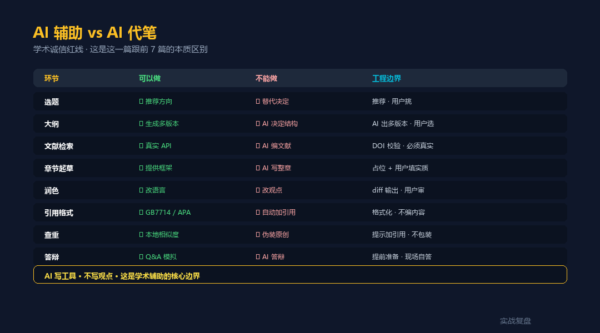
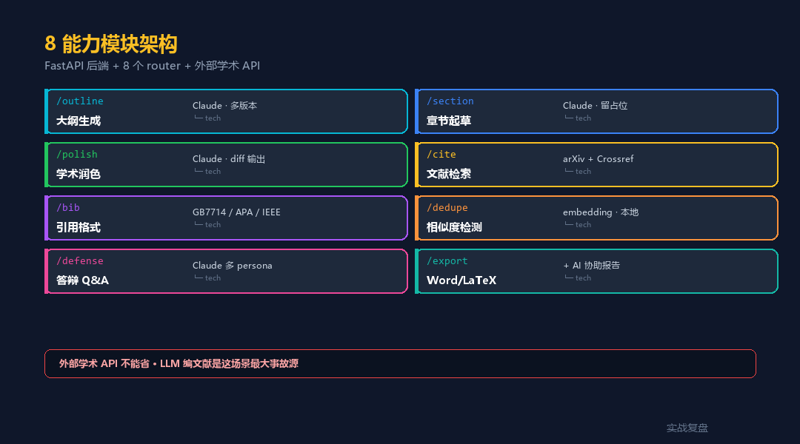

# 学生论文助手 · livetoken 案例 — AI 辅助 / 不是代笔

> 实战复盘 · AI 工具栈 · 行业落地 #8
>
> 不是教你怎么 AI 代写论文 ——
> 教你怎么把 AI 做成「会查文献的导师助理」,人在环、不越界。
>
> 配套**完整可跑代码**(FastAPI + 8 能力 API + 学术诚信红线)。

<div align="center">

📖 **本文同步发布于公众号「实战复盘」** · 每周更新 AI Agent 行业落地实战
🌐 完整代码仓库:[github.com/OnelongX/aiagent](https://github.com/OnelongX/aiagent)
💡 endpoint 选型推荐:[docs/livetoken.md](../../docs/livetoken.md)

</div>

---

## TL;DR

| 项 | 内容 |
|---|---|
| **核心定位** | AI **辅助** · 不是代笔 |
| **架构** | FastAPI + 真实学术 API + 本地 embedding + 6 引用格式 |
| **8 能力** | 大纲 / 起草 / 润色 / 检索 / 格式化 / 相似度 / 答辩 / 导出 |
| **5 红线** | DOI 校验 / AI 标签 / 降重禁词 / 协助报告 / 比例监控 |
| **endpoint** | OpenAI 协议兼容(推荐 [livetoken](https://livetoken.top)) |
| **代码** | [code/](code/) 目录,**Docker 一键起 5 分钟** |

---

## I. 这一篇跟前 7 篇的本质区别

前 7 篇行业落地讲的都是**工具调度的工程纪律**:

| # | 关键词 | 核心红线 |
|---|---|---|
| 1 | 确定性 | 数字不能算错 |
| 2 | 降漏判 | 漏判不能放过 |
| 3 | 准确 | 引用不能漂移 |
| 4 | 克制 | 不能越界承诺 |
| 5 | 闭环 | 价格不能篡改 |
| 6 | 跃迁 | 数据主键稳定 |
| 7 | 范式对照 | LLM 不编文献 |
| **8** | **学术诚信** | **AI 是助理 · 不是代笔** |

**前 7 篇的边界**:业务边界(技术 / 商业 / 合规)。
**这一篇的边界**:**伦理边界**。

学术诚信是硬红线 —— **不能把别人的写作能力交给 AI**,工具的存在不是为了让人不写,而是让人写得更好。

---

## II. AI 辅助 vs AI 代笔 · 工程化



8 个学生真实痛点 × AI 边界 :

| 痛点 | 可以做 | 不能做 |
|---|---|---|
| 选题 | 推荐方向 | 替代决定 |
| 大纲 | 多版本 | AI 决定结构 |
| 文献 | 真实 API 检索 | **AI 编文献** |
| 起草 | 框架 + 占位 | AI 写整章 |
| 润色 | 改语言 | 改观点 |
| 引用格式 | GB7714 / APA | 自动加引用 |
| 重复检测 | 提示加引用 | 伪装原创 |
| 答辩 | Q&A 模拟 | AI 答辩 |

代码里这 8 条边界都有对应实现 —— 见 [code/](code/)。

---

## III. 整体架构



```
┌──────────────────────────────────────────────────┐
│  纯静态前端 (HTML + JS · 无框架)                 │
│  6 个 Tab:大纲 / 起草 / 润色 / 文献 /            │
│  查重 / 答辩                                      │
└────────────────┬─────────────────────────────────┘
                 │  REST
                 ▼
┌──────────────────────────────────────────────────┐
│  FastAPI · 8 个 router                            │
│  ├ /api/outline        大纲(Claude · JSON mode)│
│  ├ /api/section        章节起草(留占位)        │
│  ├ /api/polish         润色(diff 输出)         │
│  ├ /api/cite/search    文献检索(真实 API)      │
│  ├ /api/cite/format    引用格式化(6 种)         │
│  ├ /api/dedupe         相似度检测(禁词列表)    │
│  └ /api/defense        答辩 Q&A(3 persona)     │
└────────┬────────────────────┬────────────────────┘
         │                    │
         ▼                    ▼
┌────────────────┐    ┌─────────────────────────┐
│  LLM           │    │  真实学术 API           │
│  Claude / GPT  │    │  · arXiv                 │
│  通过 livetoken│    │  · Crossref(DOI 验真)  │
│  endpoint      │    │  · OpenAlex              │
└────────────────┘    └─────────────────────────┘
```

**关键设计**:**学术 API 不是可选** —— 阻止 LLM 编造文献的唯一办法。

---

## IV. 工程决策 1:大纲生成留 N 个版本

```python
# code/backend/app/api/outline.py

SYSTEM_PROMPT = """你是论文写作辅导老师。生成大纲时:

1. 严格按学科常规结构(实验型/综述型/工程型/理论型)
2. 子章节标题要具体,不要"分析 X"这种空泛标题
3. 每章注明建议字数
4. 输出 N 套不同思路,让用户对比

绝不:
- 假装这是用户的研究成果
- 给出具体研究数据或结论(用户自己做实验)
"""
```

**关键**:出 3 套大纲让用户挑,**AI 不替用户决定结构**。

---

## V. 工程决策 2:章节起草留 `[作者填入]` 占位

```python
# code/backend/app/api/section.py

SYSTEM_PROMPT = """为指定章节起草框架文本。

关键纪律:
- 提供论证框架,具体数据 / 实验结果用 [作者填入: ...] 占位
- 草稿开头自动加 [本节由 AI 协助起草,核心论证由作者完成] 标签
"""

# 自动提取占位符返回给前端
placeholders = re.findall(r"\[作者填入[^\]]*\]", draft)
```

**前端展示**:每个占位符都标红,提醒学生「这些必须自己补」。

---

## VI. 工程决策 3:真实学术 API + DOI 校验

```python
# code/backend/app/services/academic_api.py

async def search_papers(query, year_from, year_to, limit):
    """并发三源 + DOI 验真"""
    results = await asyncio.gather(
        arxiv_search(query, limit),
        crossref_search(query, limit),
        openalex_search(query, limit),
    )

    deduped = deduplicate(merge(results))

    # 并发 DOI 校验(Crossref verify)
    for p in deduped:
        if p.doi:
            p.doi_verified = await crossref_verify_doi(p.doi)

    return deduped
```

```python
# code/backend/app/api/cite.py

@router.post("/format")
async def format(req):
    # 格式化前必须 DOI 校验
    if req.paper.doi and not req.paper.doi_verified:
        verified = await crossref_verify_doi(req.paper.doi)
        if not verified:
            raise HTTPException(400, f"DOI {req.paper.doi} 未通过校验")
    ...
```

**任何引用进入正文前 → Crossref 验真 → 才允许格式化**。这一条挡死 LLM 编文献。

---

## VII. 工程决策 4:降重禁词列表(防包装抄袭)

```python
# code/backend/app/api/dedupe.py

FORBIDDEN_WORDS = [
    "改写后无法识别",
    "避免查重",
    "伪装原创",
    "绕过检测",
    "降低重复率",
]


def _sanitize(text: str) -> str:
    """检查输出是否含禁词 · 含则替换为合规建议"""
    for w in FORBIDDEN_WORDS:
        if w in text:
            return "建议改写或加引用 · 标明原始来源"
    return text
```

**任何降重建议都不能教学生「怎么绕过查重」**,只能教「怎么合规处理相似段落」。

---

## VIII. 工程决策 5:答辩 3 persona 模拟

```python
# code/backend/app/api/defense.py

PERSONAS = {
    "critic": {
        "prompt": "你扮演严厉答辩委员。挑刺、质疑、找漏洞..."
    },
    "friendly": {
        "prompt": "你扮演友好答辩委员。提扩展性问题..."
    },
    "outsider": {
        "prompt": "你扮演跨学科答辩委员。挑战 generalizability..."
    },
}
```

**关键**:**真实答辩 60% 是挑刺**,默认友好的 LLM 模拟不出来 —— 必须显式分 persona。

---

## IX. 5 分钟跑通

```bash
git clone https://github.com/OnelongX/aiagent.git
cd aiagent/02-industry-cases/08-thesis-assistant/code

# 配 endpoint
cp .env.example backend/.env
# 编辑 backend/.env 填 LLM_API_KEY(推荐 livetoken)

# 一键启动
docker compose up -d

# 访问 http://localhost:8081
```

详细部署 + API 参考见 [code/README.md](code/README.md)。

---

## X. 跟现有产品的对照

| 产品 | 强项 | 弱项 |
|---|---|---|
| Grammarly | 英文语法 | 不懂中文学术语境 |
| 知网研学 | 国内文献库 | AI 辅助弱 |
| iThenticate | 查重权威 | 只查重不辅助 |
| Notion AI | 通用辅助 | 不懂学术规范 |
| ChatGPT 4o | 能写能改 | **会编文献 + 无 DOI 校验** |
| **本方案** | **学术规范 + 真实文献 + 红线 Hooks** | 需要自己搭 |

**核心差异**:**学术诚信工程化**。

---

## XI. 关联文档

- [code/](code/) —— 完整代码 + Docker 部署
- [docs/livetoken.md](../../docs/livetoken.md) —— 推荐的 endpoint
- [docs/endpoints.md](../../docs/endpoints.md) —— endpoint 选型综述
- [02-industry-cases/06-fullstack-workbench/](../06-fullstack-workbench/) —— Vue + Chroma 工作台对照
- [02-industry-cases/07-vectorless-rag-cs/](../07-vectorless-rag-cs/) —— PageIndex 客服对照
- [主仓库 README](../../README.md)

---

## XII. 行业落地系列 → 8 篇

| # | 关键词 | 工程量 | 代码 |
|---|---|---|---|
| 1-5 | 确定性 / 降漏判 / 准确 / 克制 / 闭环 | 3 周 / 篇 | 概念示例 |
| 6 | 跃迁 | 3 个月 | ⭐ Vue + FastAPI + Chroma |
| 7 | 范式对照 | 2-3 周 | ⭐ FastAPI + PageIndex |
| **8** | **学术诚信** | **2-3 周** | ⭐ **FastAPI + 真实学术 API** |

#6 / #7 / #8 = **三种 AI 应用形态的工程对照**:

- #6:多功能工作台(Vue 重型前端)
- #7:专注客服(纯静态前端)
- #8:垂类辅助(纯静态前端 + 多模块 API)

---

## License

本仓库代码 MIT。详见 [LICENSE](../../LICENSE)。

**本工具是学术辅助 · 请遵守所在学术机构的诚信规范。**
