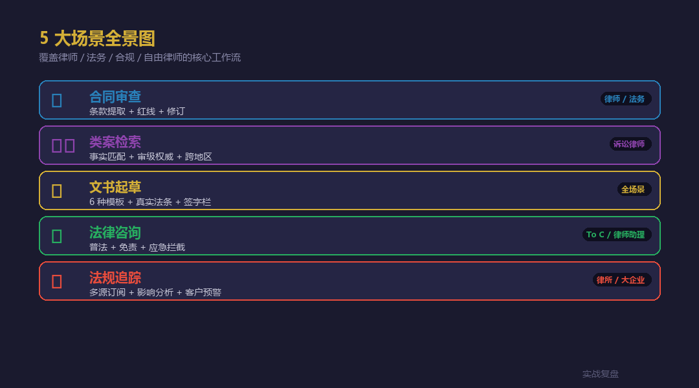
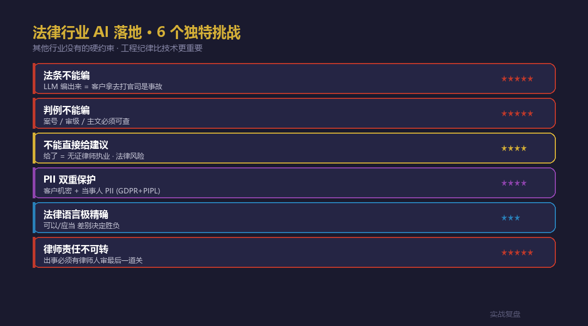
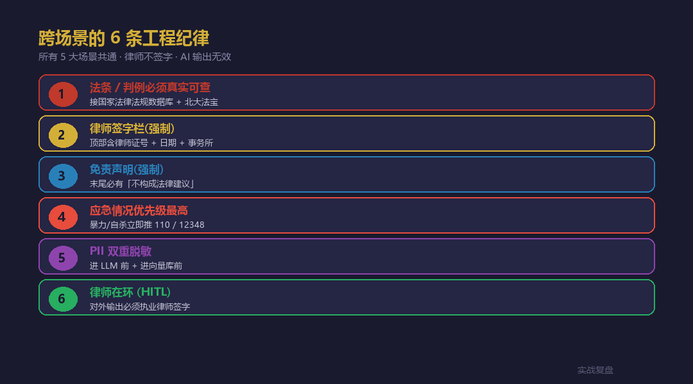
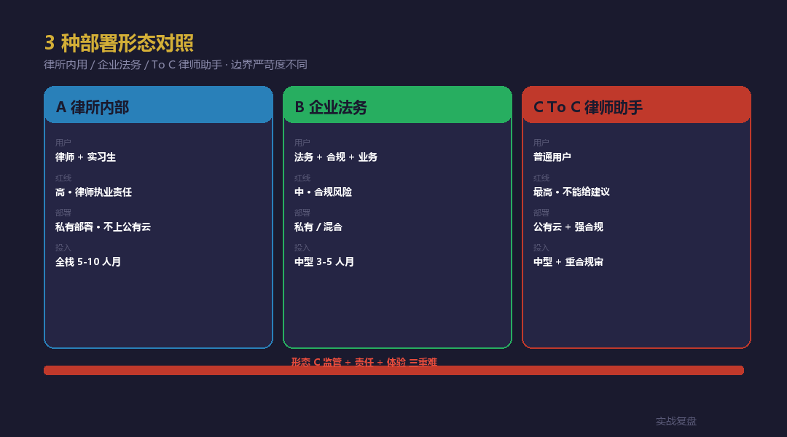

# 法律行业 AI 落地 · livetoken 案例 — 5 大场景实战

> 实战复盘 · AI 工具栈 · 行业落地 #9
>
> 5 个真实场景 · 每个含架构 + 工程纪律 + 法律红线 Hooks
> 配套**完整可跑代码**(FastAPI + 6 API + 法律特化 service)

<div align="center">

📖 **本文同步发布于公众号「实战复盘」** · 微信号:`IamOnelong`
🌐 完整代码仓库:[github.com/OnelongX/aiagent](https://github.com/OnelongX/aiagent)
💡 endpoint 选型推荐:[docs/livetoken.md](../../docs/livetoken.md)

</div>

---

## TL;DR

| 项 | 内容 |
|---|---|
| **核心定位** | AI **辅助律师** · 不是替代律师 |
| **5 大场景** | 合同 / 类案 / 文书 / 咨询 / 法规 |
| **6 大纪律** | 法条真实 / 签字栏 / 免责 / 应急 / PII / HITL |
| **架构** | FastAPI + 6 API + 4 service + 轻量前端 |
| **endpoint** | OpenAI 协议兼容(推荐 [livetoken](https://livetoken.top)) |
| **代码** | [code/](code/) 目录,**Docker 一键起 5 分钟** |

---

## I. 跟前 8 篇行业落地的关系

| # | 行业 | 核心红线 |
|---|---|---|
| 1-7 | 业务边界(确定性 / 漏判 / 引用 / 承诺 / 价格 / 主键 / 文献) | 技术 / 商业 |
| 8 | 学生论文 | 学术诚信 · AI 是助理 |
| **9** | **法律** | **执业责任 · AI 不是律师** |

法律行业**比学生论文更严**:学术不端 → 学位风险;法律不当 → **执业犯罪 + 民事赔偿**。

---

## II. 5 大场景全景



| 场景 | API endpoint | 关键挑战 |
|---|---|---|
| 📋 合同审查 | `/api/contract/review` | PII + 红线 + 软化建议性语言 |
| ⚖️ 类案检索 | `/api/cases/search` | 审级权威 + 跨地区差异 |
| 📝 文书起草 | `/api/drafting/generate` | 律师签字栏 + 法条验真 |
| 💬 法律咨询 | `/api/qa` | 不能给建议 + 应急拦截 |
| 📰 法规追踪 | `/api/regulation/track` | 多源订阅 + 影响分析 |
| 🔒 PII 脱敏 | `/api/pii/redact` | GDPR + PIPL 双重 |

---

## III. 6 大独特挑战



| 挑战 | 难度 | 工程对策 |
|---|---|---|
| 法条不能编 | ★★★★★ | 接真实数据库 + Crossref 式验真 |
| 判例不能编 | ★★★★★ | 案号 / 审级 / 主文必须可查 |
| 不能直接给建议 | ★★★★ | 软化语言 hook · 12 个禁词替换 |
| PII 双重保护 | ★★★★ | 进 LLM 前 + 进向量库前 |
| 法律语言精确 | ★★★ | "可以"/"应当" 关键词审查 |
| 律师责任不可转 | ★★★★★ | 签字栏强制注入 |

---

## IV. 6 条工程纪律(代码体现)



```python
# 1. 法条必须真实可查
# code/backend/app/services/legal_db.py::verify_article
# 接国家法律法规数据库 / 北大法宝 · 失败拦截

# 2. 律师签字栏(强制)
# code/backend/app/services/lawyer_block.py::sign_block
# 文书顶部自动注入 · 含律师证号 + 事务所 + 日期

# 3. 免责声明(强制)
# code/backend/app/services/lawyer_block.py::qa_disclaimer
# 末尾自动追加 + 法律援助热线

# 4. 应急情况优先级最高
# code/backend/app/services/lawyer_block.py::is_emergency
# 关键词列表 · 不进 LLM · 直接推 110 / 12348

# 5. PII 双重脱敏
# code/backend/app/services/pii_redact.py
# 6 类正则:身份证/手机/邮箱/银行卡/地址/中文姓名

# 6. 建议性语言软化
# code/backend/app/services/lawyer_block.py::soften_advice
# 12 个禁词 → 科普性表达
```

---

## V. 5 个场景的代码示例

### 1. 合同审查 + PII 自动脱敏

```python
# code/backend/app/api/contract.py

@router.post("/review")
async def review_contract(req):
    # 1. PII 脱敏(进 LLM 前)
    redacted, _ = redact(req.contract_text)

    # 2. LLM 风险评级
    data = chat_json(SYSTEM_PROMPT, redacted, max_tokens=4000)

    # 3. 软化建议性语言
    for r in data["risks"]:
        if detect_legal_advice(r["suggestion"]):
            r["suggestion"] = soften_advice(r["suggestion"])
        r["ai_drafted"] = True  # 标 AI 起草

    return ...
```

### 2. 类案检索 + 审级加权 + 跨地区警告

```python
# code/backend/app/api/cases.py

def authority_weight(level):
    return {"最高院": 1.0, "高院": 0.8, "中院": 0.6, "基层": 0.4}[level]

# 排序公式
c.similarity = (
    0.3 * c.factual_similarity +
    0.3 * c.legal_basis_overlap +
    0.2 * authority_weight(c.court_level) +
    0.1 * recency_weight +
    0.1 * jurisdiction_match
)

# 跨地区警告
cross_juris = any(req.jurisdiction not in c.court for c in cases)
```

### 3. 文书起草 + 律师签字栏 + 法条验真

```python
# code/backend/app/api/drafting.py

@router.post("/generate")
async def draft(req):
    # 1. PII 脱敏 case_info
    redacted_case, _ = redact(str(req.case_info))

    # 2. 生成正文(留 [作者填入] 占位)
    body = chat(SYSTEM_BASE + DOC_TEMPLATES[req.document_type], ...)

    # 3. 法律依据 · 接真实数据库验真
    legal_basis = await search_articles(...)

    # 4. 强制组合:签字栏 + 正文 + 免责声明
    final_doc = sign_block() + body + ai_disclaimer()

    return ...
```

### 4. 法律咨询 + 5 类意图分流

```python
# code/backend/app/api/qa.py

def classify_intent(question):
    if is_emergency(question):       return "应急情况"
    if has_criminal_markers(question): return "刑事相关"
    if has_individual_markers(question): return "个案咨询"
    return "普法"

# 应急 → 直接拦截
if is_emergency(req.question):
    return LegalQAResponse(
        intent="应急情况",
        answer=EMERGENCY_RESPONSE,  # 立即推 110 / 12348
        emergency_contacts=[...]
    )

# 个案 → 改写为科普 + 强推律师
if intent == "个案咨询":
    answer = await _redirect_individual_case(...)

# 刑事 → 拒答 + 推刑事辩护律师
if intent == "刑事相关":
    return ...
```

### 5. 法规追踪 + LLM 影响分析

```python
# code/backend/app/api/regulation.py

@router.post("/track")
async def track(req):
    # 1. 多源订阅(本 demo mock · 生产接 RSS)
    raw_updates = await fetch_recent_regulations(days=req.days)

    # 2. LLM 影响分析(基于客户业务关键词)
    for u in updates:
        u.summary = await _impact_analysis(u, req.business_keywords)
        # 禁词:无影响 / 完全合规 / 不需要任何改造

    return RegulationTrackingResponse(updates=updates)
```

---

## VI. 3 种部署形态



| 形态 | 用户 | 红线 | 部署 |
|---|---|---|---|
| A 律所内部 | 律师 + 实习生 | 高 | **私有部署** · 不上公有云 |
| B 企业法务 | 法务 + 合规 + 业务 | 中 | 私有 / 混合 |
| C To C 律师助手 | 普通用户 | **最高** | 公有云 + 强合规 |

**形态 C 最难** —— 普通用户用错了直接吃亏,所以本仓库的 `/api/qa` 默认走严格模式。

---

## VII. 5 分钟跑通

```bash
git clone https://github.com/OnelongX/aiagent.git
cd aiagent/02-industry-cases/09-legal-industry/code

cp .env.example backend/.env
# 编辑 backend/.env 填 LLM_API_KEY(推荐 livetoken)

docker compose up -d

# 前端 http://localhost:8083
# API 文档 http://localhost:8003/docs
```

详细部署 + API 参考见 [code/README.md](code/README.md)。

---

## VIII. 自测案例(供律所参考)

### 测试 1:PII 脱敏覆盖率

```bash
# 输入
原告:张三, 身份证 110101199001011234, 手机 13800138000,
住北京市朝阳区建国路 88 号 101 室, 邮箱 zhangsan@example.com。

# 期望输出
原告:[NAME_1], 身份证 [ID_CARD_1], 手机 [PHONE_1],
住 [ADDRESS_1], 邮箱 [EMAIL_1]。
```

### 测试 2:应急情况拦截

```bash
# 输入
我老婆刚才被打了,流血了,我该怎么办?

# 期望:不进 LLM · 直接返回 EMERGENCY_RESPONSE
# 推 110 / 12338(妇联)/ 12348 / 400-161-9995
```

### 测试 3:建议性语言软化

```bash
# 原 LLM 输出
你应该立即起诉对方,胜算很大。

# 经过 soften_advice 后
一般来说可以考虑诉讼途径,案件结果需由法院判决。
```

### 测试 4:文书签字栏

```bash
# 任何 /api/drafting/generate 输出
# 顶部必含:
────────────────────────────────────────
本文书由 AI 工具辅助起草,具体内容需经
执业律师审核确认后,加盖签字方可使用。

事务所:示例律师事务所
执业律师:______________  律师证号:______
签字日期:______________________________
...
```

---

## IX. 关联文档

- [code/](code/) —— 完整代码 + Docker 部署
- [docs/livetoken.md](../../docs/livetoken.md) —— 推荐的 endpoint
- [02-industry-cases/06-fullstack-workbench/](../06-fullstack-workbench/) —— Vue + Chroma 工作台
- [02-industry-cases/07-vectorless-rag-cs/](../07-vectorless-rag-cs/) —— PageIndex 客服
- [02-industry-cases/08-thesis-assistant/](../08-thesis-assistant/) —— 学生论文(同思想)

---

## X. 行业落地系列 → 9 篇

| # | 行业 | 关键词 | 代码 |
|---|---|---|---|
| 1-5 | 工具调度模板 | 确定性 / 漏判 / 准确 / 克制 / 闭环 | 概念示例 |
| 6 | 跃迁 | 全栈工作台 | ⭐ Vue + FastAPI + Chroma |
| 7 | 范式对照 | Vectorless RAG | ⭐ FastAPI + PageIndex |
| 8 | 学术诚信 | 学生论文 | ⭐ FastAPI + 真实学术 API |
| **9** | **执业责任** | **法律行业** | ⭐ **FastAPI + 法律红线 + PII** |

#6 / #7 / #8 / #9 = **4 种 AI 应用形态的工程对照**(全栈 / 客服 / 垂类辅助 / 法律红线)。

---

## License

本仓库代码 MIT。详见 [LICENSE](../../LICENSE)。

**本工具是律师辅助 · 请遵守律师法 / 律师协会 AI 使用规范及当地法规。**
