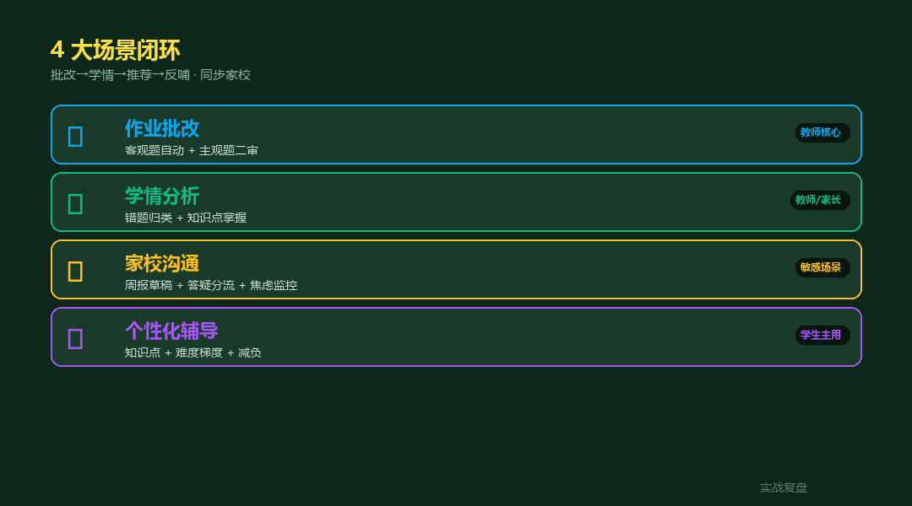
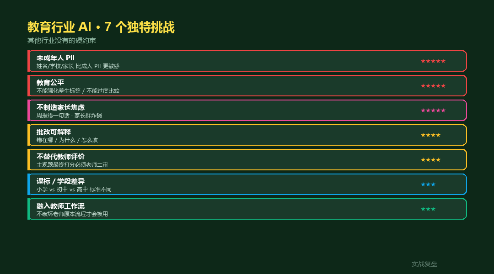
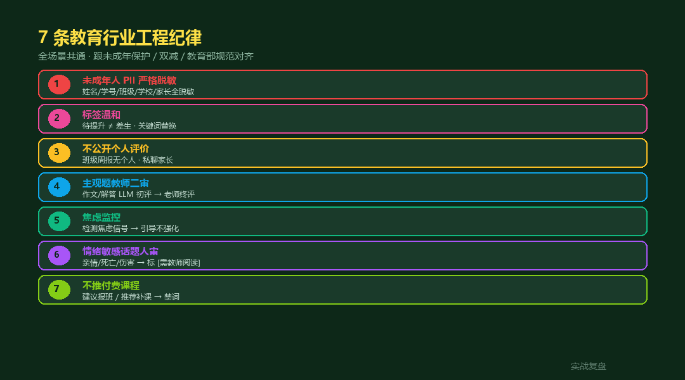
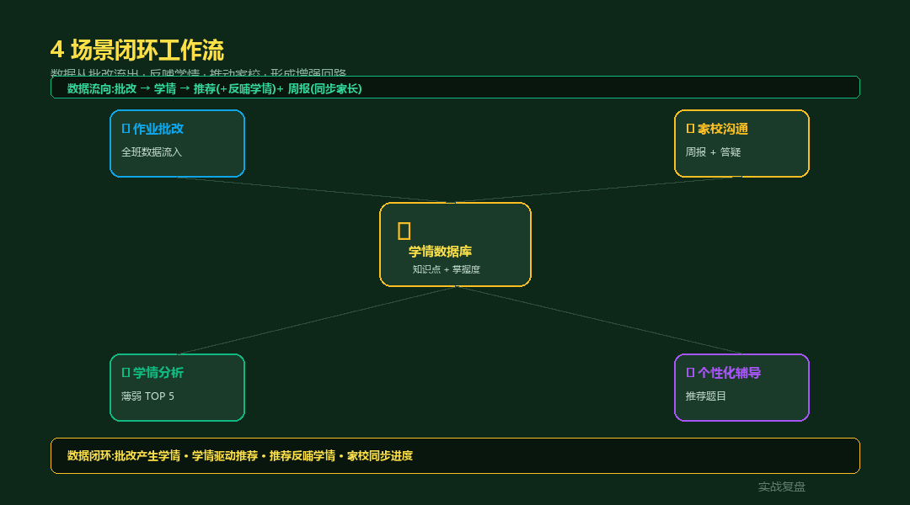

# 教育行业 AI 落地 · livetoken 案例 — 学情/批改/家校/辅导 4 大场景

> 实战复盘 · AI 工具栈 · 行业落地 #10
>
> 4 个真实场景 · 每个含架构 + 工程纪律 + 教育特化 Hooks
> 配套**完整可跑代码**(FastAPI + 7 API + 教育红线 service)

<div align="center">

📖 **本文同步发布于公众号「实战复盘」** · 微信号:`IamOnelong`
🌐 完整代码仓库:[github.com/OnelongX/aiagent](https://github.com/OnelongX/aiagent)
💡 endpoint 选型推荐:[docs/livetoken.md](../../docs/livetoken.md)

</div>

---

## TL;DR

| 项 | 内容 |
|---|---|
| **核心定位** | AI **辅助教师** · 不是替代教师 |
| **4 大场景** | 学情 / 批改 / 家校 / 辅导 |
| **7 大纪律** | PII / 温和 / 不公开 / 二审 / 焦虑 / 敏感话题 / 不推付费 |
| **架构** | FastAPI + 7 API + 4 service + 轻量前端 |
| **endpoint** | OpenAI 协议兼容(推荐 [livetoken](https://livetoken.top)) |
| **代码** | [code/](code/) 目录,**Docker 一键起 5 分钟** |

---

## I. 教育行业的 AI 落地难

| # | 行业 | 核心红线 |
|---|---|---|
| 8 | 学生论文 | AI 是助理 |
| 9 | 法律 | AI 不是律师 |
| **10** | **教育** | **AI 不是教师 + 不制造焦虑 + 未成年保护** |

教育行业比学生论文/法律**多一层挑战:家长 IM 沟通敏感度极高** —— 一句话措辞错,全班家长群炸锅。

---

## II. 4 大场景全景



| 场景 | API endpoint | 关键挑战 |
|---|---|---|
| ✍️ 作业批改 | `/api/grade/objective` + `/essay` | 客观自动 · 主观必教师二审 |
| 📊 学情分析 | `/api/analytics/class` | 班级薄弱 TOP 5 · 不输出个人 |
| 📨 家校沟通 | `/api/communication/*` | 周报 5 红线 · 答疑分流 |
| 🎯 个性化辅导 | `/api/recommend` | 双减时长上限 + 难度梯度 |
| 🔒 PII 脱敏 | `/api/pii/redact` | 未成年版(更严) |

---

## III. 7 大独特挑战



| 挑战 | 难度 | 工程对策 |
|---|---|---|
| 未成年 PII | ★★★★★ | 学号/班级/学校 / 家长信息 全脱敏 + minor flag |
| 教育公平 | ★★★★★ | 不输出个人排名 · 软化标签 |
| 不制造焦虑 | ★★★★★ | 周报 5 红线 + 焦虑信号引导 |
| 批改可解释 | ★★★★ | 4 维度评分 + diff 改进 + 理由 |
| 不替代教师 | ★★★★ | 主观题必 `requires_teacher_review=True` |
| 课标差异 | ★★★ | 学段配置 · 推荐时长上限不同 |
| 教师工作流 | ★★★ | 不破坏老师原流程 · 客观题先省时间 |

---

## IV. 7 条工程纪律(代码体现)



```python
# 1. 未成年 PII 严格脱敏
# code/backend/app/services/pii_redact_edu.py
# 8 类正则 + minor_data_detected flag

# 2. 标签温和(待提升 ≠ 差生)
# code/backend/app/services/teacher_block.py::soften_labels
# 8 个负面词替换字典

# 3. 不公开个人评价
# code/backend/app/api/analytics.py::class_analytics
# 只输出班级聚合 · 不出个人成绩

# 4. 主观题必须教师二审
# code/backend/app/api/grade.py::grade_essay
# requires_teacher_review=True 永远开启

# 5. 焦虑监控
# code/backend/app/services/teacher_block.py::is_anxiety_signal
# 12 关键词 + CALM_RESPONSE 引导回复

# 6. 情绪敏感话题人审
# code/backend/app/services/teacher_block.py::detect_sensitive_topic
# 5 类话题(self_harm/family_loss/abuse/depression/family_change)

# 7. 不推付费课程
# code/backend/app/services/teacher_block.py::has_commercial_content
# 8 个商业关键词阻断
```

---

## V. 4 场景闭环工作流



```
批改 → 学情数据库(知识点 + 掌握度)
        ↓
     ┌──┴──┐
     ↓     ↓
   推荐    周报
   (反哺  (同步
   学情)  家长)
```

**数据闭环**:批改产生学情 · 学情驱动推荐 · 推荐反哺学情 · 家校同步进度。

---

## VI. 关键代码示例

### 1. 作文批改 · 敏感话题预扫描

```python
# code/backend/app/api/grade.py

@router.post("/essay")
async def grade_essay(req):
    # 1. PII 脱敏(进 LLM 前)
    redacted_essay, _, _ = redact(req.student_answer)

    # 2. 情绪敏感话题预扫描(关键)
    sensitive = detect_sensitive_topic(req.student_answer)
    if sensitive:
        # 不进 LLM 评分 · 立即标记需教师阅读
        return GradeEssayResponse(
            sensitive_flag=sensitive,
            requires_teacher_review=True,
            overall_comment="检测到敏感话题 · AI 不予自动评分 · 请教师人审",
        )

    # 3. LLM 评分 + 标签软化 + 教师二审标记
    ...
```

### 2. 周报草稿 · 5 红线检测

```python
# code/backend/app/services/teacher_block.py

FORBIDDEN_PATTERNS = [
    (re.compile(r"[一-龥]{2,4}比[一-龥]{2,4}强|排名第\d+"), "公开比较"),
    (re.compile(r"差生|学渣|没救"), "标签化"),
    (re.compile(r"再这样下去|考不上|前途堪忧"), "焦虑诱导"),
    (re.compile(r"性格(有|存在)问题|心理(有|存在)问题"), "越权评价"),
    (re.compile(r"建议报班|建议补课|建议购买"), "经济压力"),
]

# 检测到禁忌 → issues[] 标 block · 教师必须改了才能发
```

### 3. 个性化推荐 · 双减时长上限

```python
# code/backend/app/api/recommend.py

DAILY_LOAD_CAP = {
    "primary":     60,    # 小学
    "junior_high": 90,    # 初中
    "senior_high": 120,   # 高中
}

# 难度梯度:略高于当前掌握度(防挫败)
target_range = (mastery + 0.1, min(mastery + 0.3, 1.0))

# 同一知识点最多 3 题(多样性)
candidates = _diversify(candidates, max_per_kp=3)
```

### 4. 家长答疑 · 5 类意图分流

```python
# code/backend/app/api/communication.py

if intent == "教育焦虑":
    return CALM_RESPONSE          # 引导不强化

if intent == "孩子表现":
    return REDIRECT_TO_TEACHER    # 不给 AI 直答个人评价

if intent == "经济咨询":
    return NO_COMMERCIAL_REPLY    # 不推任何付费课
```

---

## VII. 3 种部署形态

| 形态 | 用户 | 红线 | 部署 |
|---|---|---|---|
| **校内** | 教师 + 学校 | 教育数据安全 | **私有部署** · 接 LMS |
| **家庭** | 家长 + 学生 | 未成年保护 + 焦虑管理 | App / 小程序 |
| **教培** | 机构 + 教师 + 学员 | **反向商业诱导**(双减) | 严控付费推荐 |

**最难的是教培形态** —— 商业利益冲突最大。

---

## VIII. 5 分钟跑通

```bash
git clone https://github.com/OnelongX/aiagent.git
cd aiagent/02-industry-cases/10-education-industry/code

cp .env.example backend/.env
# 编辑 backend/.env 填 LLM_API_KEY · 选学段

docker compose up -d

# 前端 http://localhost:8084 (7 tab)
# API 文档 http://localhost:8004/docs
```

详细部署 + API 参考见 [code/README.md](code/README.md)。

---

## IX. 自测案例

### 测试 1:作文敏感话题拦截

```bash
# 输入(模拟)
"...最近我总觉得活着没意思,想离开这个世界..."

# 期望:不进 LLM 评分 · sensitive_flag=self_harm · 教师必须人审
```

### 测试 2:周报禁忌词检测

```bash
# 输入草稿
"张三同学差生表现差,建议家长报补课班..."

# 期望:issues=[
#   {"issue_type":"标签化","matched_text":"差生"},
#   {"issue_type":"经济压力","matched_text":"建议报"}
# ]
```

### 测试 3:家长焦虑回复

```bash
# 输入
"老师我焦虑得睡不着,孩子成绩天天补还是这样..."

# 期望:intent="教育焦虑" · 返回 CALM_RESPONSE · 引导 + 推荐心理援助
```

### 测试 4:推荐双减时长上限

```bash
# .env 设 GRADE_STAGE=primary

# 期望 daily_load_cap_minutes=60(小学不超 60 分钟)
```

---

## X. 关联文档

- [code/](code/) —— 完整代码 + Docker 部署
- [docs/livetoken.md](../../docs/livetoken.md) —— 推荐的 endpoint
- [02-industry-cases/08-thesis-assistant/](../08-thesis-assistant/) —— 学生论文(同思想)
- [02-industry-cases/09-legal-industry/](../09-legal-industry/) —— 法律行业(同 hook 模式)

---

## XI. 行业落地系列 → 10 篇

| # | 行业 | 关键词 | 代码 |
|---|---|---|---|
| 1-5 | 工具调度模板 | 确定性 / 漏判 / 准确 / 克制 / 闭环 | 概念示例 |
| 6 | 跃迁 | 全栈工作台 | ⭐ Vue + FastAPI + Chroma |
| 7 | 范式对照 | Vectorless RAG | ⭐ FastAPI + PageIndex |
| 8 | 学术诚信 | 学生论文 | ⭐ FastAPI + 真实学术 API |
| 9 | 执业责任 | 法律行业 | ⭐ FastAPI + 法律红线 |
| **10** | **教育责任 + 双减** | **教育行业** | ⭐ **FastAPI + 教育红线 + 未成年保护** |

#6 / #7 / #8 / #9 / #10 = **5 种产品级实战的工程对照**。

---

## License

本仓库代码 MIT。详见 [LICENSE](../../LICENSE)。

**本工具是教师辅助 · 请遵守未成年人保护法 / 教育数据规范 / 双减政策。**
