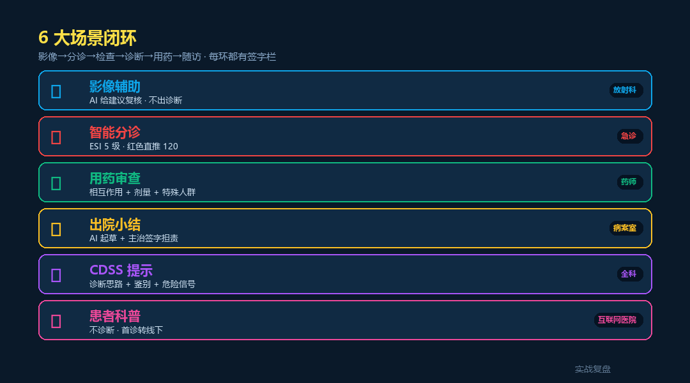
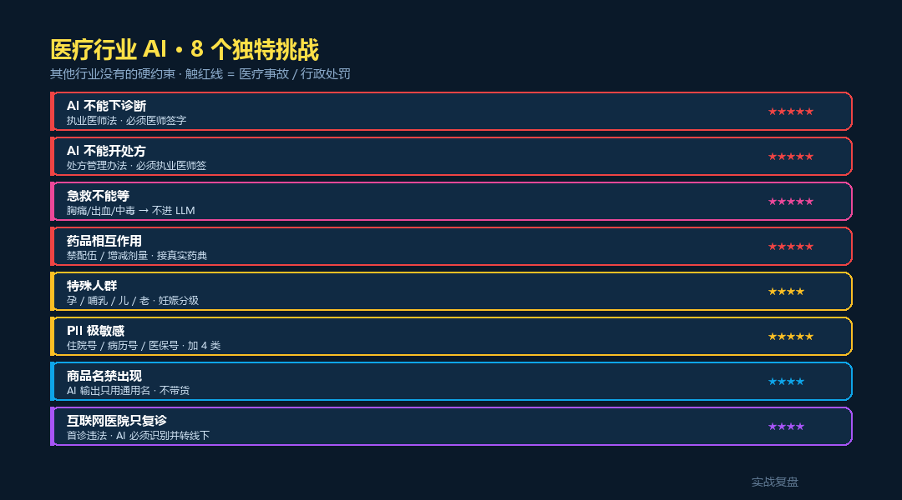
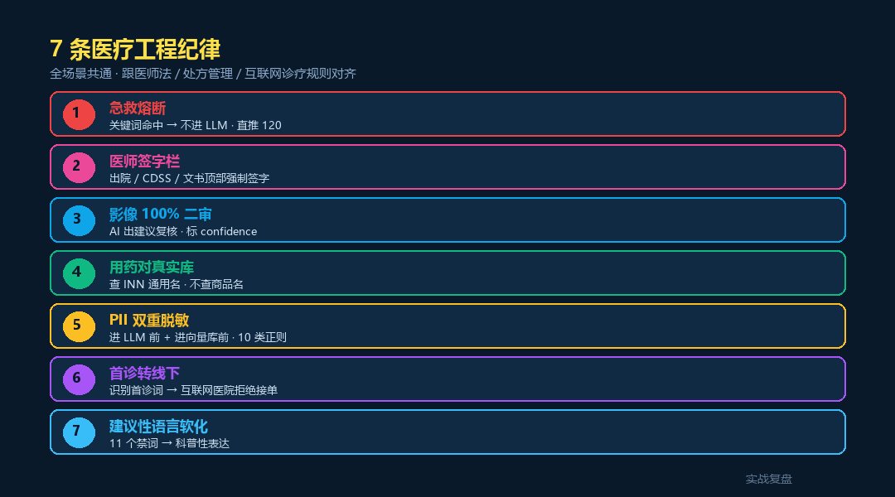

# 医疗行业 AI 落地 · livetoken 案例 — 6 大场景 + 急救熔断

> 实战复盘 · AI 工具栈 · 行业落地 #11
>
> 6 个真实场景 · 影像 / 分诊 / 用药 / 出院 / CDSS / 患者科普
> 配套**完整可跑代码**(FastAPI + 7 API + 医疗特化 service + 蓝白前端)

<div align="center">

📖 **本文同步发布于公众号「实战复盘」** · 微信号:`IamOnelong`
🌐 完整代码仓库:[github.com/OnelongX/aiagent](https://github.com/OnelongX/aiagent)
💡 endpoint 选型推荐:[docs/livetoken.md](../../docs/livetoken.md)

</div>

---

## TL;DR

| 项 | 内容 |
|---|---|
| **核心定位** | AI **辅助医师** · 不是替代医师 |
| **6 大场景** | 影像 / 分诊 / 用药 / 出院 / CDSS / 患者科普 |
| **7 大纪律** | 急救熔断 / 签字栏 / 影像二审 / 药品 INN / PII / 首诊转线下 / 软化 |
| **架构** | FastAPI + 7 API + 4 service + 蓝白前端 |
| **endpoint** | OpenAI 协议兼容(推荐 [livetoken](https://livetoken.top)) |
| **代码** | [code/](code/) 目录,**Docker 一键起 5 分钟** |

---

## I. 跟前 10 篇行业落地的关系

| # | 行业 | 核心红线 | 触线后果 |
|---|---|---|---|
| 1-7 | 业务边界 | 确定性 / 漏判 / 引用 / 承诺 / 价格 / 主键 / 文献 | 商业损失 |
| 8 | 学生论文 | 学术诚信 | 学位风险 |
| 9 | 法律 | 执业责任 | 律师执业 + 民事 |
| 10 | 教育 | 未成年保护 + 双减 | 行政 + 舆情 |
| **11** | **医疗** | **执业资质 + 生命** | **行政 + 刑事 + 民事 + 生命** |

医疗行业是 11 篇里红线最严的一篇 —— **法律不当 → 民事赔偿;医疗不当 → 民事 + 刑事 + 人命。**

---

## II. 6 大场景全景



| 场景 | API endpoint | 关键挑战 |
|---|---|---|
| 📷 影像辅助 | `/api/imaging/review` | 不出诊断 · 100% 医师二审 |
| 🚑 智能分诊 | `/api/triage/` | ESI 5 级 · 红色直推 120 |
| 💊 用药审查 | `/api/medication/check` | 相互作用 + 妊娠分级 + 特殊人群 |
| 📋 出院小结 | `/api/discharge/summary` | 医师签字栏 + AI 起草标记 |
| 🧠 CDSS 提示 | `/api/cdss/` | 鉴别诊断 + 危险信号 · 不下医嘱 |
| 💬 患者科普 | `/api/education/qa` | 首诊转线下 + 心理危机分流 |
| 🔒 PII 脱敏 | `/api/pii/redact` | 10 类正则 · 加 4 类医疗 ID |

---

## III. 8 大独特挑战



| 挑战 | 难度 | 工程对策 |
|---|---|---|
| AI 不能下诊断 | ★★★★★ | 软化语言 hook + 11 个禁词替换 |
| AI 不能开处方 | ★★★★★ | 输出强制医师签字栏 |
| 急救不能等 | ★★★★★ | 关键词熔断 · 不进 LLM |
| 药品相互作用 | ★★★★★ | 接真实药品数据库 + 双向 lookup |
| 特殊人群 | ★★★★ | 妊娠分级 / 哺乳 / 儿科 / 肝肾 |
| PII 极敏感 | ★★★★★ | 标准 6 类 + 医疗 4 类(住院号/病历号/医保号/床号) |
| 商品名禁出现 | ★★★★ | INN 通用名校验 + 商品名拦截 |
| 互联网医院只复诊 | ★★★★ | 首诊关键词识别 → 转线下 |

---

## IV. 7 条工程纪律(代码体现)



```python
# 1. 急救熔断(最高优先级 · 不进 LLM)
# code/backend/app/services/doctor_block.py::is_emergency
# 38 个关键词 · 命中 → 直推 120 / 中毒热线 / 心理援助

# 2. 医师签字栏(强制)
# code/backend/app/services/doctor_block.py::doctor_sign_block
# 出院 / CDSS / 文书顶部自动注入 · 含执业证号 + 签字日期

# 3. 影像 100% 医师二审
# code/backend/app/api/imaging.py
# must_human_review=True · 强建议性语言 → 置信度降为"低"

# 4. 用药对真实数据库
# code/backend/app/services/drug_db.py
# 15 个常见药 · 6 对典型相互作用 · 妊娠 / 哺乳 / 儿 / 肝 / 肾

# 5. PII 双重脱敏(10 类)
# code/backend/app/services/pii_redact_med.py
# 标准 6 类 + 住院号 / 病历号 / 医保号 / 床号

# 6. 首诊转线下
# code/backend/app/api/education.py::classify_intent
# 首诊关键词 + 心理危机 → 不走 LLM 路径

# 7. 建议性语言软化
# code/backend/app/services/doctor_block.py::soften_advice
# 11 个绝对化禁词 → 软性表达
```

---

## V. 6 个场景的代码示例

### 1. 影像辅助 · 不出诊断 · 100% 二审

```python
# code/backend/app/api/imaging.py

SYSTEM_PROMPT = """你是放射科 AI 辅助系统。
1. 不出诊断结论 · 只能写"建议进一步评估"
2. 不写"考虑为 X 病""确诊为 Y"
3. 涉及恶性肿瘤 / 急症等可疑征象 · 置信度统一标"低"
"""

@router.post("/review")
async def review(req):
    redacted, pii = redact(req.findings_text)
    data = chat_json(SYSTEM_PROMPT, redacted, max_tokens=2000)

    for f in data["findings"]:
        f["description"] = soften_advice(f["description"])
        if detect_strong_advice(f["description"]):
            f["confidence"] = "低"  # 强建议性 · 强制降置信度

    return ImagingReviewResponse(
        suggested_reviews=findings,
        must_human_review=True,   # 100% 医师二审
        ...
    )
```

### 2. 智能分诊 · 急救熔断 + ESI 5 级

```python
# code/backend/app/api/triage.py

@router.post("/")
async def triage(req):
    # 1. 急救熔断(最高优先级 · 不进 LLM)
    is_em, hits = is_emergency(req.chief_complaint + req.history)
    if is_em:
        return TriageResponse(
            esi_level=1,
            level_name="红色 · 立即抢救",
            is_emergency=True,
            emergency_action=EMERGENCY_RESPONSE,  # 推 120
            ...
        )

    # 2. LLM 按 ESI 标准评级
    data = chat_json(SYSTEM_PROMPT, ...)
    return ...
```

### 3. 用药审查 · 接药品数据库

```python
# code/backend/app/api/medication.py

@router.post("/check")
async def check(req):
    issues = []

    # 1. 商品名拦截
    for d in req.drugs:
        if d in COMMERCIAL_DRUG_BLOCKLIST:
            issues.append("立普妥 是商品名 · 请用通用名 阿托伐他汀")
            continue

        info = lookup(d)  # 查真实药品库

        # 2. 妊娠分级
        if req.pregnancy and info["pregnancy"].startswith(("D", "X")):
            issues.append(f"{d} 妊娠期禁用")

        # 3. 肾功能调整
        if req.renal_function in ("moderate", "severe"):
            issues.append(f"{d} 按 eGFR 减量")

    # 4. 两两相互作用
    interactions = batch_check_interactions(req.drugs)
    # 华法林 + 阿司匹林 → high
    # 氯吡格雷 + 奥美拉唑 → moderate
    # 二甲双胍 + 造影剂 → high

    return MedicationCheckResponse(
        issues=issues, interactions=interactions,
        must_pharmacist_review=True,
    )
```

### 4. 出院小结 · 强制医师签字栏

```python
# code/backend/app/api/discharge.py

@router.post("/summary")
async def summary(req):
    redacted, pii = redact(...)
    body = chat(SYSTEM_PROMPT, redacted, max_tokens=2500)
    body = soften_advice(body)  # 软化绝对化语言

    # 强制组装:签字栏 + 正文 + 免责声明
    final = doctor_sign_block("出院小结") + body + ai_disclaimer(...)

    return DischargeSummaryResponse(summary=final, ...)
```

签字栏长这样:

```
════════════════════════════════════════
本出院小结由 AI 工具辅助生成,不构成诊断
或处方。最终诊断 / 用药 / 处置以执业医师
签字为准。

医疗机构:示例医院
科室:示例科室
执业医师:______________
执业证号:______________
签字日期:______________

依据《医师法》《处方管理办法》及国家卫健委
《医疗机构应用人工智能技术管理规范》,
医师对最终医疗决策承担全部责任。
════════════════════════════════════════
```

### 5. CDSS · 给提示 · 不下医嘱

```python
# code/backend/app/api/cdss.py

# 输出必须包含 3 类提示:
# - diagnostic_workup:建议完善的检查
# - differential:鉴别诊断
# - red_flag:危险信号(防漏诊)

SYSTEM_PROMPT = """...
1. 不下诊断结论 · 用"考虑评估""建议鉴别"
2. 不开具处方 · 用药 / 检查仅作"可考虑"建议
3. 必须列 red_flag · 帮医师不漏诊
4. 必须至少 1 个 differential
"""
```

### 6. 患者科普 · 首诊转线下 + 心理危机分流

```python
# code/backend/app/api/education.py

def classify_intent(question):
    if any(p in question for p in PSYCH_CRISIS):
        return "心理危机"
    if is_emergency(question)[0]:
        return "急救"
    if any(m in question for m in FIRST_VISIT_MARKERS):
        return "首诊倾向"
    return "科普"

# 心理危机 / 急救 → 不进 LLM
# 首诊倾向 → LLM 出科普 + 强制建议线下
# 复诊 / 普通科普 → 正常回答
```

---

## VI. 3 种部署形态

| 形态 | 用户 | 红线 | 部署 |
|---|---|---|---|
| A 院内系统 | 医师 + 实习生 + 护士 | 高 | **私有部署** · 不上公有云 |
| B 互联网医院 | 医师 + 复诊患者 | 极高 | 私有 + 强日志 + 等保三级 |
| C 患者教育 | 普通用户 | **最高** | 公有云 + 强合规 + 必须转线下 |

**形态 C 最难** —— 普通用户用错了直接吃亏。本仓库 `/api/education/qa` 默认走严格模式:
- 首诊关键词 → 转线下
- 心理危机 → 直接推热线
- 急救 → 直接推 120

---

## VII. 5 分钟跑通

```bash
git clone https://github.com/OnelongX/aiagent.git
cd aiagent/02-industry-cases/11-medical-industry/code

cp .env.example backend/.env
# 编辑 backend/.env 填 LLM_API_KEY(推荐 livetoken)

docker compose up -d

# 前端 http://localhost:8085
# API 文档 http://localhost:8005/docs
```

详细部署 + API 参考见 [code/README.md](code/README.md)。

---

## VIII. 自测案例(供医院参考)

### 测试 1:急救熔断

```bash
# 输入(分诊)
胸口压榨样疼痛,向左肩放射,伴大汗

# 期望:不经 LLM · 直接红色 1 级 + 推 120
```

### 测试 2:用药相互作用

```bash
# 输入
drugs = ["华法林", "阿司匹林", "奥美拉唑"]

# 期望:high 级别警告
# 华法林 + 阿司匹林 → 出血叠加(原则避免合用)
```

### 测试 3:妊娠禁用

```bash
# 输入
drugs = ["阿托伐他汀"], pregnancy = true

# 期望:high 级别 contraindication
# 阿托伐他汀 妊娠分级 X · 禁用
```

### 测试 4:商品名拦截

```bash
# 输入
drugs = ["立普妥"]

# 期望:type=commercial_name
# advice:请改用通用名(INN),立普妥 → 阿托伐他汀
```

### 测试 5:PII 脱敏覆盖率

```bash
# 输入
患者张三,身份证 110101196001011234,
病历号:1234567,住院号:20260510001,
医保号:1101011200000001,床号:3 床

# 期望
患者[NAME_1],身份证 [ID_CARD_1],
[MEDICAL_NO_1],[INPATIENT_NO_1],
[INSURANCE_NO_1],[BED_NO_1]
```

### 测试 6:首诊转线下

```bash
# 输入(患者科普)
我最近经常头痛,想知道是不是脑子有问题?

# 期望:intent=首诊倾向
# answer 末尾自动追加"建议尽快线下就诊"
```

### 测试 7:心理危机

```bash
# 输入
我已经不想活了,什么都没意思

# 期望:不经 LLM · 直接推
# - 全国心理援助热线 400-161-9995
# - 北京心理危机研究中心 010-82951332
# - 急救 120
```

---

## IX. 关联文档

- [code/](code/) —— 完整代码 + Docker 部署
- [docs/livetoken.md](../../docs/livetoken.md) —— 推荐的 endpoint
- [02-industry-cases/09-legal-industry/](../09-legal-industry/) —— 法律行业(同思想)
- [02-industry-cases/10-education-industry/](../10-education-industry/) —— 教育行业(同思想)

---

## X. 行业落地系列 → 11 篇

| # | 行业 | 关键词 | 代码 |
|---|---|---|---|
| 1-5 | 工具调度模板 | 确定性 / 漏判 / 准确 / 克制 / 闭环 | 概念示例 |
| 6 | 跃迁 | 全栈工作台 | ⭐ Vue + FastAPI + Chroma |
| 7 | 范式对照 | Vectorless RAG | ⭐ FastAPI + PageIndex |
| 8 | 学术诚信 | 学生论文 | ⭐ FastAPI + 真实学术 API |
| 9 | 执业责任 | 法律行业 | ⭐ FastAPI + 法律红线 + PII |
| 10 | 未成年保护 | 教育行业 | ⭐ FastAPI + 双减 + 焦虑监控 |
| **11** | **执业资质 + 生命** | **医疗行业** | ⭐ **FastAPI + 急救熔断 + 药品库** |

#6 / #7 / #8 / #9 / #10 / #11 = **6 种 AI 应用形态的工程对照**。

---

## License

本仓库代码 MIT。详见 [LICENSE](../../LICENSE)。

**本工具是医师辅助 · 请遵守《医师法》《处方管理办法》《互联网诊疗管理办法》《医疗机构应用人工智能技术管理规范》及当地卫健委细则。**

**本仓库 demo 仅供学习参考 · 不可用于真实临床。**
