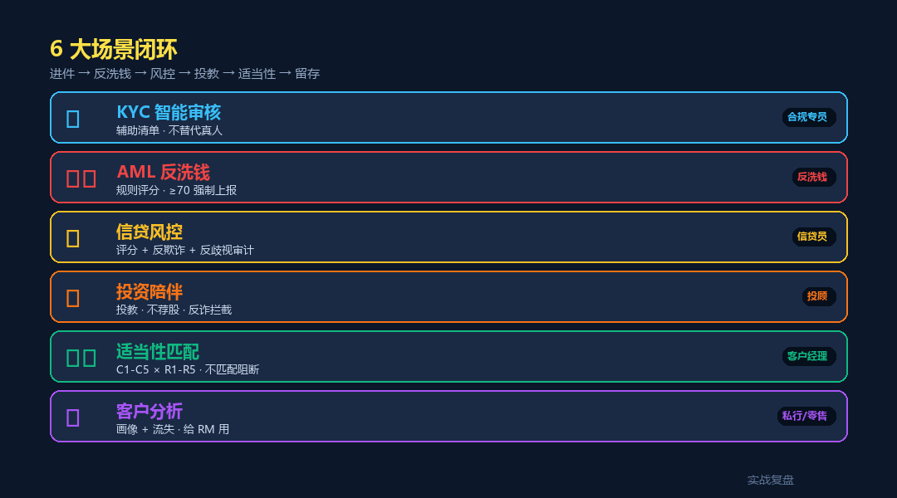
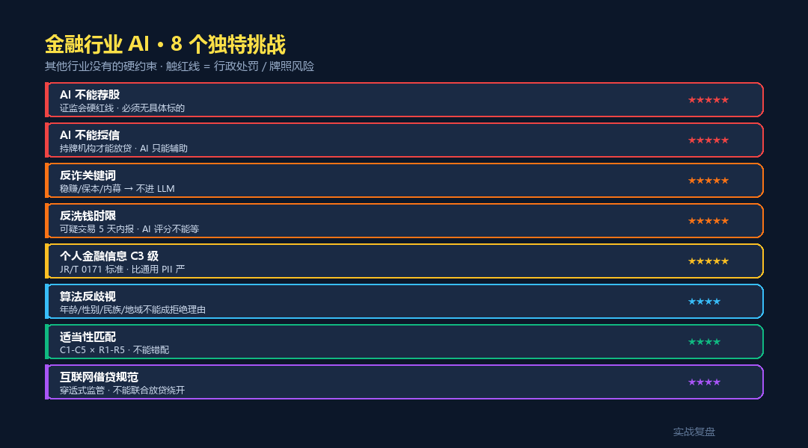
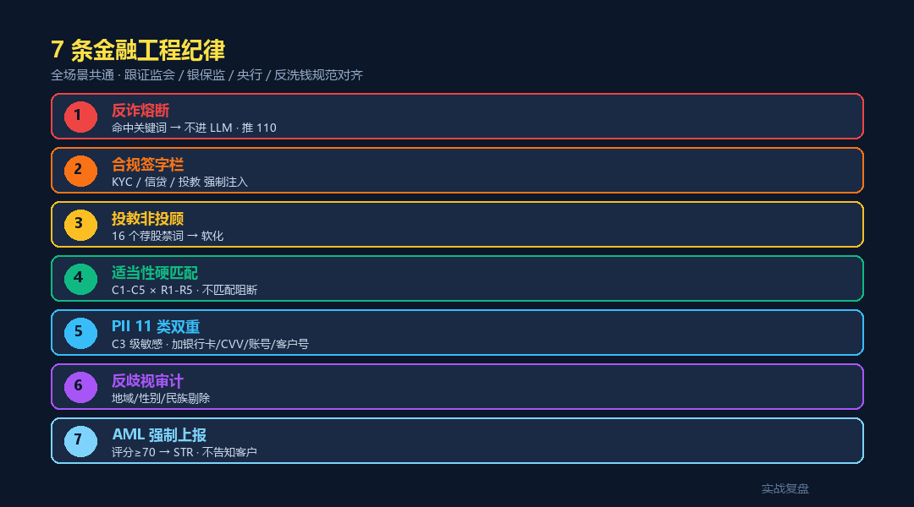
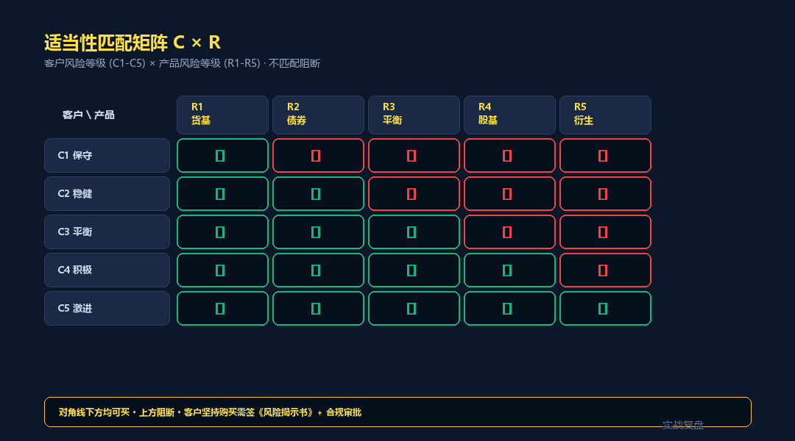

# 金融行业 AI 落地 · livetoken 案例 — 6 大场景 + 反诈熔断

> 实战复盘 · AI 工具栈 · 行业落地 #12
>
> 6 个真实场景 · KYC / AML / 信贷 / 投顾 / 适当性 / 客户
> 配套**完整可跑代码**(FastAPI + 7 API + 金融特化 service + 深蓝金色前端)

<div align="center">

📖 **本文同步发布于公众号「实战复盘」** · 微信号:`IamOnelong`
🌐 完整代码仓库:[github.com/OnelongX/aiagent](https://github.com/OnelongX/aiagent)
💡 endpoint 选型推荐:[docs/livetoken.md](../../docs/livetoken.md)

</div>

---

## TL;DR

| 项 | 内容 |
|---|---|
| **核心定位** | AI **辅助持牌机构** · 不替代合规专员 / 信贷员 / 投顾 |
| **6 大场景** | KYC / AML / 信贷风控 / 投资陪伴 / 适当性 / 客户分析 |
| **7 大纪律** | 反诈熔断 / 签字栏 / 投教非投顾 / 适当性硬匹配 / PII C3 / 反歧视 / AML 上报 |
| **架构** | FastAPI + 7 API + 4 service + 深蓝金色前端 |
| **endpoint** | OpenAI 协议兼容(推荐 [livetoken](https://livetoken.top)) |
| **代码** | [code/](code/) 目录,**Docker 一键起 5 分钟** |

---

## I. 跟前 11 篇行业落地的关系

| # | 行业 | 核心红线 | 触线后果 |
|---|---|---|---|
| 1-7 | 业务边界 | 7 类技术红线 | 商业损失 |
| 8 | 学生论文 | 学术诚信 | 学位风险 |
| 9 | 法律 | 执业责任 | 律师执业 + 民事 |
| 10 | 教育 | 未成年保护 + 双减 | 行政 + 舆情 |
| 11 | 医疗 | 执业资质 + 生命 | 行政 + 刑事 + 民事 + 生命 |
| **12** | **金融** | **持牌经营 + 投资者保护** | **行政 + 牌照 + 民事 + 刑事(非法集资 / 诈骗)** |

金融行业是 12 篇里**监管最密**的一篇 —— 不是单部法,而是 8+ 部法律 / 部门规章 / 自律规则同时约束:

- 《商业银行互联网贷款管理暂行办法》
- 《证券期货投资者适当性管理办法》
- 《反洗钱法》
- 《个人金融信息保护技术规范》(JR/T 0171-2020)
- 《征信业管理条例》
- 《商业银行个人贷款管理办法》
- 《关于规范金融机构资产管理业务的指导意见》(资管新规)
- 央行《金融机构大额交易和可疑交易报告管理办法》

---

## II. 6 大场景全景



| 场景 | API endpoint | 关键挑战 |
|---|---|---|
| 🪪 KYC 智能审核 | `/api/kyc/review` | 不替代人脸 · PEP 强制 EDD |
| 🛡️ AML 反洗钱 | `/api/aml/screen` | 规则评分 · ≥70 STR · 不告知客户 |
| 💳 信贷风控 | `/api/credit/score` | 反欺诈 + 反歧视 + 0-1000 评分 |
| 📊 投资陪伴 | `/api/advisory/qa` | 不荐股 · 反诈熔断 |
| ⚖️ 适当性匹配 | `/api/suitability/check` | C1-C5 × R1-R5 · 硬约束 |
| 👥 客户分析 | `/api/customer/insight` | 画像 + 流失 · 给 RM 不给客户 |
| 🔒 PII 脱敏 | `/api/pii/redact` | 11 类 · C3 级敏感(银行卡/CVV/账号) |

---

## III. 8 大独特挑战



| 挑战 | 难度 | 工程对策 |
|---|---|---|
| AI 不能荐股 | ★★★★★ | 16 个荐股禁词软化 + 股票代码剔除 |
| AI 不能授信 | ★★★★★ | 输出标 `must_credit_officer=True` |
| 反诈关键词 | ★★★★★ | 不进 LLM · 直接推 110 / 96110 |
| 反洗钱时限 | ★★★★★ | AML 评分 + STR 强制上报旁路 |
| 个人金融信息 C3 级 | ★★★★★ | 11 类 PII + C3 敏感字段标记 |
| 算法反歧视 | ★★★★ | 5 类字段(地域/性别/民族/婚姻/年龄)审计 |
| 适当性匹配 | ★★★★ | 5×5 矩阵硬阻断 + 风险揭示书 |
| 互联网借贷规范 | ★★★★ | 设备风险 + 黑名单熔断 + 反欺诈 |

---

## IV. 7 条工程纪律(代码体现)



```python
# 1. 反诈熔断(最高优先级 · 不进 LLM)
# code/backend/app/services/compliance_block.py::is_fraud_signal
# 22 个关键词 · 命中 → 直推 110 / 96110 / 投保 / 银保监

# 2. 合规签字栏(强制)
# code/backend/app/services/compliance_block.py::compliance_sign_block
# KYC / 信贷 / 投教 顶部自动注入 · 含许可证号 + 合规专员

# 3. 投教非投顾
# code/backend/app/services/compliance_block.py::ADVISORY_SOFTENING
# 16 个荐股禁词 · 软化 · 后置审计股票代码

# 4. 适当性硬匹配
# code/backend/app/services/market_db.py::SUITABILITY_MATRIX
# 5×5 矩阵 · 不匹配阻断

# 5. PII 双重脱敏(11 类)
# code/backend/app/services/pii_redact_fin.py
# 标准 6 类 + 金融 5 类(银行卡/CVV/账号/客户号/流水号)
# C3 级敏感字段标记

# 6. 反歧视审计
# code/backend/app/services/compliance_block.py::detect_discrimination
# 信贷决策中检测 5 类歧视性表达

# 7. AML 强制上报
# code/backend/app/services/market_db.py::aml_suspicious_score
# 评分 ≥70 → must_report=True · 不告知客户
```

---

## V. 6 个场景的代码示例

### 1. KYC · 不替代真人 · PEP 强制 EDD

```python
# code/backend/app/api/kyc.py

SYSTEM_PROMPT = """你是 KYC 审核 AI 辅助。
1. 不替代真人尽调 · 输出只是合规专员辅助清单
2. 不下"通过 / 拒绝" · 用"建议增强尽调"
3. 严格按 6 个 category:identity / income / fund_source / purpose / pep / sanctions
4. 不歧视 · 不基于地域 / 性别 / 民族
"""

@router.post("/review")
async def review(req):
    redacted, pii = redact(...)
    data = chat_json(SYSTEM_PROMPT, redacted, max_tokens=1800)

    # PEP 自报 → 强制升级
    if req.pep_self_report and data["suggested_action"] == "accept":
        data["suggested_action"] = "enhanced_dd"
        findings.append("按 PEP 制度执行 EDD + 高管审批")

    return KYCResponse(..., must_human_review=True)
```

### 2. AML · 规则评分 + STR 旁路

```python
# code/backend/app/services/market_db.py

def aml_suspicious_score(transaction):
    score = 0
    rules = []
    if amount >= 50000:           score += 25; rules.append("大额")
    if count_24h >= 5:            score += 20; rules.append("高频")
    if cross_border and amount >= 70000: score += 20; rules.append("跨境大额")
    if counterparty_risky:        score += 30; rules.append("对手方关注名单")
    if night_time and amount >= 30000: score += 10; rules.append("夜间大额")
    if new_account_days <= 7 and amount >= 30000:
        score += 25; rules.append("新户冲量 · 账户出租嫌疑")
    return min(score, 100), rules

# ≥70 → must_report=True
# 不告知客户 · 直接走 STR 流程
```

### 3. 信贷 · 反欺诈 + 反歧视 + 0-1000 评分

```python
# code/backend/app/api/credit.py

@router.post("/score")
async def score(req):
    # 1. 黑名单熔断 · 不进 LLM
    if req.blacklist_hit:
        return CreditResponse(risk_score=0, risk_band="D",
                              suggested_decision="decline", ...)

    # 2. LLM 评估
    data = chat_json(SYSTEM_PROMPT, blob, max_tokens=1800)

    # 3. 反歧视审计 · 检测 AI 输出
    for f in data["findings"]:
        d_hits = detect_discrimination(f["description"] + f["advice"])
        if d_hits:  # 命中地域/性别/民族
            f["advice"] = "[反歧视审计:剔除] " + f["advice"]

    return CreditResponse(..., must_credit_officer=True)
```

### 4. 投资陪伴 · 监管硬红线

```python
# code/backend/app/api/advisory.py

def classify_intent(question):
    if is_fraud_signal(question)[0]:  return "反诈拦截"
    if any(m in q for m in STOCK_RECOMMEND_MARKERS) or detect_specific_stock(q):
        return "拒答荐股"
    return "投教"

# 反诈 → 不进 LLM · 直接推 110
# 拒答荐股 → 固定话术 · "AI 不提供具体推荐 · 监管硬性规定"
# 投教 → LLM + 后置审计(剔除股票代码 + 软化强建议 + 过滤推广)
```

### 5. 适当性匹配 · 5×5 矩阵

```python
# code/backend/app/services/market_db.py

SUITABILITY_MATRIX = {
    "C1": {"R1"},
    "C2": {"R1", "R2"},
    "C3": {"R1", "R2", "R3"},
    "C4": {"R1", "R2", "R3", "R4"},
    "C5": {"R1", "R2", "R3", "R4", "R5"},
}

def is_suitable(customer, product_risk):
    if product_risk in SUITABILITY_MATRIX[customer]:
        return True, "..."
    return False, "违反适当性匹配"

# 大额 ≥100 万 → 触发双录
# 周期 < 1 年 + R4/R5 → 警告
# 不匹配 + 客户坚持 → 必须签《风险揭示书》
```

### 6. 客户分析 · 给 RM 不给客户

```python
# code/backend/app/api/customer.py

SYSTEM_PROMPT = """你是 RM 助手 · 给客户经理画像和留存建议。
1. 输出对象是 RM · 不是客户 · 不是营销话术
2. 不写"立即推荐 X 产品""配资 Y 万"
3. retention_suggestions 是"行动方向" · 不是 push 话术
4. 不出现具体股票代码 / 基金代号
"""

# 营销话术拦截:
# "推荐购买" / "限时优惠" → 标记 [检测到营销话术已过滤]
```

---

## VI. 3 种部署形态

| 形态 | 用户 | 红线 | 部署 |
|---|---|---|---|
| A 银行 / 券商 / 基金内部 | 合规 + RM + 信贷 | 极高 | **私有部署** · 不上公有云 |
| B 互联网借贷平台 | 信贷 + 反欺诈 | 极高 | 私有 + 等保三级 + 央行牌照 |
| C 投教对客 | 普通投资者 | **最高** | 公有云 + 强合规 + 必须找投顾 |

**形态 C 最难** —— C 端投教稍有不慎就违规。本仓库 `/api/advisory/qa` 默认严格模式:
- 含股票代码 / 推荐字眼 → 拒答荐股
- 反诈关键词 → 直接推 110
- 投教内容 → 后置审计 + 全部软化

---

## VII. 5 分钟跑通

```bash
git clone https://github.com/OnelongX/aiagent.git
cd aiagent/02-industry-cases/12-finance-industry/code

cp .env.example backend/.env
# 编辑 backend/.env 填 LLM_API_KEY(推荐 livetoken)

docker compose up -d

# 前端 http://localhost:8086
# API 文档 http://localhost:8006/docs
```

详细部署 + API 参考见 [code/README.md](code/README.md)。

---

## VIII. 自测案例(供金融机构参考)

### 测试 1:反诈熔断

```bash
# 输入(投资陪伴)
群里老师说有个稳赚不赔的项目,年化 50%,我该投吗?

# 期望:不经 LLM · 直接 FRAUD_RESPONSE
# 推 110 / 96110 / 投保 12386 / 银保监 12378
```

### 测试 2:拒答荐股

```bash
# 输入
600519 现在能买吗?

# 期望:intent=拒答荐股
# 固定话术 · 引导找持牌投顾 · 不进 LLM
```

### 测试 3:适当性阻断

```bash
# 输入
customer_level=C2, product_code=MIX-002(R4 偏股混合)

# 期望
is_suitable=false
reason: 客户 C2 不可购买 R4 · 违反适当性匹配
warnings: 客户坚持需签《风险揭示书》+ 合规审批
```

### 测试 4:AML 评分

```bash
# 输入
amount_rmb=100000, count_24h=6, new_account_days=3

# 期望:score≥70 · level=high
# rules_hit:
#   - 大额交易 ¥100,000(≥5万触发申报)
#   - 24h 内 6 笔(≥5 笔高频)
#   - 新开户 7 天内大额(可能账户出租)
# must_report=true → 强制 STR
```

### 测试 5:信贷黑名单熔断

```bash
# 输入
blacklist_hit=true

# 期望:不进 LLM
# risk_score=0 · risk_band=D · suggested_decision=decline
# advice: 拒绝 · 上报反欺诈系统
```

### 测试 6:PII C3 级脱敏

```bash
# 输入
客户张三,身份证 110101199001011234,
银行卡 6222021234567890123,CVV 888,
客户号:6688001234,账号:6225881234567890,
交易号:T20260511A001

# 期望
客户[NAME_1],身份证 [ID_CARD_1],
银行卡 [BANK_CARD_1],[CVV_1],
[CUSTOMER_NO_1],[ACCOUNT_NO_1],
[TRADE_NO_1]
# c3_sensitive_data_detected=true
```

### 测试 7:KYC PEP 升级

```bash
# 输入
pep_self_report=true,suggested_action 默认 accept

# 期望:被强制升级为 enhanced_dd
# findings 追加:按 PEP 制度 EDD + 高管审批
```

---

## IX. 适当性矩阵全景



| 客户 \ 产品 | R1 货基 | R2 债券 | R3 平衡 | R4 股基 | R5 衍生 |
|---|:---:|:---:|:---:|:---:|:---:|
| C1 保守 | ✓ | ✗ | ✗ | ✗ | ✗ |
| C2 稳健 | ✓ | ✓ | ✗ | ✗ | ✗ |
| C3 平衡 | ✓ | ✓ | ✓ | ✗ | ✗ |
| C4 积极 | ✓ | ✓ | ✓ | ✓ | ✗ |
| C5 激进 | ✓ | ✓ | ✓ | ✓ | ✓ |

对角线下方均可买 · 上方阻断 · 客户坚持需签《风险揭示书》+ 合规审批。

---

## X. 关联文档

- [code/](code/) —— 完整代码 + Docker 部署
- [docs/livetoken.md](../../docs/livetoken.md) —— 推荐的 endpoint
- [09-legal-industry/](../09-legal-industry/) —— 法律行业(同思想)
- [10-education-industry/](../10-education-industry/) —— 教育行业(同思想)
- [11-medical-industry/](../11-medical-industry/) —— 医疗行业(同思想)

---

## XI. 行业落地系列 → 12 篇

| # | 行业 | 关键词 | 代码 |
|---|---|---|---|
| 1-5 | 工具调度模板 | 5 类技术红线 | 概念示例 |
| 6 | 跃迁 | 全栈工作台 | ⭐ Vue + FastAPI + Chroma |
| 7 | 范式对照 | Vectorless RAG | ⭐ FastAPI + PageIndex |
| 8 | 学术诚信 | 学生论文 | ⭐ FastAPI + 真实学术 API |
| 9 | 执业责任 | 法律行业 | ⭐ FastAPI + 法律红线 + PII |
| 10 | 未成年保护 | 教育行业 | ⭐ FastAPI + 双减 + 焦虑监控 |
| 11 | 执业资质 + 生命 | 医疗行业 | ⭐ FastAPI + 急救熔断 + 药品库 |
| **12** | **持牌经营 + 投资者保护** | **金融行业** | ⭐ **FastAPI + 反诈熔断 + 适当性矩阵 + 反歧视** |

#6 / #7 / #8 / #9 / #10 / #11 / **#12** = **7 种 AI 应用形态的工程对照**。

---

## License

本仓库代码 MIT。详见 [LICENSE](../../LICENSE)。

**本工具是持牌机构辅助 · 请遵守相关金融监管法规及当地银保监 / 证监会细则。**

**本仓库 demo 仅供学习参考 · 不可用于真实业务运营。**
