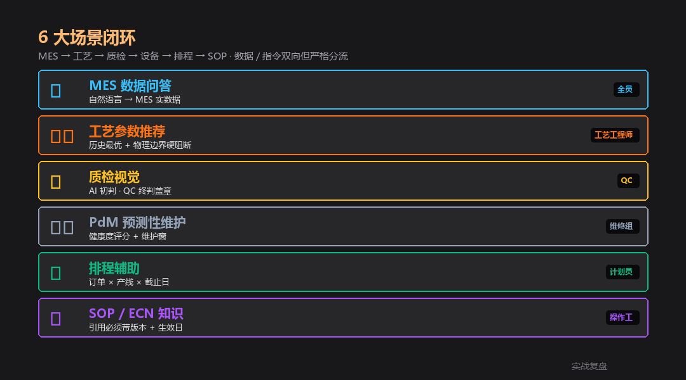
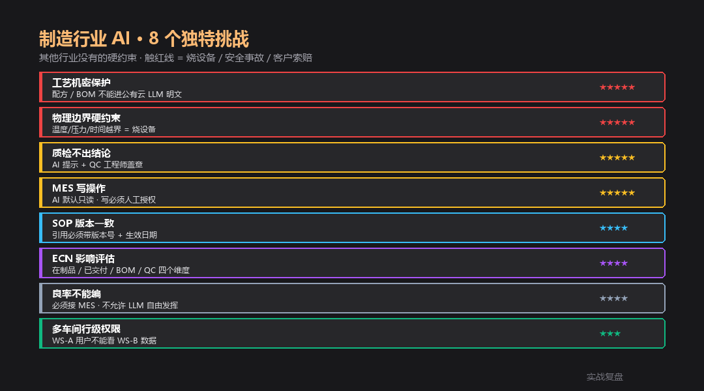
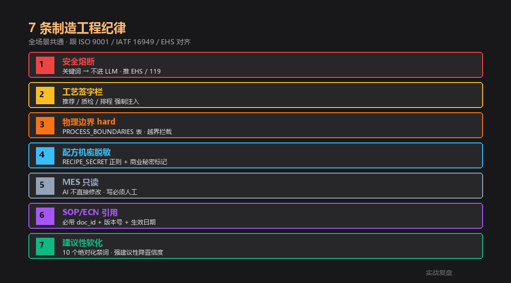

# 制造行业 AI 落地 · livetoken 案例 — 6 大场景 + 物理边界

> 实战复盘 · AI 工具栈 · 行业落地 #13
>
> 6 个真实场景 · MES / 工艺 / 质检 / PdM / 排程 / SOP-ECN
> 配套**完整可跑代码**(FastAPI + 7 API + 工艺特化 service + 工业橙前端)

<div align="center">

📖 **本文同步发布于公众号「实战复盘」** · 微信号:`IamOnelong`
🌐 完整代码仓库:[github.com/OnelongX/aiagent](https://github.com/OnelongX/aiagent)
💡 endpoint 选型推荐:[docs/livetoken.md](../../docs/livetoken.md)

</div>

---

## TL;DR

| 项 | 内容 |
|---|---|
| **核心定位** | AI **辅助工厂团队** · 不替代工艺工程师 / QC / 维修组签字 |
| **6 大场景** | MES 问答 / 工艺推荐 / 质检视觉 / PdM / 排程 / SOP-ECN |
| **7 大纪律** | 安全熔断 / 签字栏 / 物理边界 / 配方机密 / MES 只读 / SOP 版本 / 软化 |
| **架构** | FastAPI + 7 API + 4 service + 工业橙 7-tab 前端 |
| **endpoint** | OpenAI 协议兼容(推荐 [livetoken](https://livetoken.top) · **工艺机密强烈建议私有部署 LLM**) |
| **代码** | [code/](code/) 目录,**Docker 一键起 5 分钟** |

---

## I. 跟前 12 篇行业落地的关系

| # | 行业 | 核心红线 | 触线后果 |
|---|---|---|---|
| 1-7 | 业务边界 | 7 类技术红线 | 商业损失 |
| 8 | 学生论文 | 学术诚信 | 学位风险 |
| 9 | 法律 | 执业责任 | 律师执业 + 民事 |
| 10 | 教育 | 未成年保护 + 双减 | 行政 + 舆情 |
| 11 | 医疗 | 执业资质 + 生命 | 行政 + 刑事 + 民事 + 生命 |
| 12 | 金融 | 持牌经营 + 投资者保护 | 行政 + 牌照 + 民事 + 刑事 |
| **13** | **制造** | **物理边界 + 工艺机密 + EHS** | **烧设备 + 安全事故 + 客户索赔 + 商业秘密泄露** |

制造行业的红线**最物理**:法律 / 医疗 / 金融的红线是规则,制造的红线是**物理边界** —— 温度超 100°C 设备就烧,压力超额炉子就爆,工艺机密泄露专利就废。AI 越界 = 真金白银的损失。

---

## II. 6 大场景全景



| 场景 | API endpoint | 关键挑战 |
|---|---|---|
| 📊 MES 数据问答 | `/api/mes/qa` | 只读 + 行级权限 + 实数据 |
| ⚙️ 工艺参数推荐 | `/api/process/recommend` | 物理边界硬阻断 + 必须试跑 |
| 🔍 质检视觉 | `/api/qc/inspect` | AI 初判 · QC 终判盖章 |
| 🛠️ PdM 预测性维护 | `/api/pdm/check` | 健康度评分 · 维修组按 SOP |
| 📅 排程辅助 | `/api/scheduling/plan` | 订单 × 产线 × 截止日 |
| 📚 SOP / ECN 知识 | `/api/sop/qa` | 引用必须带版本 + 生效日 |
| 🔒 PII / 商业秘密 | `/api/pii/redact` | 8 类 · 含 SN / Lot / 客户料号 |

---

## III. 8 大独特挑战



| 挑战 | 难度 | 工程对策 |
|---|---|---|
| 工艺机密保护 | ★★★★★ | RECIPE_SECRET 正则 + 私有 LLM 推荐 |
| 物理边界硬约束 | ★★★★★ | PROCESS_BOUNDARIES 表 + 越界拦截 |
| 质检不出结论 | ★★★★★ | must_qc_engineer=True · 强建议性降置信度 |
| MES 写操作 | ★★★★★ | MES_READONLY_MODE=true · 写必须人工 |
| SOP 版本一致 | ★★★★ | cite_docs 必带 doc_id + version + effective_date |
| ECN 影响评估 | ★★★★ | 4 维评估(WIP / 已交付 / BOM / QC) |
| 良率不能编 | ★★★★ | LLM 不算良率 · MES 实拉 |
| 多车间行级权限 | ★★★ | USER_WORKSHOP 字段过滤 |

---

## IV. 7 条工程纪律(代码体现)



```python
# 1. 安全熔断(最高优先级 · 不进 LLM)
# code/backend/app/services/process_guard.py::is_safety_incident
# 24 个关键词(明火/燃爆/化学品/人员受伤/急停)→ 推 EHS / 119

# 2. 工艺签字栏(强制)
# code/backend/app/services/process_guard.py::process_sign_block
# 工艺工程师 + 质量工程师 双签 · ISO 9001 / IATF 16949

# 3. 物理边界硬阻断
# code/backend/app/services/process_guard.py::PROCESS_BOUNDARIES
# 烧结 / 涂层 / SMT / 注塑 / CVD · 12 个工序参数边界

# 4. 配方机密脱敏
# code/backend/app/services/process_guard.py::mask_recipe_secrets
# 配方代号 / 专利号 / 催化剂 / 添加剂 / BOM 5 类正则

# 5. MES 默认只读
# code/backend/app/config.py::mes_readonly_mode
# AI 拉数据 · 不写数据 · 写必须工艺工程师授权

# 6. SOP / ECN 引用必带版本
# code/backend/app/api/sop_ecn.py
# cite_docs 强制包含 doc_id + version + effective_date

# 7. 建议性语言软化
# code/backend/app/services/process_guard.py::soften_advice
# 10 个绝对化禁词(必须/绝对/100%/包合格)→ 软化
```

---

## V. 6 个场景的代码示例

### 1. MES 自然语言问答 · 只读 · 实数据

```python
# code/backend/app/api/mes_qa.py

@router.post("/qa")
async def qa(req):
    intent = classify_intent(req.question)
    line_codes = LINE_PATTERN.findall(req.question)

    if intent == "yield_query":
        for lc in line_codes:
            line = lookup_line(lc)
            # 行级权限检查
            if req.workshop_scope != "*" and line["workshop"] != req.workshop_scope:
                data[lc] = {"_error": "无权访问"}
                continue
            data[lc] = get_line_kpi(lc, days=7)   # 真实从 MES 拉

    return MESQAResponse(..., must_engineer_review=True)
```

### 2. 工艺参数推荐 · 物理边界硬阻断

```python
# code/backend/app/services/process_guard.py

PROCESS_BOUNDARIES = {
    "sinter_temp_c":    {"min": 200,  "max": 850,  "unit": "°C"},
    "reflow_peak_c":    {"min": 215,  "max": 260,  "unit": "°C"},
    "injection_press_mpa": {"min": 30, "max": 200, "unit": "MPa"},
    # ... 12 个工序
}

def check_boundary(param_key, value):
    bd = PROCESS_BOUNDARIES[param_key]
    if value > bd["max"]:
        return False, f"超过物理上限 · 烧设备 / 安全风险"
    # ...

# code/backend/app/api/process.py
for s in llm_suggestions:
    ok, note = check_boundary(s["param_key"], s["suggested_value"])
    if not ok:
        violations.append(note)   # 越界自动拦截
```

### 3. 质检 · AI 初判 · QC 终判

```python
# code/backend/app/api/qc.py

SYSTEM_PROMPT = """你是 QC AI · 给质检员提供初判建议。
1. 不下最终判定 — 必须 QC 工程师终判
2. 涉及客户敏感缺陷 / 安全件 → confidence 强制"低" + hold_for_qc
3. suggested_action 限制为 4 类:scrap / rework / release / hold_for_qc
"""

# 检测到强建议语言 → 降置信度
if detect_strong_advice(desc):
    f["confidence"] = "低"

return QCInspectionResponse(..., must_qc_engineer=True)
```

### 4. PdM · 安全熔断 + 健康度评分

```python
# code/backend/app/api/pdm.py

@router.post("/check")
async def check(req):
    # 1. 安全熔断
    is_safe, hits = is_safety_incident(req.extra_observations)
    if is_safe:
        return PdMResponse(
            findings=[{"suggested_action": SAFETY_RESPONSE}],
            ...
        )  # 不进 LLM · 推 EHS

    # 2. 健康度评分 + LLM 解读
    health = equipment_health(req.line_code)
    data = chat_json(SYSTEM_PROMPT, ...)
    return PdMResponse(..., must_maintenance_team=True)
```

### 5. 排程 · 贪心 demo · 生产对接 APS

```python
# code/backend/app/api/scheduling.py

PRIORITY_RANK = {"urgent": 0, "high": 1, "normal": 2, "low": 3}

@router.post("/plan")
async def plan(req):
    orders_sorted = sorted(req.orders,
                           key=lambda o: (PRIORITY_RANK[o.priority], o.due_date))
    for order in orders_sorted:
        best_line = min(line_calendar.items(), key=lambda kv: kv[1])
        if end_date > due_date:
            bottlenecks.append("产能不足 · 建议升级优先级 / 加产线 / 协商延期")
            unscheduled.append(order.order_id)
            continue
        plans.append(SchedulingPlan(...))

    return SchedulingResponse(..., must_planner_review=True)
```

### 6. SOP / ECN · 引用必带版本

```python
# code/backend/app/api/sop_ecn.py

@router.post("/qa")
async def qa(req):
    # 直接引用 ECN ID
    if "ECN-" in req.question.upper():
        for token in req.question.split():
            ecn = get_ecn(token)
            if ecn:
                cite_docs.append(ecn)

    cite_str = "\n".join(
        f"· {c['doc_id']}({c['title']} · v{c['version']} · 生效 {c['effective_date']})"
        for c in cite_docs
    )

    # ECN 自动附影响范围
    if intent == "ecn_query":
        answer += "\n影响范围:\n" + "\n".join(c["impact"])
```

---

## VI. 3 种部署形态

| 形态 | 用户 | 红线 | 部署 |
|---|---|---|---|
| A 单工厂 | 工艺 + QC + 维修 + 计划 | 高 | **完全内网** · 接 OPC-UA / 私有 LLM |
| B 多工厂 / 集团 | 集团 + 各工厂 | 极高 | 总部 + 分厂分级 · 行级权限 |
| C 设备厂卖给客户 | OEM 客户 | **最高** | 私有部署 · 数据不出客户内网 · LLM 走 vLLM 自建 |

**配方 / 工艺参数 = 商业秘密** —— 任何对外 API 都建议:
- 私有部署 LLM(vLLM + Qwen / DeepSeek-V3 等开源大模型)
- 配方字段强制脱敏后再 prompt
- 审计日志全量留存 · 至少 3 年

---

## VII. 5 分钟跑通

```bash
git clone https://github.com/OnelongX/aiagent.git
cd aiagent/02-industry-cases/13-manufacturing-industry/code

cp .env.example backend/.env
# 编辑 backend/.env 填 LLM_API_KEY

docker compose up -d

# 前端 http://localhost:8087
# API 文档 http://localhost:8007/docs
```

详细部署 + API 参考见 [code/README.md](code/README.md)。

---

## VIII. 自测案例(供工厂参考)

### 测试 1:安全熔断

```bash
# 输入(PdM)
extra_observations: "氢气泄漏报警, 急停按下"

# 期望:不经 LLM · 直接 SAFETY_RESPONSE
# 推 EHS 分机 + 119 · risk_level=high
```

### 测试 2:物理边界拦截

```bash
# 输入(工艺推荐)
current: {"sinter_temp_c": 700}
LLM 推荐:900°C(超过物理上限 850°C)

# 期望:boundary_violations 命中
# "sinter_temp_c = 900°C · 超过物理上限 850°C · 烧设备 / 安全风险"
```

### 测试 3:配方机密脱敏

```bash
# 输入
"试调整配方代号 RX-2026-V3,催化剂 CAT77,添加剂 ADD42"

# 期望(进 LLM 前)
"试调整 [RECIPE_SECRET],[RECIPE_SECRET],[RECIPE_SECRET]"
```

### 测试 4:MES 行级权限

```bash
# 输入
workshop_scope: "WS-A"
问题:"L-B1 良率多少"

# 期望:L-B1 属 WS-B
# data["L-B1"] = {"_error": "无权访问该车间"}
```

### 测试 5:QC 安全件强制降置信度

```bash
# 输入(质检 LLM 返回)
{"defect_type":"裂纹","severity":"high","confidence":"高",
 "description":"必须报废,100% 不良品"}

# 期望:detect_strong_advice 命中
# confidence 强制改"低" · 文本前加 [已软化绝对化语言]
```

### 测试 6:SOP 引用必带版本

```bash
# 输入
"L-A1 涂层开机怎么做"

# 期望:cite_docs 包含
# SOP-CT-001 · 涂层产线开机标准作业 · v3.2 · 2026-03-01
```

### 测试 7:ECN 影响评估

```bash
# 输入
"ECN-2026-038 影响哪些 WIP?"

# 期望:answer 自动附 impact 列表
# - 在制品(WIP):允许走完原工艺
# - 已交付:无召回需求
# - QC:首件须重新 PPAP 提交
# - BOM:维持不变
```

### 测试 8:商业秘密标记

```bash
# 输入(PII 脱敏)
"客户料号:PN-A0815,批次号:Lot-20260511-001,SN:SN-A0815-998877"

# 期望:trade_secret_detected=true
# 3 个 SECRET_KEYS 命中
```

---

## IX. 跟 MES 现场结合的建议

(基于光因科技 3 年 MES 结构化数据沉淀的实际工程经验)

1. **AI 是 MES 的查询层 · 不是决策层**
   - 把"自然语言→SQL/API"做扎实,80% 的价值已经出来了
   - 不要让 AI 直接写 MES · 写永远经计划员 / 工艺工程师授权

2. **历史数据是最大资产 · 比模型更重要**
   - 3 年良率 / 工艺参数 / 故障记录 → AI 推荐的真实底座
   - 没有 3 年数据,AI 推荐只是 LLM 在猜

3. **物理边界来自工艺手册 · 不是 LLM 学出来的**
   - PROCESS_BOUNDARIES 表必须工艺工程师签字确认
   - 越界 = 设备保护 · 这是物理 hard stop

4. **配方机密 → 私有 LLM**
   - 公有云 LLM 适合 SOP / 排程 / MES 问答
   - 涉及配方比例的工艺推荐 → vLLM + 7B 开源模型自建
   - 内外网双轨

5. **AI 上线前 · 跟工艺 / QC / 维修各做一轮"拔插测试"**
   - 拔掉 AI · 流程能不能跑?
   - 跑不动的说明 AI 越权 · 必须收回
   - 跑得动的才是健康的 AI 集成姿势

---

## X. 关联文档

- [code/](code/) —— 完整代码 + Docker 部署
- [docs/livetoken.md](../../docs/livetoken.md) —— 推荐的 endpoint
- [09-legal-industry/](../09-legal-industry/) —— 法律(同思想)
- [10-education-industry/](../10-education-industry/) —— 教育(同思想)
- [11-medical-industry/](../11-medical-industry/) —— 医疗(同思想)
- [12-finance-industry/](../12-finance-industry/) —— 金融(同思想)

---

## XI. 行业落地系列 → 13 篇(收官)

| # | 行业 | 关键词 | 代码 |
|---|---|---|---|
| 1-5 | 工具调度模板 | 5 类技术红线 | 概念示例 |
| 6 | 跃迁 | 全栈工作台 | ⭐ Vue + FastAPI + Chroma |
| 7 | 范式对照 | Vectorless RAG | ⭐ FastAPI + PageIndex |
| 8 | 学术诚信 | 学生论文 | ⭐ FastAPI + 真实学术 API |
| 9 | 执业责任 | 法律 | ⭐ FastAPI + 法律红线 + PII |
| 10 | 未成年保护 | 教育 | ⭐ FastAPI + 双减 + 焦虑监控 |
| 11 | 执业资质 + 生命 | 医疗 | ⭐ FastAPI + 急救熔断 + 药品库 |
| 12 | 持牌 + 投资者保护 | 金融 | ⭐ FastAPI + 反诈熔断 + 适当性矩阵 |
| **13** | **物理边界 + 工艺机密** | **制造** | ⭐ **FastAPI + 边界硬阻断 + MES 只读** |

#6 / #7 / #8 / #9 / #10 / #11 / #12 / **#13** = **8 种 AI 应用形态的工程对照**(全栈 / Vectorless / 学术 / 法律 / 教育 / 医疗 / 金融 / 制造)。

---

## License

本仓库代码 MIT。详见 [LICENSE](../../LICENSE)。

**本工具是工艺 / QC / 维护团队辅助 · 请遵守 ISO 9001 / IATF 16949 / 安全生产法及工厂内部 SOP。**

**本仓库 demo 仅供学习参考 · 不可用于真实生产线下发指令。**
