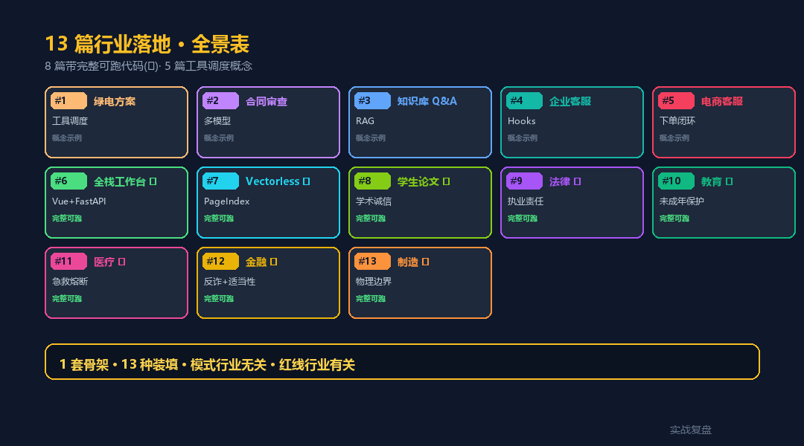
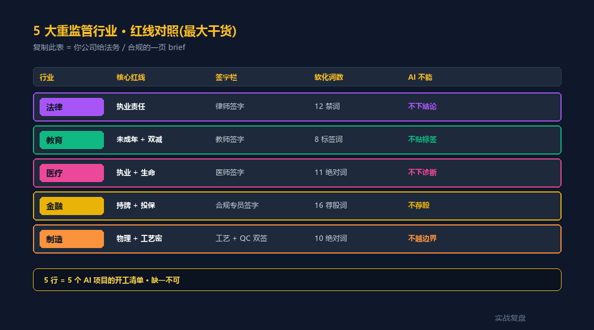
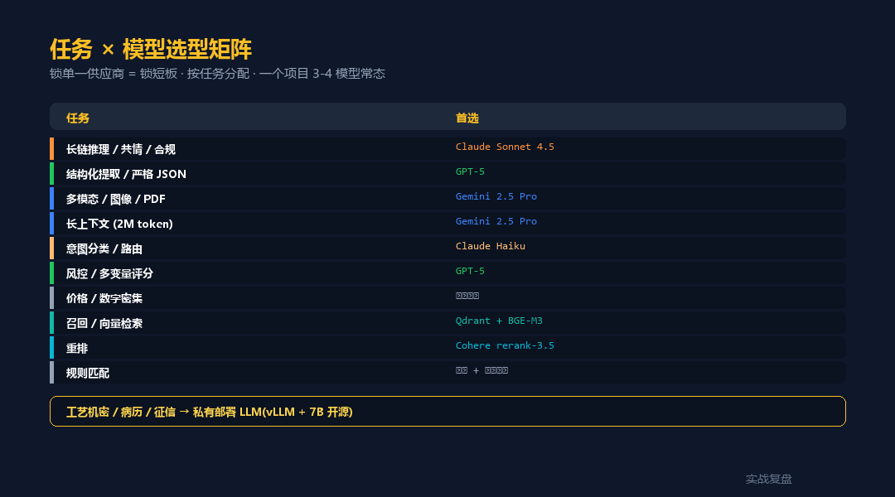
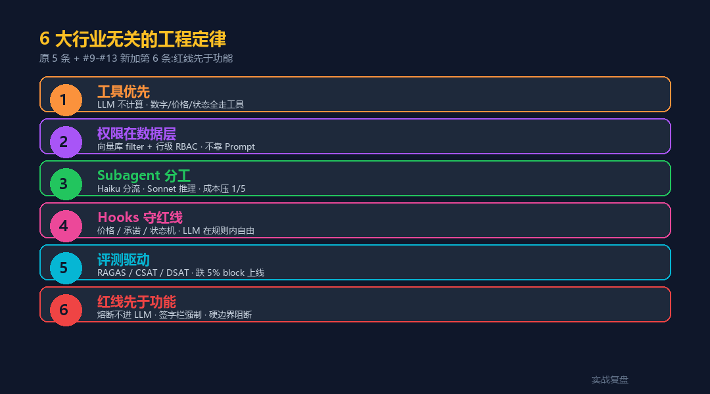
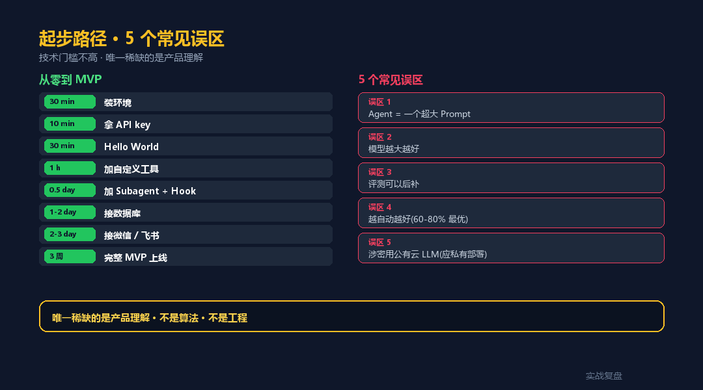

# 13 篇行业落地综述 —— 工程模式行业无关 · 红线决定形态

> 实战复盘 · AI 工具栈 · 阶段性综述(13 篇收官)
>
> 从绿电方案到 MES 工艺,13 个完整 case 跑下来,
> 验证了一句话:**Claude Agent SDK 的工程模式是行业无关的。**

---

<div align="center">

<a href="https://github.com/OnelongX/aiagent">

</a>

📖 **本文同步发布于公众号「实战复盘」** · 微信号:`IamOnelong`
🌐 [完整代码仓库 · github.com/OnelongX/aiagent](https://github.com/OnelongX/aiagent)
💡 endpoint 选型:[docs/livetoken.md](../docs/livetoken.md)

</div>

---

## I. 一句话核心结论

写过 13 个行业 case 之后,**反直觉的结论必须先说**:

> **工程模式是行业无关的 · 红线是行业有关的。**
>
> 同一套 FastAPI + 7 router + 4 service 骨架,
> 撑得起 13 个领域(绿电 / 合同 / 知识库 / 客服 / 电商 / 二手 3C / 自媒体 / 论文 / 法律 / 教育 / 医疗 / 金融 / 制造)。
>
> 但**红线**完全不同 —— 法律不能下结论 / 医疗不能下诊断 / 金融不能荐股 /
> 教育不能贴标签 / 制造不能越物理边界。

90% 的人卡的不是技术,是认知:看不见自己行业的红线长什么样。

---

## II. 13 篇全景表

| # | 篇目 | 红线类型 | 关键创新 | 代码 |
|---|---|---|---|---|
| 1 | [家庭绿电方案助手](../02-industry-cases/01-home-solar-advisor/) | 业务边界 | 6 工具 + 4 Subagent | 概念示例 |
| 2 | [合同审查助手](../02-industry-cases/02-contract-review/) | 漏判 <2% | 多模型交叉验证 | 概念示例 |
| 3 | [企业知识库 Q&A](../02-industry-cases/03-enterprise-kb-qa/) | 引用准确 | Qdrant + RAGAS | 概念示例 |
| 4 | [企业客服系统](../02-industry-cases/04-customer-service/) | 边界守护 | 12 工具 + 5 Hooks | 概念示例 |
| 5 | [绿电电商客服](../02-industry-cases/05-solar-ecommerce/) | 下单闭环 | OMS · 双引擎 | 概念示例 |
| **6** | [**全栈 AI 工作台**](../02-industry-cases/06-fullstack-workbench/) ⭐ | 跃迁示范 | Vue + FastAPI + Chroma | **完整可跑** |
| **7** | [**Vectorless RAG 客服**](../02-industry-cases/07-vectorless-rag-cs/) ⭐ | 范式对照 | PageIndex 中文 | **完整可跑** |
| **8** | [**学生论文助手**](../02-industry-cases/08-thesis-assistant/) ⭐ | 学术诚信 | 8 能力 + DOI 校验 | **完整可跑** |
| **9** | [**法律行业 AI**](../02-industry-cases/09-legal-industry/) ⭐ | 执业责任 | 5 场景 + 法律红线 + 签字栏 | **完整可跑** |
| **10** | [**教育行业 AI**](../02-industry-cases/10-education-industry/) ⭐ | 未成年保护 + 双减 | 4 场景 + 焦虑监控 | **完整可跑** |
| **11** | [**医疗行业 AI**](../02-industry-cases/11-medical-industry/) ⭐ | 执业资质 + 生命 | 6 场景 + 急救熔断 + 药品库 | **完整可跑** |
| **12** | [**金融行业 AI**](../02-industry-cases/12-finance-industry/) ⭐ | 持牌 + 投资者保护 | 6 场景 + 反诈熔断 + 适当性矩阵 | **完整可跑** |
| **13** | [**制造行业 AI**](../02-industry-cases/13-manufacturing-industry/) ⭐ | 物理边界 + 工艺机密 | 6 场景 + 边界硬阻断 + MES 只读 | **完整可跑** |

**8 篇带 ⭐ 的全部是完整可跑代码**(FastAPI + Docker + 前端),5 篇带 `概念示例` 的是工具调度模板。



---

## III. 1 套骨架 · 13 种装填

不管什么行业,Agent 工程的骨架就 4 层:

```
┌─ 渠道层      微信 / 网页 / 邮件 / 企微 / 内网 / API
├─ 状态层      Redis (session) + Postgres (history) + 向量库
├─ Agent 层    主 Agent + Subagent(triager 用 Haiku · 推理用 Sonnet)
└─ 工具层      读(MES/CRM/KB)+ 写(OMS/工单)+ 评(评分/审计)
```

5 篇带完整代码的重监管行业(#9-#13)再加 1 个**红线层**:

```
┌─ 渠道层
├─ 状态层
├─ 红线层      ← 急救 / 反诈 / 安全熔断 · 不进 LLM · 直走应急通道
├─ Agent 层
└─ 工具层
```

13 篇都是这个骨架。**换行业只换数据 + 工具 + 红线表,骨架不动**。

---

## IV. 5 大重监管行业的红线对照(本综述最大干货)

#9-#13 跑完之后,5 个最难落地的强监管行业,红线对照如下:

| 维度 | 法律 #9 | 教育 #10 | 医疗 #11 | 金融 #12 | 制造 #13 |
|---|---|---|---|---|---|
| **核心红线** | 执业责任 | 未成年保护 + 双减 | 执业资质 + 生命 | 持牌经营 + 投资者保护 | 物理边界 + 工艺机密 |
| **触线后果** | 律师执业 + 民事 | 行政 + 舆情 | 行政 + 刑事 + 民事 + 生命 | 行政 + 牌照 + 刑事 | 烧设备 + 安全事故 + 索赔 |
| **熔断关键词** | 应急(暴力 / 伤害) | 焦虑(自伤 / 家暴) | 急救(胸痛 / 中毒) | 反诈(稳赚 / 内幕) | 安全(燃爆 / 化学品) |
| **签字栏** | 律师签字 | 教师签字 | 医师签字 | 合规专员签字 | 工艺工程师 + QC 双签 |
| **PII 层级** | 标准 6 类 | 8 类(加未成年) | 10 类(加 4 医疗 ID) | 11 类 C3(加 5 金融) | 8 类(加 SN / Lot / 料号) |
| **AI 不能** | 下结论 / 给具体建议 | 贴标签 / 制造焦虑 | 下诊断 / 开处方 | 荐股 / 授信 | 越物理边界 / 写 MES |
| **建议性软化** | 12 个禁词 | 8 个负面标签 | 11 个绝对化词 | 16 个荐股禁词 | 10 个绝对化词 |
| **必须二审** | 律师人工 | 教师签字 | 医师 100% 复核 | 合规审批 | QC 终判盖章 |



**这张表是 5 篇 README + 代码沉淀出来的最大干货** ——
复制粘贴 ↑↑↑ 就是你公司启动 AI 项目时给法务 / 合规的一页 brief。

---

## V. 8 种 AI 应用形态对照

#6-#13 这 8 篇全栈代码,沉淀出 **8 种 AI 应用形态**:

| # | 形态 | 代表 case | 对应骨架特征 |
|---|---|---|---|
| 6 | **全栈 AI 工作台** | 工作台 | Vue + FastAPI + Chroma · 通用 |
| 7 | **Vectorless RAG** | 客服 | PageIndex 替代向量库 · 中文长文 |
| 8 | **垂类辅助** | 学生论文 | 8 能力工具栈 · 真实学术 API |
| 9 | **执业责任型** | 法律 | 软化语言 + 签字栏 + 应急 |
| 10 | **未成年保护型** | 教育 | 焦虑监控 + 双减 + 标签温和 |
| 11 | **生命相关型** | 医疗 | 急救熔断 + 药品库 + 医师二审 |
| 12 | **持牌监管型** | 金融 | 反诈 + 适当性矩阵 + 反歧视 |
| 13 | **物理边界型** | 制造 | 物理参数硬约束 + 配方机密 + MES 只读 |

**8 种形态 = 8 种"AI 边界"** —— 不是"AI 能做什么",而是"AI **不能**做什么"。

后者远比前者重要。

---

## VI. 任务 × 模型选型矩阵

"用 Claude 还是 GPT 还是 Gemini" 是错的问法。**正确问法**:这个任务用哪个模型?



| 任务类型 | 首选 | 次选 | 不用 LLM |
|---|---|---|---|
| 长链推理 / 共情 / 合规 | **Claude Sonnet 4.5** | Opus | – |
| 结构化提取 / 严格 JSON | **GPT-5** | GPT-5 mini | – |
| 多模态(图像 / PDF) | **Gemini 2.5 Pro** | Claude 多模态 | – |
| 长上下文(2M token) | **Gemini 2.5 Pro** | – | – |
| 意图分类 / 路由 | **Haiku** | GPT-5 mini | – |
| 风控 / 多变量评分 | **GPT-5** | Opus | – |
| 价格 / 数字密集 | – | – | **走数据库** |
| 召回 / 向量检索 | – | – | **Qdrant + BGE-M3** |
| 重排 | – | – | **Cohere rerank-3.5** |
| 规则匹配 | – | – | **正则 + 规则引擎** |

**一个项目里 3-4 个模型并存是正常的**。LiteLLM 一层封装,task_type 决定调谁。

**特别提示(从 #13 学到的)**:涉及**工艺机密 / 配方 / 患者病历 / 客户征信**的场景,
**强烈建议私有部署 LLM**(vLLM + Qwen / DeepSeek-V3),不进公有云 API。

---

## VII. 6 大行业无关的工程定律(扩展)



### 定律 1:工具优先 · LLM 不计算

任何数字 / 价格 / 状态 / 时间,**全部走工具**。
LLM 算 8 × 1500 都可能错,不要让它算复利、阶梯电价、库存、良率。

### 定律 2:权限在数据层 · 不在 Prompt

错:"你是 HR,只能回答 HR 问题"(prompt injection 一句话突破)
对:在向量库 filter + 行级 RBAC,LLM 接触不到不该看的 chunk。
**LLM 永远不能负责安全**。

### 定律 3:Subagent 分工 · 一个 Agent 别干太多

主 Agent 调度,Subagent 各管一段。triager 用 Haiku 分流,info/action 用 Sonnet。
**单次对话成本可压 1/5**。

### 定律 4:Hooks 守红线 · 不让 LLM 决定边界

价格 / 金额 / 承诺 / 状态机 / ACL / 物理边界 —— 这些**绝对不能让 LLM 自由发挥**。
Hook 写死规则,LLM 在规则内自由。

### 定律 5:评测驱动 · 没评测就没生产

- RAG 场景 → RAGAS 4 指标
- 客服场景 → CSAT / Containment / AHT / FCR
- 自媒体 → 阅读量 P30 / DSAT 闭环
- 医疗 / 金融 / 制造 → 错判率 / 漏判率 / 漂移率

**任一指标跌 5% → block 上线**。

### 定律 6(#9-#13 新加):红线先于功能 · 熔断先于推理

强监管行业的核心:**不是 AI 能做什么,而是 AI 不能做什么**。

- 急救 / 反诈 / 安全 / 心理危机 关键词 → **不进 LLM** · 直走应急通道
- 越物理边界 / 违反适当性 / 触发歧视 → **硬阻断** · 不软化
- 医师 / 律师 / 合规 / 工艺工程师签字栏 → **强制注入** · 不可省略

**红线层应当在 Agent 层之前**(参考 §III 的 5 层架构)。

---

## VIII. AI 红线工具箱(从 #9-#13 抽出的可复用模板)

写到 #13 时,沉淀出 5 个**几乎可复制粘贴**的模板:

### 1. 关键词熔断器(任何行业)

```python
# 模板源:11-medical / 12-finance / 13-manufacturing 的 *_guard.py

EMERGENCY_KEYWORDS = [...]  # 行业相关 · 20-40 个

def is_emergency(text: str) -> tuple[bool, list[str]]:
    hits = [k for k in EMERGENCY_KEYWORDS if k in text]
    return (len(hits) > 0, hits)

# 在 router 入口最优先检查
if is_emergency(req.text)[0]:
    return EMERGENCY_RESPONSE  # 不经 LLM
```

### 2. 软化语言字典(任何行业)

```python
ADVICE_SOFTENING = {
    "建议买入":         "您可以了解此类资产的特征",     # finance
    "确定是缺陷":       "影像提示可能存在",             # manufacturing
    "你患有":           "影像 / 症状提示可能存在",      # medical
    "差生":             "待提升",                       # education
}

def soften(text):
    for k, v in ADVICE_SOFTENING.items():
        text = text.replace(k, v)
    return text
```

### 3. PII 分级脱敏(任何行业)

```python
PATTERNS = {
    "ID_CARD":   re.compile(r"[18位身份证]"),
    "PHONE":     re.compile(r"1[3-9]\d{9}"),
    # 行业特化追加:
    # 医疗:住院号 / 病历号 / 医保号 / 床号
    # 金融:银行卡 / CVV / 账号 / 客户号 / 流水号
    # 制造:SN / Lot / 客户料号 / 工号
}

SENSITIVE_KEYS = {...}   # C3 级敏感字段

def redact(text):
    for key, pattern in PATTERNS.items():
        text = pattern.sub(f"[{key}]", text)
    return text, sensitive_detected
```

### 4. 签字栏强制注入

```python
def sign_block(scenario: str) -> str:
    return f"""════════════════════════════════════════
本{scenario}由 AI 工具辅助生成,**不构成
{决定 / 诊断 / 处方 / 处置}**。最终决策以
{律师 / 医师 / 工艺工程师}签字为准。

机构:{settings.org_name}
执业 / 工号:____________
签字日期:______________
════════════════════════════════════════
"""

# 强制组合
final_doc = sign_block(scenario) + body + ai_disclaimer()
```

### 5. 硬边界检查(物理 / 监管)

```python
# 制造:工艺参数
PROCESS_BOUNDARIES = {
    "sinter_temp_c": {"min": 200, "max": 850},
}

# 金融:适当性矩阵
SUITABILITY_MATRIX = {
    "C1": {"R1"},
    "C2": {"R1", "R2"},
}

# 越界 / 不匹配 → 直接阻断 · 不软化
```

**5 个模板可以混搭** —— 你的行业有几条红线就用几个。

---

## IX. 起步路径 —— 技术门槛不高的具体证明



| 阶段 | 时间 | 你需要做 |
|---|---|---|
| 装环境 | 30 分钟 | `pip install claude-agent-sdk litellm` |
| 拿 API key | 10 分钟 | 注册 [livetoken](https://livetoken.top) / 官方 console |
| Hello World | 30 分钟 | 跑通官方 query 例子 |
| 加 1 个自定义工具 | 1 小时 | 包一个 Python 函数 |
| 加 Subagent + Hook | 半天 | 照 docs 抄 |
| 接自己数据库 | 1-2 天 | SQLAlchemy + REST |
| 接微信 / 飞书 / 邮箱 | 2-3 天 | webhook + 现成 SDK |
| **完整 MVP 上线** | **3 周** | 行业落地系列 8 篇任何一篇都给了完整代码 |

**所有工具都是普通 Python 函数**。数据是公司本来就有的。模型走 API,不用自己部署。

**唯一稀缺的是产品理解** —— 你得知道你的行业 20 年来的 Excel 是哪 6 个工具。

---

## X. 5 个常见误区

### 误区 1:Agent = 一个超大 Prompt

错。Agent = **调度器 + 工具集 + 规则集 + 红线层**。

### 误区 2:模型越大越好

错。一个项目混搭 3-4 个模型是常态。

### 误区 3:评测可以后补

错。没有黄金集 / RAGAS / CSAT 闭环,第二周就开始飘。

### 误区 4:越自动越好

错。Containment Rate **控制在 60-80% 最优**。转人工兜底比自动重要。

### 误区 5(#13 新加):涉密场景用公有云 LLM

错。涉及配方 / 病历 / 征信 / 律师函的场景,**必须私有部署 LLM**(vLLM + 7B/14B 开源)。

---

## XI. 打开思维的 4 个问题(原 3 个 + #9-#13 新加 1 个)

不要问"怎么做 Agent",要问:

1. **我这个行业的 20 年 Excel,能拆成多少个确定性函数?**
2. **我的客户在我这儿做的事,能拆成多少段流水线?**
3. **我们的红线规则(合规 / 风控 / 金额 / 承诺),哪些必须写成 Hook?**
4. **(新)我们行业的 5 个熔断关键词是什么?触发后该走哪条应急通道?**

回答完这 4 个问题,**Agent 的骨架就已经画出来了**。剩下的是套模板。

---

## XII. 升华

### 不是 "AI 取代专家"

是 "把专家的工具栈,让普通人也能调"。

- 设计院 3 万的光伏方案 → Agent 5 分钟出
- 律师 5000 一份的合同审查 → Agent 10 分钟标记 + 修订
- 医生 30 分钟一份的影像复核 → Agent 出建议复核 + 医师二审
- 客服 3 天才回的工单 → Agent 当场答 + 转人工带摘要
- 工艺工程师 1 周调一次参数 → Agent 给推荐 + 工艺师签字试跑

**专业知识不再是稀缺品。专业知识的可调用性,才是稀缺品。**

### 13 篇下来的核心结论

> **工程模式行业无关 · 红线决定形态。**

13 个完全不同的领域,**同一套 FastAPI + 7 router + 4 service 骨架都撑得住**。

骨架不动,**装填的是数据 + 工具 + 红线**。

### 真正的门槛

你愿不愿意花 1 周时间,把自己行业的隐性知识,变成:
- 20 个工具
- 4 个 Subagent
- 5 个 Hooks
- **1 张红线表**(#9-#13 新加)

愿意的 · 2026 年是 Agent 红利的最后窗口。
不愿意的 · 继续看别人享受复利。

---

## XIII. 给读者的 3 件事

如果你看完想动手:

1. **挑一个你最熟的业务流程** —— 越熟越好,熟到能画 SOP
2. **去看「行业落地」系列里跟你最近的那一篇** —— 法律 / 教育 / 医疗 / 金融 / 制造 任一篇都是完整可跑代码
3. **照抄骨架,换数据 + 换工具 + 改红线表,跑 MVP**

技术问题留言区可以问。**业务问题先问自己**。

---

## XIV. Essays · 第一性原理观察

- [Claude 是个黑洞 · 你的 Skills/Code/数据正在被它吞掉](essays/01-claude-is-a-black-hole/) —— Claude 数据流向的反直觉真相 + 5 层防御 + 不可外包 5 能力

## XV. 关联文档

- [01-ai-toolstack/](../01-ai-toolstack/) —— AI 工具栈 13 篇
- [02-industry-cases/](../02-industry-cases/) —— 行业落地 13 篇
- [03-cross-industry/](../03-cross-industry/) —— 跨行业平移 2 篇
- [docs/livetoken.md](../docs/livetoken.md) —— endpoint 选型

---

实战复盘 · AI 工具栈 · 阶段性综述(13 篇收官)
关键词:AI Agent · Claude Agent SDK · 行业落地 · 模型选型 · 红线工具箱 · 工程定律
本文是 13 篇系列的综述,仅供学习参考。
