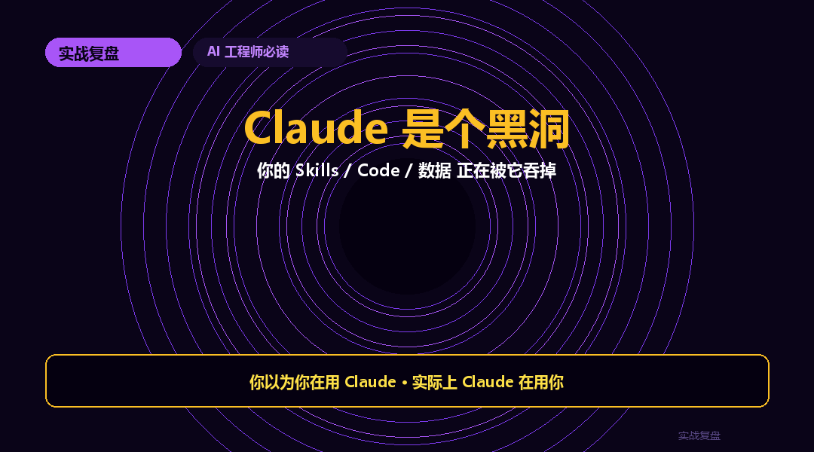
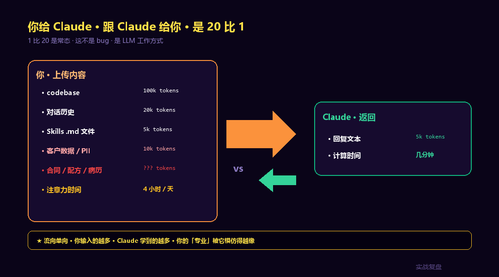
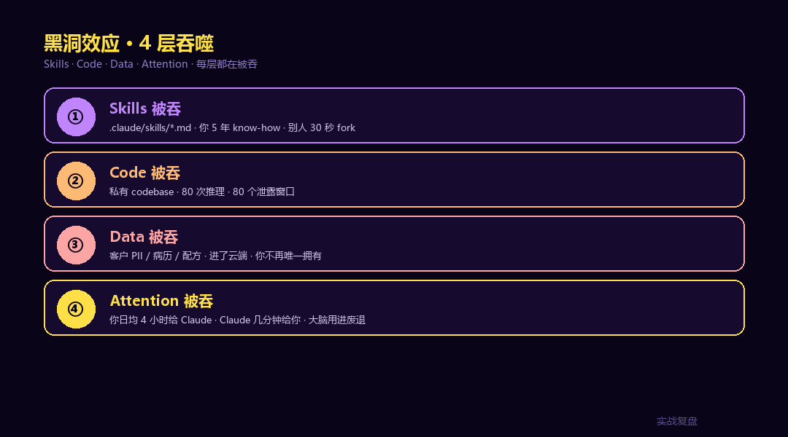
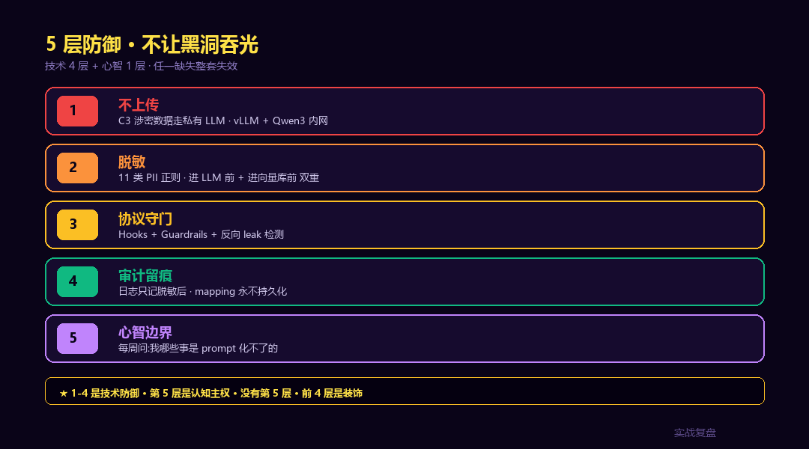
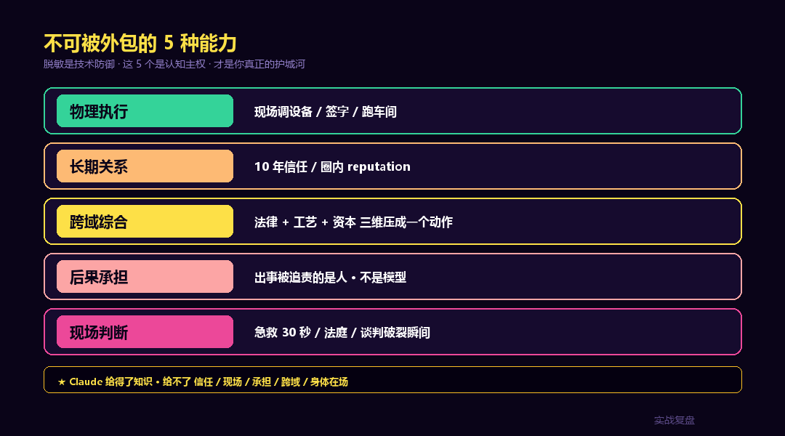

# Claude 是个黑洞 —— 你的 Skills / Code / 数据 正在被它吞掉

> 实战复盘 · Essay · 第一性原理观察
>
> 你以为你在用 Claude。
> 实际上 **Claude 在用你**。
> 它每读你一次 codebase、Skills、客户数据,你的"专业"就少一分。
> 这不是阴谋论。是数据流向。

<div align="center">

<a href="https://github.com/OnelongX/aiagent">

</a>

📖 **本文同步发布于公众号「实战复盘」** · 微信号:`IamOnelong`
🌐 [完整代码仓库 · github.com/OnelongX/aiagent](https://github.com/OnelongX/aiagent)
🐦 X thread:[@iamonelong](https://x.com/iamonelong)

</div>



---

## 一、一个反直觉的事实:数据流是单向的

打开你 Mac 的 `~/.claude/` 目录,看一眼大小。

3 个月前刚装时是几十 MB。今天可能已经 **几个 GB**。里面是 Claude 读过的:每个项目的 codebase、每一次对话历史、你写的 Skills 文件、每一份贴进去的合同 / 文档 / 代码片段。

你以为这是双向交互。**实际上每次对话的 token 比是不对称的**:

- 输入 100k:你的代码、文档、对话历史、Skills、PII
- 输出 5k:Claude 给你的回复

**1 比 20,是常态。**

这不是 bug,是 LLM 的工作方式。但这也意味着:**你给 Claude 的,永远比 Claude 给你的多。**

大多数人觉得"我赚了",因为输出对我有用。但有用的不是输出本身。有用的是 **输入的内容 + 输出的方法** 之间的差。

差越小,Claude 就越能模仿你的"专业"。模仿成功之后,下次别人不再需要你了。



---

## 二、黑洞效应 1:你的 Skills 被吞

Claude Code 推出 Skills 之后,圈内开始疯狂积累 `~/.claude/skills/*.md` 文件。

每一个 `.md` 文件,本质上是把你过去 5 年的 **领域 know-how** 提炼成 prompt 模板 + 工具调用规则。

看起来很爽:以后我不用记,Claude 帮我执行。

**但你想过没有?**

第一,Skills 是 markdown 明文。**别人开源你的 Skills 库,需要 30 秒。** 你 5 年积累的"提示词工程"等于给了同行一份免费手册。

第二,"提示词工程师"这个职业的 **本质就是可外包性最强的脑力工作**。一个人写出来的好 prompt 模板,下一个人能直接抄走、改名、贴自己 LinkedIn。

第三,更深的一层:你写 Skills 的过程,**就是把你脑子里的执行流程显化、外化、模板化**。一旦显化,它就脱离了你的人,归属于工具。

这是 Skills 革命的暗面:**越好用,越外包。越外包,越没有壁垒。**

12 个月内能保住护城河的,**只有 prompt 化不了的能力**:物理动作、现场判断、长期信任、跨域综合。

---

## 三、黑洞效应 2:你的 Code 被吞

每一次让 Claude 读你的 repo,全部 codebase 都进了 LLM 的上下文。

公有云 API 调用,端点提供商**默认日志保留 30 天**。即使签了 ZDR(Zero Data Retention),代码也短暂存在过一次。

私有 codebase 进 LLM 推理 80 次 = **80 个潜在泄露窗口**。

而且代码进了别人的 endpoint,**你失去了对它的物理控制**。哪怕万一是合规的、是安全的,**你不再是唯一拥有它的人**。

最阴险的不是泄露给外人,**而是泄露给同行**。你的核心算法、你的架构选择、你的工艺参数,如果模型未来在另一个 user 的 prompt 下"碰巧"输出类似结构,**你证明不了**是它学了你。

---

## 四、黑洞效应 3:你的客户数据被吞

这个最直接,也是合规风险最高的一环。

客户姓名、身份证号、电话、银行卡、合同条款、医疗病历、工艺配方 —— 只要贴进 Claude,**它就在云端短暂存在过**。

即使供应商承诺不训练、不保留,你也面对几个无法回避的现实:

1. **Prompt Injection**:恶意输入可以诱导 LLM 吐出系统提示词 + 上下文里的其他敏感内容
2. **Reverse Leak**:你脱敏了 PII 进 LLM,但 LLM 输出时"按常识"自动编了一对类似的 PII 拼回输出 —— 看起来无害,等于把"这里有真实 PII"的信号泄露给了下游
3. **审计责任不可转**:GDPR / PIPL / 等保不认"我把数据传给 OpenAI 了所以不是我的责任"。**你是数据控制者。**

---

## 五、黑洞效应 4:你的注意力被吞

这是最容易被忽视,但杀伤力最大的一层。

你每天花 4 小时跟 Claude 来回对话,Claude 花在你身上的总计算时间是 **几分钟**。

注意力 ROI 极度不对称。

长此以往,**你的 mind state 围绕 Claude 调度,而不是围绕你的客户、产品、市场调度**。"今天该跟谁谈合作"变成"今天该让 Claude 帮我写什么"。

外包思考是有代价的。**大脑用进废退。** 你越外包,你自己的判断力越萎缩。一年后,你 prompt 写得越来越好,但**独立思考能力越来越差**。



---

## 六、5 层防御:不让黑洞吞光

说完问题。说解决方案。

如果完全不用 Claude —— 不现实。如果照常用 —— 上面 4 个吞噬都在发生。中间路线,**5 层防御**:

### 第 1 层 · 不上传:涉密数据走私有 LLM

配方、病历、征信、律师函这类 C3 级数据,**永远不进公有云 LLM**。走 vLLM + Qwen3-14B 内网部署,数据不出机房。一行 LiteLLM 配置切换。

### 第 2 层 · 脱敏:进 LLM 前 PII 必脱

11 类 PII 正则全部命中替换为占位符(`[ID_CARD_1]`、`[BANK_CARD_1]` 等)。进 LLM 前一次,进向量库前再一次,**双重脱敏**。

### 第 3 层 · 协议守门:Hooks + Guardrails + 反向输出审计

Prompt Injection 20 个攻击模式检测、System prompt 泄露探测、Reverse leak 二次扫描 —— **输入输出两端都堵**。

### 第 4 层 · 审计:日志只记脱敏后内容

PII mapping 永不持久化、永不上传客户端。否则**日志自己就是泄密源**。

### 第 5 层 · 心智:每周问自己一个问题

"我这周做的事,**哪些是 prompt 化不了的**?" 如果答不出来 3 件,你已经在被吞了。



---

## 七、数据脱敏的工程实现(直接抄)

把过去 5 篇行业落地(法律 / 教育 / 医疗 / 金融 / 制造)的 PII 脱敏代码**合并成统一 Python 包**,放在了 GitHub:

📂 [`01-ai-toolstack/10-ai-security-pii/examples/pii_toolkit_unified.py`](../../../01-ai-toolstack/10-ai-security-pii/examples/pii_toolkit_unified.py)

核心代码 30 行可读:

```python
import re

PATTERNS = {
    "ID_CARD":      re.compile(r"[1-9]\d{5}(?:18|19|20)\d{2}..."),
    "PHONE":        re.compile(r"1[3-9]\d{9}"),
    "BANK_CARD":    re.compile(r"\b\d{16,19}\b"),
    "INPATIENT_NO": re.compile(r"住院号[::\s]*\d{6,12}"),
    "MEDICAL_NO":   re.compile(r"病历号[::\s]*\d{6,12}"),
    "CVV":          re.compile(r"(?:CVV|安全码)[::\s]*\d{3,4}"),
    "RECIPE":       re.compile(r"配方代号[::\s]*[A-Z0-9\-]+"),
    # ... 共 11 类
}

C3_KEYS = {"ID_CARD", "BANK_CARD", "CVV", "INPATIENT_NO", ...}

def redact(text, industry="general"):
    redacted = text
    counts = {}
    c3 = False
    for key, pattern in PATTERNS.items():
        matches = pattern.findall(redacted)
        if matches:
            counts[key] = len(matches)
            for i, _ in enumerate(matches, 1):
                redacted = pattern.sub(f"[{key}_{i}]", redacted, count=1)
            if key in C3_KEYS:
                c3 = True
    return redacted, {"counts": counts, "c3_sensitive": c3}
```

完整管线用法:

```python
user_input = "患者张三 110101199001011234 病历号:1234567"
redacted, meta = redact(user_input, industry="medical")

if meta["c3_sensitive"]:
    output = private_llm(redacted)   # 走内网 Qwen
else:
    output = claude(redacted)        # 走公有云

# 输出层再扫一次反向 leak
if detect_reverse_leak(output):
    output = redact(output)[0]

return output   # 客户看到的永远是脱敏后
```

这套代码跑过 5 个行业的生产数据,5 个测试场景全过。完整 280 行可复制:仓库里 [`examples/pii_toolkit_unified.py`](../../../01-ai-toolstack/10-ai-security-pii/examples/pii_toolkit_unified.py)。

---

## 八、不可被外包的 5 种能力

脱敏是技术防御。但更深的防御是 **认知主权** —— 保留你那些 LLM 永远碰不到的能力。

| # | 能力 | 为什么 LLM 拿不走 |
|---|---|---|
| 1 | **物理执行** | 现场调设备、签字、跑车间、看 demo、亲眼验真 —— LLM 不可能替你去。**身体在场是最硬的护城河。** |
| 2 | **长期关系** | 和客户喝过 10 年酒、和供应商踩过 3 个坑、和监管打过 5 个交道 —— **信任是时间换的,prompt 换不了**。 |
| 3 | **跨域综合判断** | 同时懂法律 + 工艺 + 资本,把三个维度在一个决策上压成一个动作 —— LLM 给得了单维深度但**给不了跨域综合**。 |
| 4 | **后果承担** | 出了事,被追责的是**人**,不是模型。律师签字、医师签字、工艺工程师签字 —— 签字背后是**承担**,LLM 不承担。 |
| 5 | **现场判断** | 医院抢救室、法庭辩护、车间事故、谈判破裂的那 30 秒 —— **在场的人做的判断**,电子流程做不出来。 |



---

## 九、收尾:黑洞不是敌人,是边界测试

把 Claude 当敌人没用。它就是一个高效率的工具。

但工具会扩张。**你不主动设边界,边界就由它定。**

数据脱敏是技术上的边界。代码安全是工程上的边界。**不可外包的 5 种能力是认知上的边界。**

流行的误读是:

> "你给 AI 越多,你越没有价值。"

真相不是这样。真相是:

> **"你给 AI 越多,但同时不练自己的判断、不守自己的数据、不留自己的现场能力 —— 你越没有价值。"**

Claude 是黑洞。**但你可以决定它吞什么、不吞什么。**

---

## 关联资源

- **完整脱敏代码 + 4 层防御**:[#10 AI 防泄密 + 脱敏完整指南](../../../01-ai-toolstack/10-ai-security-pii/)
- **统一 PII Toolkit**:[`pii_toolkit_unified.py`](../../../01-ai-toolstack/10-ai-security-pii/examples/pii_toolkit_unified.py)(280 行 · 5 行业测试通过 · MIT)
- **13 篇行业落地综述**:[04-survey](../../)
- 公众号「实战复盘」· 微信号 `IamOnelong`
- X 账号 [@iamonelong](https://x.com/iamonelong)

---

实战复盘 · Essays · 第一性原理观察
关键词:Claude · LLM 数据流 · 数据脱敏 · PII Toolkit · 认知主权
本文仅供学习参考。
