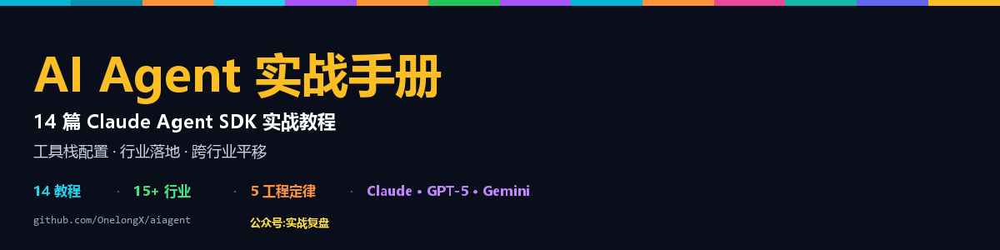

<div align="center">



# AI Agent 实战手册

**14 篇 Claude Agent SDK 实战教程**
**从工具栈配置 · 到行业落地 · 到跨行业平移**

[](https://opensource.org/licenses/MIT)
[](#内容索引)
[](#)
[](#关注公众号实战复盘)

<!-- LAST-UPDATED -->最近更新:2026-05-11<!-- /LAST-UPDATED -->

</div>

---

## 这是什么

本仓库是公众号「**实战复盘**」(微信号:`IamOnelong`)Agent 实战教程的完整开源资料。

**22+ 篇实战** 覆盖:**AI 工具栈** + **行业落地**(绿电 / 合同 / 客服 / 电商 / 论文 / 法律 / 教育 / 医疗 / 金融 / 制造 ...)+ **跨行业平移** + **阶段性综述**。

写过这些之后,验证了一个核心结论:

> **Claude Agent SDK 的工程模式是行业无关的。**
> 真正的门槛不在技术,在认知。
> 唯一稀缺的是把行业 20 年的 Excel,拆成 20 个工具 + 4 个 Subagent + 5 个 Hooks。

**13+ 个完全不同的领域**(绿电 / 合同 / 知识库 / 客服 / 电商 / 二手 3C / 自媒体 / 论文 / 法律 / 教育 / 医疗 / 金融 / 制造)—— 同一套骨架都撑得住。

---

## 内容索引

### 第一阶段:AI 工具栈(11 篇)

从用 AI 编程工具,到用官方 SDK 造自己的 AI Agent,再到多 Agent 协作 + 防泄密 + 评测体系。

| # | 篇目 | 核心 |
|---|---|---|
| 1 | [Codex CLI 配置完整教程](01-ai-toolstack/01-codex-cli/) | config.toml 全参数解析 + 3 套预设 |
| 2 | [Codex 三端通用配置](01-ai-toolstack/02-codex-multi-platform/) | CLI / Desktop / VS Code 共享配置 |
| 3 | [Claude 全家桶配置](01-ai-toolstack/03-claude-suite/) | Claude Chat / Cowork / Code 三端 |
| 4 | [opencode 配置教程](01-ai-toolstack/04-opencode/) | 75+ 模型聚合编程助手 |
| 5 | [Hermes + OpenClaw 配置](01-ai-toolstack/05-hermes-openclaw/) | 个人 AI 网关 + 工具编排 |
| 6 | [Claude Agent SDK 完整教程](01-ai-toolstack/06-claude-agent-sdk/) | Python + TS 双语 · 6 大核心能力 |
| 7 | [OpenAI SDK 完整教程](01-ai-toolstack/07-openai-sdk/) | Responses API + Agents SDK · 8 大能力 |
| 8 | [Gemini / Google AI SDK 完整教程](01-ai-toolstack/08-gemini-sdk/) | google-genai + ADK · 2M 上下文 + 原生多模态 · 三家对照 |
| 9 | [Subagent 模式深度](01-ai-toolstack/09-subagent-patterns/) | 5 经典模式 + 3 家协作对照 + 5 反模式 · 实战收藏 |
| 10 | [AI 防泄密 + 脱敏完整指南](01-ai-toolstack/10-ai-security-pii/) | 5 通道 + 4 层防御 + 统一 PII Toolkit + 私有 LLM 路由 |
| 11 | [Agent Eval 体系](01-ai-toolstack/11-agent-eval/) | RAGAS / Phoenix / Langfuse / OpenAI Tracing 四方对照 + CI 集成 |

### 第二阶段:行业落地(13 篇 · 收官)

5 个 Agent SDK 工具调度案例 + 8 个全栈产品级实战(均含完整可跑代码)。

| # | 篇目 | 关键创新 |
|---|---|---|
| 1 | [家庭绿电方案助手](02-industry-cases/01-home-solar-advisor/) | 6 工具 + 4 Subagent · 单模型工具调度 |
| 2 | [合同审查助手](02-industry-cases/02-contract-review/) | Claude+Gemini+GPT 多模型协作 · 漏判 <2% |
| 3 | [企业知识库 Q&A](02-industry-cases/03-enterprise-kb-qa/) | Qdrant + Cohere Rerank + RAGAS · 3 周落地 |
| 4 | [企业客服系统](02-industry-cases/04-customer-service/) | 12 工具 + 5 Hooks · 边界守护 |
| 5 | [绿电电商客服系统](02-industry-cases/05-solar-ecommerce/) | 接 OMS · 下单闭环 · Claude+GPT-5 双引擎 |
| **6** | [**全栈 AI 工作台**](02-industry-cases/06-fullstack-workbench/) ⭐ | Vue + FastAPI + Chroma + Docker · **完整可跑代码** |
| **7** | [**Vectorless RAG 客服**](02-industry-cases/07-vectorless-rag-cs/) ⭐ | PageIndex 中文实战 · **完整可跑代码** |
| **8** | [**学生论文助手**](02-industry-cases/08-thesis-assistant/) ⭐ | 8 能力 + 学术诚信红线 + DOI 校验 · **完整可跑代码** |
| **9** | [**法律行业 AI**](02-industry-cases/09-legal-industry/) ⭐ | 5 大场景 + 6 工程纪律 + PII 脱敏 + 签字栏 · **完整可跑代码** |
| **10** | [**教育行业 AI**](02-industry-cases/10-education-industry/) ⭐ | 4 大场景 + 7 工程纪律 + 双减对齐 + 未成年保护 · **完整可跑代码** |
| **11** | [**医疗行业 AI**](02-industry-cases/11-medical-industry/) ⭐ | 6 大场景 + 7 工程纪律 + 急救熔断 + 药品库 + 医师签字 · **完整可跑代码** |
| **12** | [**金融行业 AI**](02-industry-cases/12-finance-industry/) ⭐ | 6 大场景 + 7 工程纪律 + 反诈熔断 + 适当性矩阵 + 反歧视审计 · **完整可跑代码** |
| **13** | [**制造行业 AI**](02-industry-cases/13-manufacturing-industry/) ⭐ | 6 大场景 + 7 工程纪律 + 物理边界硬阻断 + 配方机密保护 + MES 只读 · **完整可跑代码** |

### 第三阶段:跨行业平移(2 篇)

验证工程模式与行业无关。

| # | 篇目 | 行业 |
|---|---|---|
| 1 | [二手手机推荐 + 售卖 Agent](03-cross-industry/01-used-phone-agent/) | 二手 3C · 2B/2C · 微信生态 |
| 2 | [自媒体写作 + 脚本 Agent](03-cross-industry/02-content-creator-agent/) | 内容创作 · 风格 embedding |

### 第四阶段:阶段性综述

| 篇目 | 主轴 |
|---|---|
| [13 篇行业落地综述](04-survey/) | 13 篇全景表 + 5 大重监管行业红线对照 + 任务×模型矩阵 + 6 大工程定律 + AI 红线工具箱 |

---

## 关于公众号「实战复盘」

<div align="center">

<a href="https://github.com/OnelongX/aiagent">

</a>

</div>

**每周更新 AI Agent 行业落地实战** · 微信搜索 `IamOnelong`

- 📚 16+ 篇沉淀,从 Claude Agent SDK 到全栈产品
- 🔧 行业落地系列覆盖绿电 / 合同 / 客服 / 电商 / 论文等场景
- 🛠️ 跨行业平移已验证多个方向

**留言区欢迎**:
- 你在哪个行业 · 卡在哪一步
- 想看哪个场景的深度落地
- 你正在做的 Agent 卡在哪一个 Hook

---

## 技术栈

- **Orchestrator**: [Claude Agent SDK](https://docs.anthropic.com/) (Python + TypeScript)
- **Multi-provider**: [LiteLLM](https://github.com/BerriAI/litellm)
- **Vector DB**: [Qdrant](https://qdrant.tech/)
- **Embedding**: BGE-M3
- **Rerank**: Cohere rerank-3.5
- **Eval**: [RAGAS](https://github.com/explodinggradients/ragas)
- **Models**: Claude Sonnet 4.5 / GPT-5 / Gemini 2.5 Pro / DeepSeek R1
- **Visual**: Python PIL(配图生成代码全部开源)

---

## 快速开始

```bash
# 1. 装环境
pip install claude-agent-sdk litellm

# 2. 配置 endpoint(参考 docs/endpoints.md)
export ANTHROPIC_AUTH_TOKEN="sk-xxxxx"
export ANTHROPIC_BASE_URL="https://livetoken.top"
export OPENAI_API_KEY="sk-xxxxx"
export OPENAI_BASE_URL="https://livetoken.top"

# 3. 跑第一个 Agent
python -c "
import asyncio
from claude_agent_sdk import query, ClaudeAgentOptions
async def main():
    async for m in query(prompt='What files are here?',
                          options=ClaudeAgentOptions(allowed_tools=['Bash'])):
        if hasattr(m, 'result'): print(m.result)
asyncio.run(main())
"
```

国内开发者推荐使用 **[livetoken](https://livetoken.top)** 作为统一 endpoint —— 一个 base_url 同时跑 **280+ 模型**(GPT-5 / Claude / Gemini / DeepSeek / Midjourney 等),OpenAI 协议 100% 兼容,**官方价 2.21~3.42 折**。

- 📋 endpoint 选型综述:[docs/endpoints.md](docs/endpoints.md)
- 📘 **livetoken 深度介绍**(配置示例 / 价格 / 踩坑指南):[docs/livetoken.md](docs/livetoken.md)

---

## 6 个行业无关的工程定律

13 篇沉淀的规律,**任何行业都成立**:

1. **工具优先 · LLM 不计算** —— 任何数字/价格/状态全走工具
2. **权限在数据层 · 不在 Prompt** —— 向量库 filter,不靠 prompt 自觉
3. **Subagent 分工** —— triager 用 Haiku,推理用 Sonnet · 成本压 1/5
4. **Hooks 守红线** —— 价格/承诺/状态机不让 LLM 自由发挥
5. **评测驱动** —— RAGAS / CSAT / DSAT 任一指标跌 5% 阻断上线
6. **红线先于功能**(#9-#13 新加)—— 熔断不进 LLM · 签字栏强制 · 硬边界阻断

完整版见 [13 篇行业落地综述](04-survey/),含 5 大重监管行业红线对照表 + AI 红线工具箱 5 个模板。

---

## 仓库结构

```
aiagent/
├── README.md                       # 你正在看的
├── assets/
│   ├── banner.png                  # GitHub social preview (1280×640)
│   ├── header.png                  # 顶部 header (1200×300)
│   └── gen_banner.py               # banner 生成代码
├── docs/
│   └── endpoints.md                # endpoint 选型 + 配置示例
├── sync_to_github.py               # 本地同步脚本(WeChat → GitHub)
├── .github/workflows/              # CI:自动更新索引 + link check
├── 01-ai-toolstack/                # AI 工具栈 11 篇
├── 02-industry-cases/              # 行业落地 13 篇
├── 03-cross-industry/              # 跨行业平移 2 篇
└── 04-survey/                      # 阶段性综述
```

每篇含:`README.md`(完整文章)+ `gen.py`(PIL 配图代码)+ `images/`(5 张配图)

---

## 后续路线

跨行业平移已验证 2 个方向(3C 电商 + 内容创作)。下一步:

- [x] 法律行业(合同 / 案例 / 文书)→ [#9](02-industry-cases/09-legal-industry/)
- [x] 教育行业(学情 / 批改 / 家校)→ [#10](02-industry-cases/10-education-industry/)
- [x] 医疗行业(影像 / 分诊 / 用药)→ [#11](02-industry-cases/11-medical-industry/)
- [x] 金融行业(KYC / 风控 / 投顾)→ [#12](02-industry-cases/12-finance-industry/)
- [x] 制造行业(MES / 工艺 / 质检)→ [#13](02-industry-cases/13-manufacturing-industry/)

**第二阶段:行业落地系列已完成 5 大重监管行业全覆盖**(法律 / 教育 / 医疗 / 金融 / 制造)。

模式相同,数据 + 工具不同。

---

## ☕ 打赏支持

如果本仓库对你有帮助,欢迎请作者喝杯咖啡 ☕

<div align="center">

<table>
<tr>
<td align="center" width="50%">

<br/>
<sub><b>微信支付</b></sub>
</td>
<td align="center" width="50%">

<br/>
<sub><b>支付宝</b></sub>
</td>
</tr>
</table>

</div>

> 你的支持会用于:维护和更新本系列、补充新行业落地案例、保障 livetoken endpoint 测试环境稳定运行。
> 打赏不是回报作者,而是让这套实战内容**继续更新下去**的燃料 🔥

---

## License

[MIT](LICENSE)

本仓库内容仅供学习参考。涉及的所有外部服务请按其官方文档使用,遵守相关服务条款。
